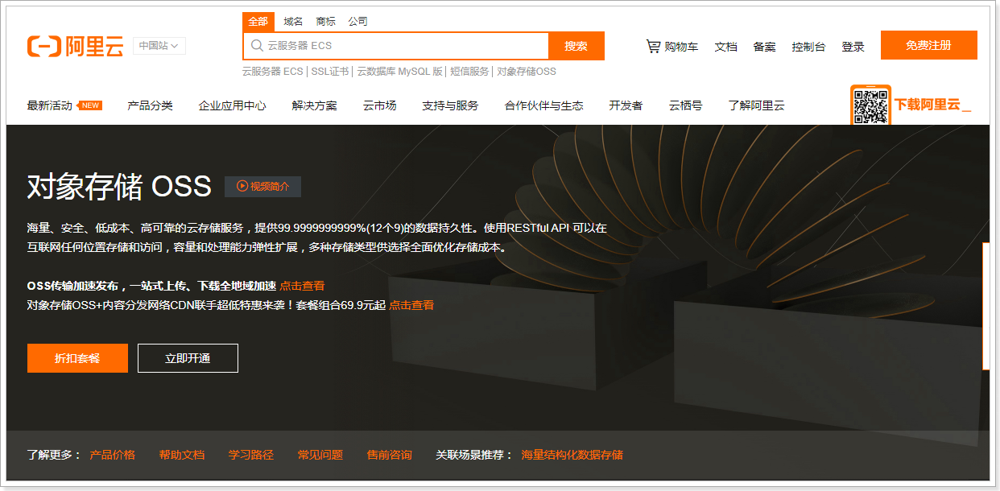

- VO **封装响应**（Value Object）值对象，通常用于服务端与界面之间的数据传递。对于一个WEB页面，用一个VO对象对应整个界面的值。
- DTO **封装请求**（Data Transfer Object）数据传输对象，通常用于界面向服务端的数据传递
  Entity最常用实体类，基本和数据表一一对应，一个实体一张表（常说的实体类，Domain）


##   1、完善用户信息

用户在首次登录时需要完善个人信息，包括性别、昵称、生日、城市、头像等。其中，头像数据需要做图片上传，这里采用阿里云的OSS服务作为我们的图片服务器，并且对头像要做人脸识别，非人脸照片不得上传。


* 首次登录时（手机号码不存在），需要创建用户存入数据库中

* 客户端检测首次登录需要完善用户信息
  * 填写用户基本信息
  * 上传用户头像（需要人脸认证）

### 1.1、阿里云OSS

实现图片上传服务，需要有存储的支持，那么我们的解决方案将以下几种：

1. 直接将图片保存到服务的硬盘（springmvc将的文件上传）
   1. 优点：开发便捷，成本低
   2. 缺点：扩容困难
2. 使用分布式文件系统进行存储
   1. 优点：容易实现扩容
   2. 缺点：开发复杂度稍大（有成熟的产品可以使用，比如：FastDFS）
3. 使用第三方的存储服务
   1. 优点：开发简单，拥有强大功能，免维护
   2. 缺点：付费

在本套课程中选用阿里云的OSS服务进行图片存储。


#### 1.1.1、概述

对象存储服务（Object Storage Service，OSS）是一种海量、安全、低成本、高可靠的云存储服务，适合存放任意类型的文件。容量和处理能力弹性扩展，多种存储类型供选择，全面优化存储成本。

地址：https://www.aliyun.com/product/oss



#### 1.1.2、账号申请

##### 购买服务

使用第三方服务最大的缺点就是需要付费，下面，我们看下如何购买开通服务。 


购买下行流量包： （不购买也可以使用，按照流量付费）


> 说明：OSS的上行流量是免费的，但是下行流量是需要购买的。

##### 创建Bucket

使用OSS，首先需要创建Bucket，Bucket翻译成中文是水桶的意思，把存储的图片资源看做是水，想要盛水必须得有桶，就是这个意思了。

进入控制台，https://oss.console.aliyun.com/overview

 

选择Bucket后，即可看到对应的信息，如：url、消耗流量等 :


文件管理：


查看文件：

 


#### 1.1.3、抽取模板工具

和发送短信类似，阿里云OSS也是采用自定义工具的形式进行封装

##### OssProperties

tanhua-autoconfig创建配置类

```java
@Data
@ConfigurationProperties(prefix = "tanhua.oss")
public class OssProperties {

    private String accessKey; 
    private String secret;
    private String bucketName;
    private String url; //域名
    private String endpoint;
}
```

##### OssTemplate

tanhua-autoconfig创建模板对象

```java
package com.tanhua.autoconfig.template;

import com.aliyun.oss.OSS;
import com.aliyun.oss.OSSClientBuilder;
import com.tanhua.autoconfig.properties.OssProperties;

import java.io.InputStream;
import java.text.SimpleDateFormat;
import java.util.Date;
import java.util.UUID;

public class OssTemplate {

    private OssProperties properties;

    public OssTemplate(OssProperties properties) {
        this.properties = properties;
    }

    /**
     * 文件上传
     *   1：文件名称
     *   2：输入流
     */
    public String upload(String filename, InputStream is) {
        //3、拼写图片路径
        filename = new SimpleDateFormat("yyyy/MM/dd").format(new Date())
                +"/"+ UUID.randomUUID().toString() + filename.substring(filename.lastIndexOf("."));


        // yourEndpoint填写Bucket所在地域对应的Endpoint。以华东1（杭州）为例，Endpoint填写为https://oss-cn-hangzhou.aliyuncs.com。
        String endpoint = properties.getEndpoint();
        // 阿里云主账号AccessKey拥有所有API的访问权限，风险很高。强烈建议您创建并使用RAM账号进行API访问或日常运维，请登录 https://ram.console.aliyun.com 创建RAM账号。
        String accessKeyId = properties.getAccessKey();
        String accessKeySecret = properties.getSecret();

        // 创建OSSClient实例。
        OSS ossClient = new OSSClientBuilder().build(endpoint, accessKeyId,accessKeySecret);

        // 填写Byte数组。
        // 填写Bucket名称和Object完整路径。Object完整路径中不能包含Bucket名称。
        ossClient.putObject(properties.getBucketName(), filename, is);

        // 关闭OSSClient。
        ossClient.shutdown();

        String url = properties.getUrl() +"/" + filename;
        return url;
    }
}

```

##### TanhuaAutoConfiguration

TanhuaAutoConfiguration加入配置

```java
@EnableConfigurationProperties({
        SmsProperties.class,
        OssProperties.class
})
public class TanhuaAutoConfiguration {

    @Bean
    public SmsTemplate smsTemplate(SmsProperties properties) {
        return new SmsTemplate(properties);
    }

    @Bean
    public OssTemplate ossTemplate(OssProperties properties) {
        return new OssTemplate(properties);
    }
}
```

#### 1.1.4、测试

tanhua-app-server加入配置内容，并测试

```yaml
tanhua:  
  oss:
    accessKey: LTAI4GKgob9vZ53k2SZdyAC7
    secret: LHLBvXmILRoyw0niRSBuXBZewQ30la
    endpoint: oss-cn-beijing.aliyuncs.com
    bucketName: tanhua001
    url: https://tanhua001.oss-cn-beijing.aliyuncs.com/
```

编写测试类

```java
@RunWith(SpringRunner.class)
@SpringBootTest(classes = AppServerApplication.class)
public class OssTest {

    @Autowired
    private OssTemplate template;

    @Test
    public void testTemplateUpload() throws FileNotFoundException {
        String path = "C:\\Users\\lemon\\Desktop\\课程资源\\02-完善用户信息\\03-资料\\2.jpg";
        FileInputStream inputStream = new FileInputStream(new File(path));
        String imageUrl = template.upload(path, inputStream);
        System.out.println(imageUrl);
    }
}
```

### 1.2、百度人脸识别

​    人脸识别（Face Recognition）基于图像或视频中的人脸检测、分析和比对技术，提供对您已获授权前提下的私有数据的人脸检测与属性分析、人脸对比、人脸搜索、活体检测等能力。灵活应用于金融、泛安防、零售等行业场景，满足身份核验、人脸考勤、闸机通行等业务需求

#### 1.2.1、概述

地址：https://ai.baidu.com/tech/face


#### 1.2.2、账号申请

##### 账号登录注册

百度云AI支持百度账号登录，也可以支持云账号。按需注册即可


##### 创建应用

按需创建应用


#### 1.2.3、抽取模板工具

##### AipFaceProperties

```java
@Data
@ConfigurationProperties("tanhua.aip")
public class AipFaceProperties {
    private String appId;
    private String apiKey;
    private String secretKey;

    @Bean
    public AipFace aipFace() {
        AipFace client = new AipFace(appId, apiKey, secretKey);
        // 可选：设置网络连接参数
        client.setConnectionTimeoutInMillis(2000);
        client.setSocketTimeoutInMillis(60000);
        return client;
    }
}
```

##### AipFaceTemplate

```java
package com.tanhua.autoconfig.template;

import com.baidu.aip.face.AipFace;
import org.json.JSONObject;
import org.springframework.beans.factory.annotation.Autowired;

import java.util.HashMap;

public class AipFaceTemplate {

    @Autowired
    private AipFace client;

    /**
     * 检测图片中是否包含人脸
     *  true：包含
     *  false：不包含
     */
    public boolean detect(String imageUrl) {
        // 调用接口
        String imageType = "URL";

        HashMap<String, String> options = new HashMap<String, String>();
        options.put("face_field", "age");
        options.put("max_face_num", "2");
        options.put("face_type", "LIVE");
        options.put("liveness_control", "LOW");

        // 人脸检测
        JSONObject res = client.detect(imageUrl, imageType, options);
        System.out.println(res.toString(2));

        Integer error_code = (Integer) res.get("error_code");

        return error_code == 0;
    }
}
```

#### 1.2.4、测试

tanhua-app-server加入百度AI的配置信息

```yml
tanhua:
  aip:
    appId: 24021388
    apiKey: ZnMTwoETXnu4OPIGwGAO2H4G
    secretKey: D4jXShyinv5q26bUS78xRKgNLnB9IfZh
```

编写单元测试类

```java
@RunWith(SpringRunner.class)
@SpringBootTest(classes = AppServerApplication.class)
public class FaceTest {


    @Autowired
    private AipFaceTemplate template;

    @Test
    public void detectFace() {
        String image = "https://tanhua001.oss-cn-beijing.aliyuncs.com/2021/04/19/a3824a45-70e3-4655-8106-a1e1be009a5e.jpg";
        boolean detect = template.detect(image);
    }
}
```

### 1.3、保存用户信息

#### 1.3.1、接口文档


YAPI接口地址：http://192.168.136.160:3000/project/19/interface/api/88

#### 1.3.2、需求分析

##### 数据库表

tb_user_info（用户基本资料表）


* 用户表和用户信息表是<font color=red>一对一的关系，两者采用主键关联的形式配置</font>

* 主键关联：用户表主键和用户资料表主键要保持一致（如：用户表id=1，此用户的资料表id=1）

##### 执行流程

1. 手机端发送请求到消费者
2. 消费者构造数据，调用提供者
3. 消费者完成业务处理，操作数据库


#### 1.3.3、代码实现

##### UserInfo实体类

```java
@Data
@NoArgsConstructor
@AllArgsConstructor
public class UserInfo implements Serializable {

    /**
     * 由于userinfo表和user表之间是一对一关系
     *   userInfo的id来源于user表的id
     */
    @TableId(type= IdType.INPUT)
    private Long id; //用户id
    private String nickname; //昵称
    private String avatar; //用户头像
    private String birthday; //生日
    private String gender; //性别
    private Integer age; //年龄
    private String city; //城市
    private String income; //收入
    private String education; //学历
    private String profession; //行业
    private Integer marriage; //婚姻状态
    private String tags; //用户标签：多个用逗号分隔
    private String coverPic; // 封面图片
    private Date created;
    private Date updated;

    //用户状态,1为正常，2为冻结
    @TableField(exist = false)
    private String userStatus = "1";
}
```

##### UserController

```java
@RestController
@RequestMapping("/user")
public class UserController {

    @Autowired
    private UserInfoService userInfoService;

    /**
     * 保存用户信息
     *   UserInfo
     *   请求头中携带token
     */
    @PostMapping("/loginReginfo")
    public ResponseEntity loginReginfo(@RequestBody UserInfo userInfo,
                                       @RequestHeader("Authorization") String token) {
        //1、解析token
        Claims claims = JwtUtils.getClaims(token);
        Integer id = (Integer) claims.get("id");
        //2、向userinfo中设置用户id
        userInfo.setId(Long.valueOf(id));
        //3、调用service
        userInfoService.save(userInfo);
        return ResponseEntity.ok(null);
    }
}
```

##### UserInfoService

```java
@Service
public class UserInfoService {

    @DubboReference
    private UserInfoApi userInfoApi;

    public void save(UserInfo userInfo) {
        userInfoApi.save(userInfo);
    }
}
```

##### UserInfoApi

```java
public interface UserInfoApi {
    public void save(UserInfo userInfo);
}
```

##### UserInfoApiImpl

```java
@DubboService
public class UserInfoApiImpl implements  UserInfoApi {

    @Autowired
    private UserInfoMapper userInfoMapper;

    @Override
    public void save(UserInfo userInfo) {
        userInfoMapper.insert(userInfo);
    }
}
```

##### UserInfoMapper

```java
public interface UserInfoMapper extends BaseMapper<UserInfo> {

}
```

### 1.4、上传用户头像

#### 1.4.1、需求分析

##### 接口文档


YAPI地址：http://192.168.136.160:3000/project/19/interface/api/91

文件上传采用POST传递，mvc中经过文件解析器转化为MultipartFile对象处理

后续请求中，请求headr中都有Authorization参数。

##### 执行流程


#### 1.4.2、代码实现

##### UsersControler

```java
/**
 * 更新用户资料
 */
@PutMapping
public ResponseEntity updateUserInfo(@RequestBody UserInfo 	userInfo,@RequestHeader("Authorization") String token) {
	Claims claims = JwtUtils.getClaims(token);
	Integer id = (Integer) claims.get("id");
    userInfo.setId(Long.valueOf(id));
    userInfoService.update(userInfo);
    return ResponseEntity.ok(null);
}
```

##### UserInfoService

```java
//更新用户头像
public void updateHead(MultipartFile headPhoto, Long id) throws IOException {
    //1、将图片上传到阿里云oss
    String imageUrl = ossTemplate.upload(headPhoto.getOriginalFilename(), headPhoto.getInputStream());
    //2、调用百度云判断是否包含人脸
    boolean detect = aipFaceTemplate.detect(imageUrl);
    //2.1 如果不包含人脸，抛出异常
    if(!detect) {
        throw new RuntimeException();
    }else{
        //2.2 包含人脸，调用API更新
        UserInfo userInfo = new UserInfo();
        userInfo.setId(id);
        userInfo.setAvatar(imageUrl);
        userInfoApi.update(userInfo);
    }
}
```

##### UserInfoApi

```java
public void update(UserInfo userInfo);
```

##### UserInfoApiImpl

```java
@Override
public void update(UserInfo userInfo) {
    userInfoMapper.updateById(userInfo);
}
```

## 2、用户信息管理

### 2.1、查询用户资料

#### 2.1.1、接口文档


YAPI地址：http://192.168.136.160:3000/project/19/interface/api/265

参数userID： 用户id，当不传递时，查询当前用户的资料信息

#### 2.1.2、代码实现

##### UserInfoVo

```java
@Data
@NoArgsConstructor
@AllArgsConstructor
public class UserInfoVo implements Serializable {

    private Long id; //用户id
    private String nickname; //昵称
    private String avatar; //用户头像
    private String birthday; //生日
    private String gender; //性别
    private String age; //年龄
    private String city; //城市
    private String income; //收入
    private String education; //学历
    private String profession; //行业
    private Integer marriage; //婚姻状态
}
```

##### UsersController

```java
@RestController
@RequestMapping("/users")
public class UsersControler {

    @Autowired
    private UserInfoService userInfoService;

    /**
     * 查询用户资料
     */
    @GetMapping
    public ResponseEntity users(Long userID,@RequestHeader("Authorization") String token) {
        if(userID == null) {
            Claims claims = JwtUtils.getClaims(token);
			Integer id = (Integer) claims.get("id");
            userID = Long.valueOf(id);
        }
        UserInfoVo userInfo = userInfoService.findById(userID);
        return ResponseEntity.ok(userInfo);
    }
}
```

##### UserInfoService

```java
//根据id查寻
public UserInfoVo findById(Long id) {
    UserInfo userInfo = userInfoApi.findById(id);

    UserInfoVo vo = new UserInfoVo();

    BeanUtils.copyProperties(userInfo,vo); //copy同名同类型的属性

    if(userInfo.getAge() != null) {
        vo.setAge(userInfo.getAge().toString());
    }

    return vo;
}
```

##### UserInfoApiImpl

```java
@Override
public UserInfo findById(Long id) {
    return userInfoMapper.selectById(id);
}
```

### 2.2、更新用户资料

#### 2.2.1、接口文档


YAPI地址：http://192.168.136.160:3000/project/19/interface/api/259

#### 2.2.2、代码实现

##### UsersController

```java
/**
 * 更新用户资料
 */
@PutMapping
public ResponseEntity updateUserInfo(@RequestBody UserInfo userInfo,@RequestHeader("Authorization") String token) {
    Claims claims = JwtUtils.getClaims(token);
    Integer id = (Integer) claims.get("id");
    userID = Long.valueOf(id);
    userInfo.setId(UserHolder.getUserId());
    userInfoService.update(userInfo);
    return ResponseEntity.ok(null);
}
```

##### UserInfoService

```java
//更新
public void update(UserInfo userInfo) {
    userInfoApi.update(userInfo);
}
```

##### UserInfoApiImpl

```java
@Override
public void update(UserInfo userInfo) {
    userInfoMapper.updateById(userInfo);
}
```

## 3、统一token处理

### 3.1、代码存在的问题


### 3.2、解决方案

基于ThreadLocal + 拦截器的形式统一处理


#### 拦截器（Interceptor）

* 是一种动态拦截方法调用的机制；

* 类似于Servlet 开发中的过滤器Filter，用于对处理器进行前置处理和后置处理。


#### ThreadLocal

* 线程内部的存储类，赋予了线程存储数据的能力。

* 线程内调用的方法都可以从ThreadLocal中获取同一个对象。

* 多个线程中ThreadLocal数据相互隔离

Threadlocal使用方法很简单

```java
ThreadLocal<T> threadLocal = new ThreadLocal<T>();
threadLocal.set() //将数据绑定到当前线程
threadLocal.get() //从当前线程中获取数据
```

### 3.3、代码实现

#### 3.3.1、ThreadLocal工具类

定义ThreadLocal工具类，仅需要调用set方法即可将数据存入ThreadLocal中

```java
/**
 * 工具类：实现向threadlocal存储数据的方法
 */
public class UserHolder {

    private static ThreadLocal<User> tl = new ThreadLocal<>();


    //将用户对象，存入Threadlocal
    public static void set(User user) {
        tl.set(user);
    }

    //从当前线程，获取用户对象
    public static User get() {
        return tl.get();
    }

    //从当前线程，获取用户对象的id
    public static Long getUserId() {
        return tl.get().getId();
    }

    //从当前线程，获取用户对象的手机号码
    public static String getMobile() {
        return tl.get().getMobile();
    }
}
```

#### 3.3.2、定义拦截器

定义拦截器，在前置拦截方法preHandle中解析token并验证有效性，如果失效返回状态码401。如果有效，解析User对象，存入ThreadLocal中

```java
public class TokenInterceptor implements HandlerInterceptor {
    
    @Override
    public boolean preHandle(HttpServletRequest request, HttpServletResponse response, Object handler) throws Exception {
        
        //1、获取请求头
        String token = request.getHeader("Authorization");

        //2、使用工具类，判断token是否有效
        boolean verifyToken = JwtUtils.verifyToken(token);
        //3、如果token失效，返回状态码401，拦截 
        if(!verifyToken) {
            response.setStatus(401);
            return false;
        }
        //4、如果token正常可用，放行

        //解析token，获取id和手机号码，构造User对象，存入Threadlocal
        Claims claims = JwtUtils.getClaims(token);
        String mobile = (String) claims.get("mobile");
        Integer id = (Integer) claims.get("id");

        User user = new User();
        user.setId(Long.valueOf(id));
        user.setMobile(mobile);

        UserHolder.set(user);

        return true;
    }
}
```

#### 3.3.3、注册拦截器

拦截器需要注册到MVC容器中

```java
@Configuration
public class WebConfig  implements WebMvcConfigurer {

    @Override
    public void addInterceptors(InterceptorRegistry registry) {
        registry.addInterceptor(new TokenInterceptor())
                .addPathPatterns("/**")
                .excludePathPatterns(new String[]{"/user/login","/user/loginVerification"});
    }
}
```

#### 3.3.4、测试

修改UsersController方法，从ThreadLoca中获取用户数据

```java
/**
 * 查询用户资料
 */
@GetMapping
public ResponseEntity users(Long userID) {
    if(userID == null) {
        userID = UserHolder.getUserId();
    }
    UserInfoVo userInfo = userInfoService.findById(userID);
    return ResponseEntity.ok(userInfo);
}
```

## 4、统一异常处理

软件开发过程中，不可避免的是需要处理各种异常，常见的形式就是逐层向上抛出，web层进行处理。使用try {...} catch {...}很方便就能对异常做到业务处理

1. 冗余代码多，影响代码可读性
2. 异常处理和业务代码耦合

### 4.1、解决方案

SpringMVC提供了一套解决全局异常的处理方案，可以在代码无侵入的前提下完成异常处理。遵循逐层抛出，异常处理器统一处理的思路


### 4.2、代码实现

项目中可能存在不可预知的各种异常，如：空指针，数组越界等。针对这类异常，可以直接在异常处理器中统一处理；

还有一类是可预知的错误，如图片不合法，验证码错误等等。这类错误也可以理解为业务异常，可以通过自定义异常类来处理；

#### 4.2.1、业务异常对象

为了方便操作，将一些常见的业务错误封装到ErrorResult对象中

```java
@Data
@NoArgsConstructor
@AllArgsConstructor
@Builder
public class ErrorResult {

    private String errCode = "999999";
    private String errMessage;

    public static ErrorResult error() {
        return ErrorResult.builder().errCode("999999").errMessage("系统异常稍后再试").build();
    }

    public static ErrorResult fail() {
        return ErrorResult.builder().errCode("000001").errMessage("发送验证码失败").build();
    }

    public static ErrorResult loginError() {
        return ErrorResult.builder().errCode("000002").errMessage("验证码失效").build();
    }

    public static ErrorResult faceError() {
        return ErrorResult.builder().errCode("000003").errMessage("图片非人像，请重新上传!").build();
    }

    public static ErrorResult mobileError() {
        return ErrorResult.builder().errCode("000004").errMessage("手机号码已注册").build();
    }

    public static ErrorResult contentError() {
        return ErrorResult.builder().errCode("000005").errMessage("动态内容为空").build();
    }

    public static ErrorResult likeError() {
        return ErrorResult.builder().errCode("000006").errMessage("用户已点赞").build();
    }

    public static ErrorResult disLikeError() {
        return ErrorResult.builder().errCode("000007").errMessage("用户未点赞").build();
    }

    public static ErrorResult loveError() {
        return ErrorResult.builder().errCode("000008").errMessage("用户已喜欢").build();
    }

    public static ErrorResult disloveError() {
        return ErrorResult.builder().errCode("000009").errMessage("用户未喜欢").build();
    }
}
```

#### 4.2.2 业务异常类

自定义业务异常类，针对业务错误之间抛出业务异常即可

```java
/**
 * 自定义异常类
 */
@Data
public class BusinessException extends RuntimeException {

    private ErrorResult errorResult;

    public BusinessException(ErrorResult errorResult) {
        super(errorResult.getErrMessage());
        this.errorResult = errorResult;
    }
}
```

#### 4.2.3、异常处理器

```java
/**
 * 自定义统一异常处理
 *  1、通过注解，声明异常处理类
 *  2、编写方法，在方法内部处理异常，构造响应数据
 *  3、方法上编写注解，指定此方法可以处理的异常类型
 */
@ControllerAdvice
public class ExceptionAdvice {

    //处理业务异常
    @ExceptionHandler(BusinessException.class)
    public ResponseEntity handlerException(BusinessException be) {
        be.printStackTrace();
        ErrorResult errorResult = be.getErrorResult();
        return ResponseEntity.status(HttpStatus.INTERNAL_SERVER_ERROR).body(errorResult);
    }

    //处理不可预知的异常
    @ExceptionHandler(Exception.class)
    public ResponseEntity handlerException1(Exception be) {
        be.printStackTrace();
        return ResponseEntity.status(HttpStatus.INTERNAL_SERVER_ERROR).body(ErrorResult.error());
    }
}
```