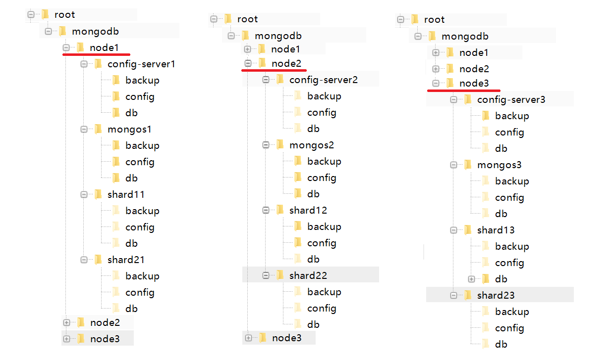

## 分片集群

高数据量和吞吐量的数据库应用会对单机的性能造成较大压力,大的查询量会将单机的CPU耗尽,大的数据量对单机的存储压力较大,最终会耗尽系统的内存而将压力转移到磁盘IO上。

　　为了解决这些问题,有两个基本的方法: 垂直扩展和水平扩展。

　　　　垂直扩展：增加更多的CPU和存储资源来扩展容量。

　　　　水平扩展：将数据集分布在多个服务器上。水平扩展即分片。

### 原理介绍

分片（sharding）是MongoDB用来将大型集合分割到不同服务器（或者说一个集群）上所采用的方法。

例如，如果数据库1tb的数据集，并有4个分片，然后每个分片可能仅持有256 GB的数据。如果有40个分片，那么每个切分可能只有25GB的数据。

 

MongoDB中数据的分片是以集合为基本单位的，集合中的数据通过片键（Shard key）被分成多部分。其实片键就是在集合中选一个键，用该键的值作为数据拆分的依据。

一般片键采用范围或哈希的方式进行分片。

### 集群搭建

#### 环境准备

先创建一个如下的目录结果:

* 在root目录下创建mongodb目录。内部依次创建文件夹（node1，node2，node3）。
* 在node1文件夹下创建：config-server1，mongos1，shard11，shard21文件夹
  * config-server1目录下创建backup，config，db文件夹
  * mongos1，shard11，shard21同上创建
* 在node2和node3文件夹下创建



#### 配置服务

##### 创建容器

进入node1，node2，node3的config-serverx目录。执行docker命令创建并启动docker容器

**配置服务1**

```shell
#进入目录
cd /root/mongodb/node1/config-server1
#创建并启动容器。
docker run --restart=always --privileged=true -p 10021:27019 -v $PWD/config:/etc/mongod -v $PWD/db:/data/db -d --name pro-file-server-config1 mongo:4.0.0 -f /etc/mongod/config.conf --configsvr --replSet "rs-file-server-config-server" --bind_ip_all
```

**配置服务2**

```shell
#进入目录
cd /root/mongodb/node2/config-server2
#创建并启动容器。
docker run --restart=always --privileged=true -p 10022:27019 -v $PWD/config:/etc/mongod -v $PWD/db:/data/db -d --name pro-file-server-config2 mongo:4.0.0 -f /etc/mongod/config.conf --configsvr --replSet "rs-file-server-config-server" --bind_ip_all
```

**配置服务2**

```shell
#进入目录
cd /root/mongodb/node3/config-server3
#创建并启动容器。
docker run --restart=always --privileged=true -p 10023:27019 -v $PWD/config:/etc/mongod -v $PWD/db:/data/db -d --name pro-file-server-config3 mongo:4.0.0 -f /etc/mongod/config.conf --configsvr --replSet "rs-file-server-config-server" --bind_ip_all`
```

##### 配置Mongo

**将3个配置服务关联到一起**

通过docker进入任意一台config-server配置三台服务器之间的联系

```shell
#进入pro-file-server-config1配置服务器
docker exec -it pro-file-server-config1 /bin/bash
#连接mongo 配置服务器暴露的默认端口为27019
mongo -port 27019
#执行配置内容
rs.initiate({
_id: "rs-file-server-config-server",
configsvr: true,
members: [
{ _id : 0,host : "192.168.136.163:10021" },
{ _id : 1,host : "192.168.136.163:10022" },
{ _id : 2, host : "192.168.136.163:10023" }
]
});
#查看状态
rs.status()
```

#### 路由服务

##### 创建容器

**mongos1**

```shell
#进入目录
cd /root/mongodb/node1/mongos1
#创建并启动容器。
docker run --restart=always --privileged=true -p 10011:27017 -v $PWD/config:/etc/mongod -v $PWD/db:/data/db -d --entrypoint mongos --name pro-file-server-mongos1 mongo:4.0.0 -f /etc/mongod/config.conf --configdb rs-file-server-config-server/192.168.50.100:10021,192.168.50.100:10022,192.168.50.100:10023 --bind_ip_all
```

**mongos2**

```shell
#进入目录
cd /root/mongodb/node2/mongos2
#创建并启动容器。
docker run --restart=always --privileged=true -p 10012:27017 -v $PWD/config:/etc/mongod -v $PWD/db:/data/db -d --entrypoint mongos --name pro-file-server-mongos2 mongo:4.0.0 -f /etc/mongod/config.conf --configdb rs-file-server-config-server/192.168.50.100:10021,192.168.50.100:10022,192.168.50.100:10023 --bind_ip_all
```


**mongos3**

```shell
#进入目录
cd /root/mongodb/node3/mongos3
#创建并启动容器。
docker run --restart=always --privileged=true -p 10013:27017 -v $PWD/config:/etc/mongod -v $PWD/db:/data/db -d --entrypoint mongos --name pro-file-server-mongos3 mongo:4.0.0 -f /etc/mongod/config.conf --configdb rs-file-server-config-server/192.168.50.100:10021,192.168.50.100:10022,192.168.50.100:10023 --bind_ip_all
```

##### 配置Mongo

通过docker进入任意一台mongos配置三台服务器之间的联系

```shell
#进入pro-file-server-mongos1服务器
docker exec -it pro-file-server-mongos1 /bin/bash
#连接mongo
mongo -port 27018
#执行配置内容
sh.addShard("rs-file-server-shard1-server/192.168.136.163:10031,192.168.136.163:10032,192.168.136.163:10033")
sh.addShard("rs-file-server-shard2-server192.168.136.163:10041,192.168.136.163:10042,192.168.136.163:10043")
```

#### 分片服务

##### 创建容器

分片服务share11

```shell
cd /root/mongodb/node1/shard21
docker run --restart=always --privileged=true -p 10041:27018 -v $PWD/config:/etc/mongod -v $PWD/backup:/data/backup -v $PWD/db:/data/db -d --name pro-file-server-shard21 mongo:4.0.0 -f /etc/mongod/config.conf --shardsvr --replSet "rs-file-server-shard2-server" --bind_ip_all
```

分片服务share12

```shell
cd /root/mongodb/node2/shard22
docker run --restart=always --privileged=true -p 10042:27018 -v $PWD/config:/etc/mongod -v $PWD/backup:/data/backup -v $PWD/db:/data/db -d --name pro-file-server-shard22 mongo:4.0.0 -f /etc/mongod/config.conf --shardsvr --replSet "rs-file-server-shard2-server" --bind_ip_all
```

分片服务share13

```shell
cd /root/mongodb/node3/shard23
docker run --restart=always --privileged=true -p 10043:27018 -v $PWD/config:/etc/mongod -v $PWD/backup:/data/backup -v $PWD/db:/data/db -d --name pro-file-server-shard23 mongo:4.0.0 -f /etc/mongod/config.conf --shardsvr --replSet "rs-file-server-shard2-server" --bind_ip_all
```

##### 配置Mongo

通过docker进入任意一台share配置三台服务器之间的联系

```shell
#进入pro-file-server-shard21服务器
docker exec -it pro-file-server-shard21 /bin/bash
#连接mongo
mongo -port 27018
#执行配置内容
`rs.initiate({
_id: "rs-file-server-shard2-server",
members: [
{ _id : 0, host : "192.168.136.163:10041" },
{ _id : 1, host : "192.168.136.163:10042" },
{ _id : 2, host : "192.168.136.163:10043" }
]
});`
#查看状态
rs.status()
```

#### 分片配置

```shell
#mongodb客户端连接
mongo 192.168.136.163:10011

#创建分片数据库test
sh.enableSharding("test")

#将collection加入分片并设置分片字段
sh.shardCollection("test.user", {"_id": "hashed" })
```

### 服务器说明

路由服务

| IP              | 端口  |
| --------------- | ----- |
| 192.168.136.163 | 10011 |
| 192.168.136.163 | 10012 |
| 192.168.136.163 | 10013 |

配置服务

| IP              | 端口  |
| --------------- | ----- |
| 192.168.136.163 | 10021 |
| 192.168.136.163 | 10022 |
| 192.168.136.163 | 10023 |

分片服务

| 分片服务01            | 分片服务02            |
| --------------------- | --------------------- |
| 192.168.136.163:10031 | 192.168.136.163:10041 |
| 192.168.136.163:10032 | 192.168.136.163:10042 |
| 192.168.136.163:10033 | 192.168.136.163:10043 |

