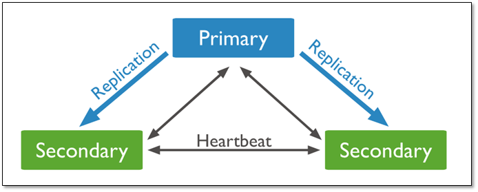
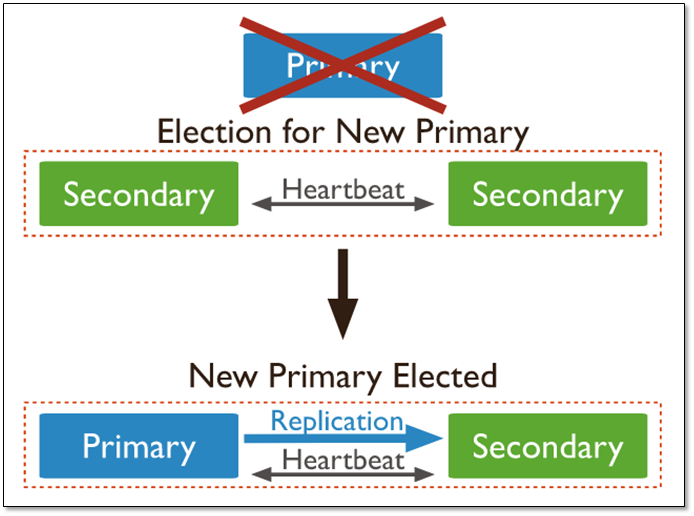
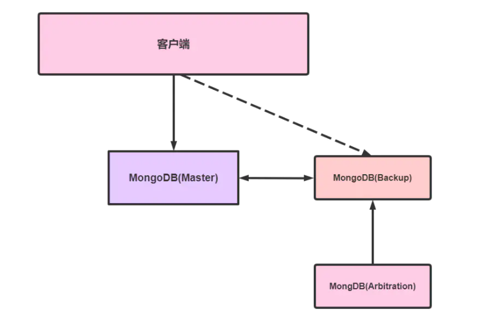

## 副本集群

对于中小型项目，使用副本集群就够了。

一个主，两个从库组成，主库宕机时，这两个从库都可以被选为主库。

 

当主库宕机后,两个从库都会进行竞选，其中一个变为主库，当原主库恢复后，作为从库加入当前的复制集群即可。

 

### 原理解释



Master:代表主节点，主节点提供所有数据的CRUD服务

Backup:代表从节点，从节点不提供任何服务

Arbitration:代表仲裁节点，仲裁节点不存储任何数据，其主要作用就是当主节点挂掉以后，把那个备份节点提升为一个主节点。

### 集群搭建

**创建容器**

```shell
docker run -di --name=master_mongo  -p 27017:27017 mongo:4.0.3  --replSet mongo_clus 
docker run -di --name=backup_mongo1 -p 27018:27017 mongo:4.0.3  --replSet mongo_clus 
docker run -di --name=backup_mongo2 -p 27019:27017 mongo:4.0.3  --replSet mongo_clus
```

 设置副本集名称，也就是设置集群名称，必须要设置，否则没法构建集群

**配置**

进入`master_mongo`容器中

```shell
docker exec  -it master_mongo /bin/bash
```

登录`Mongo`

```shell
mongo -port 27017
```

创建集群

```shell
cfg={
  "_id":"mongo_clus",
  members:[{
      _id:0,
      host:"192.168.136.161:27017",
      priority:2
  },{
      _id:1,
      host:"192.168.136.161:27018",
      priority:1
  },{
      _id:2,
      host:"192.168.136.161:27019",
      priority:2
  }]
}
rs.initiate(cfg)
```

注意修改ip地址
