##   1、首页推荐

 中

### 1.1、接口分析

地址：http://192.168.136.160:3000/project/19/interface/api/118

 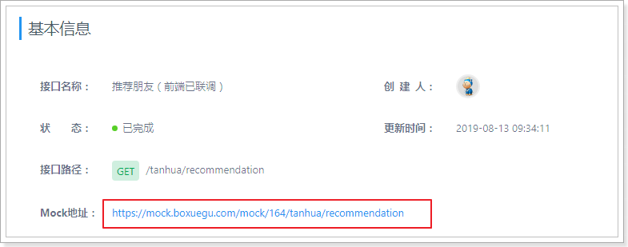

 

响应：

~~~json
{
    "counts": 4698,
    "pagesize": 20,
    "pages": 58,
    "page": 16,
    "items": [
        {
            "id": 1011,
            "avatar": "assets/images/avatar_2.png",
            "nickname": "黑马小妹",
            "gender": "woman",
            "age": 23,
            "tags": [
                "本科",
                "年龄相仿",
                "单身"
            ],
            "fateValue": 96
        },
        {
            "id": 2495,
            "avatar": "assets/images/avatar_1.png",
            "nickname": "米朵妹妹",
            "gender": "man",
            "age": 28,
            "tags": [
                "年龄相仿",
                "本科",
                "单身"
            ],
            "fateValue": 87
        },
        {
            "id": 5708,
            "avatar": "assets/images/avatar_4.png",
            "nickname": "黑马小妹",
            "gender": "man",
            "age": 24,
            "tags": [
                "单身",
                "本科",
                "年龄相仿"
            ],
            "fateValue": 94
        },
        {
            "id": 4768,
            "avatar": "assets/images/avatar_3.png",
            "nickname": "黑马小妹",
            "gender": "man",
            "age": 24,
            "tags": [
                "年龄相仿",
                "单身",
                "本科"
            ],
            "fateValue": 80
        }
    ]
}
~~~

### 1.2、功能实现

#### 1.2.1 controller

`TanhuaController`编写推荐列表方法

```java
/**
 * 查询分页推荐好友列表
 */
@GetMapping("/recommendation")
public ResponseEntity recommendation(RecommendUserDto dto) {
    PageResult pr = tanhuaService.recommendation(dto);
    return ResponseEntity.ok(pr);
}
```

#### 1.2.2 service

`TanhuaService`编写推荐列表方法

```java
//查询分页推荐好友列表
public PageResult recommendation(RecommendUserDto dto) {
    //1、获取用户id
    Long userId = UserHolder.getUserId();
    //2、调用recommendUserApi分页查询数据列表（PageResult -- RecommendUser）
    PageResult pr = recommendUserApi.queryRecommendUserList(dto.getPage(),dto.getPagesize(),userId);
    //3、获取分页中的RecommendUser数据列表
    List<RecommendUser> items = (List<RecommendUser>) pr.getItems();
    //4、判断列表是否为空
    if(items == null || items.size() <=0) {
        return pr;
    }
    //5、提取所有推荐的用户id列表
    List<Long> ids = CollUtil.getFieldValues(items, "userId", Long.class);
    UserInfo userInfo = new UserInfo();
    userInfo.setAge(dto.getAge());
    userInfo.setGender(dto.getGender());
    //6、构建查询条件，批量查询所有的用户详情
    Map<Long, UserInfo> map = userInfoApi.findByIds(ids, userInfo);
    //7、循环推荐的数据列表，构建vo对象
    List<TodayBest> list = new ArrayList<>();
    for (RecommendUser item : items) {
        UserInfo info = map.get(item.getUserId());
        if(info!=null) {
            TodayBest vo = TodayBest.init(info, item);
            list.add(vo);
        }
    }
    //8、构造返回值
    pr.setItems(list);
    return pr;
}
```

#### 1.2.3 API接口

在`RecommendUserApi` 接口和`RecommendUserApiImpl`实现类中添加方法查询

```java
//分页查询
public PageResult queryRecommendUserList(Integer page, Integer pagesize, Long toUserId) {
    //1、构建Criteria对象
    Criteria criteria = Criteria.where("toUserId").is(toUserId);
    //2、创建Query对象
    Query query = Query.query(criteria).with(Sort.by(Sort.Order.desc("score"))).limit(pagesize)
            .skip((page - 1) * pagesize);
    //3、调用mongoTemplate查询
    List<RecommendUser> list = mongoTemplate.find(query, RecommendUser.class);
    long count = mongoTemplate.count(query, RecommendUser.class);
    //4、构建返回值PageResult
    return  new PageResult(page,pagesize,count,list);
}
```

#### 1.2.4 请求dto对象

```java
import lombok.AllArgsConstructor;
import lombok.Data;
import lombok.NoArgsConstructor;

@Data
@NoArgsConstructor
@AllArgsConstructor
public class RecommendUserDto {

    private Integer page = 1; //当前页数
    private Integer pagesize = 10; //页尺寸
    private String gender; //性别 man woman
    private String lastLogin; //近期登陆时间
    private Integer age; //年龄
    private String city; //居住地
    private String education; //学历
}

```


## 2、MongoDB集群

## 3、圈子功能

### 2.1、功能说明

探花交友项目中的圈子功能，类似微信的朋友圈，基本的功能为：发布动态、浏览好友动态、浏览推荐动态、点赞、评论、喜欢等功能。

 

发布：

 

### 1.2、实现方案分析

对于圈子功能的实现，我们需要对它的功能特点做分析：

- 数据量会随着用户数增大而增大
- 读多写少
- 非好友看不到其动态内容
- ……

针对以上特点，我们来分析一下：

- 对于数据量大而言，显然不能够使用关系型数据库进行存储，我们需要通过MongoDB进行存储
- 对于读多写少的应用，需要减少读取的成本
  - 比如说，一条SQL语句，单张表查询一定比多张表查询要快
- 对于每个人数据在存储层面最好做到相互隔离，这样的话就不会有影响

#### 1.2.1 单点问题分析

- 单机Mongodb并不适用于企业场景，存在两个问题亟需解决
  - 单点故障
    单一MongoDB提供服务，在服务器宕机时造成整体应用崩溃
  - 海量数据存储
    单一MongoDB，并不能支持海量数据存储

#### 三种集群形式

- 为了解决单点故障和海量数据存储问题，MongoDB提供了三种集群形式来支持
  - Master-Slaver（主从集群）： 是一种主从副本的模式，目前已经不推荐使用
  - Replica Set （副本集群）：多个服务器存储相同的数据保证可靠性。模式取代了 Master-Slaver 模式，是一种互为主从的关系。可以解决单点故障问题，适用于中小型应用（数据量适中），故障转移，读写分离。
  - Sharding （分片集群）：可以解决单点故障和海量数据存储问题

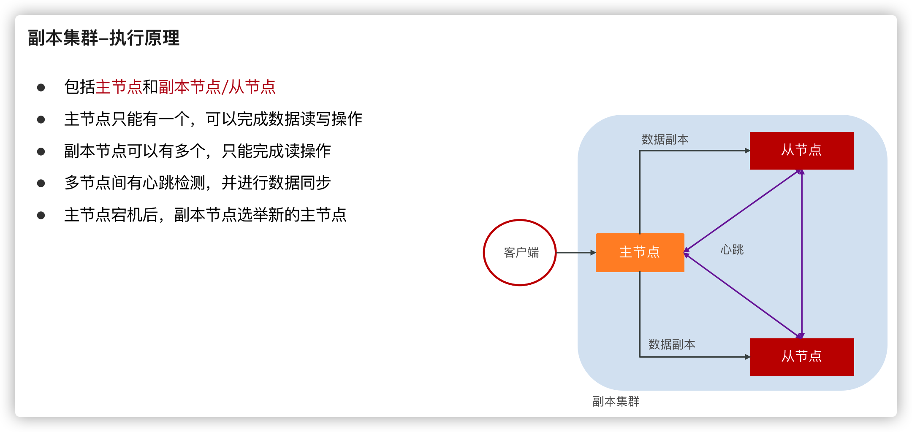

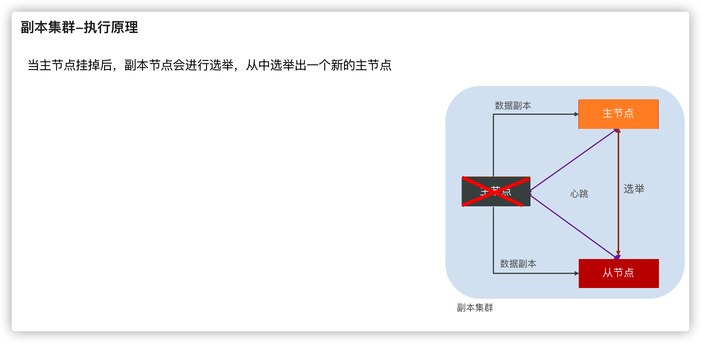

---

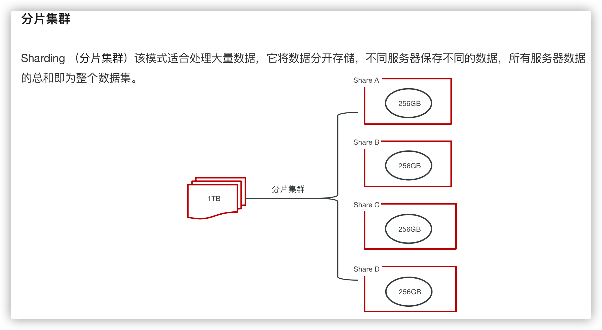

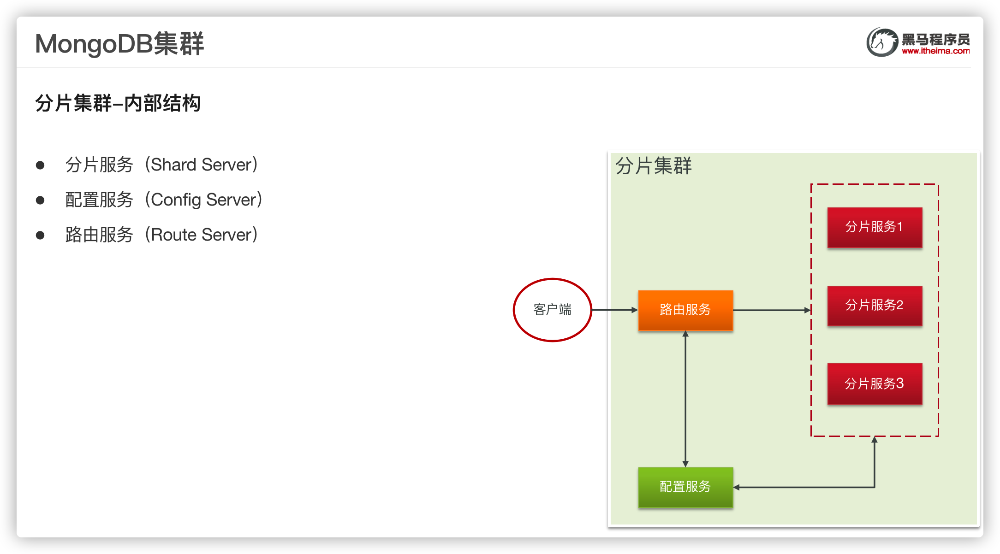

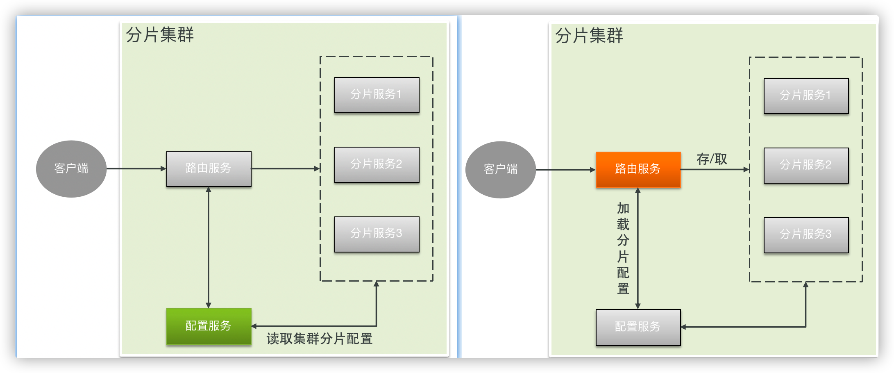

为了保证每个服务的高可用，需要服务配置副本集群，这里仅以单节点为例

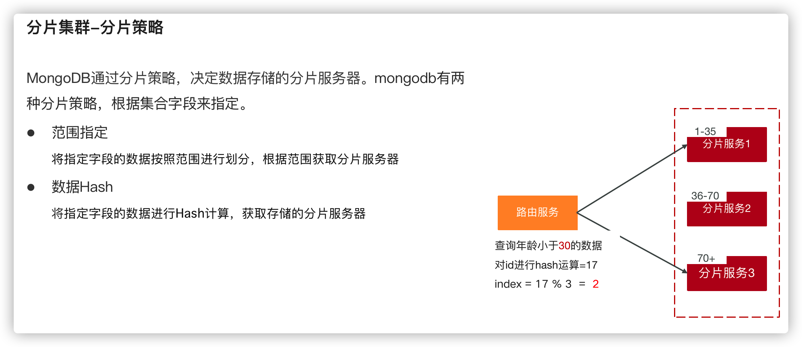


### 1.3、技术方案(重点)

表结构设计：

- 查看个人发布的动态
- 查看好友发布的动态
- 后续版本指定好友可见/不可见

**所以对于存储而言，主要是核心的4张表：**

- 发布表：记录了所有用户的发布的东西信息，如图片、视频等。
- 自己时间线：相册是每个用户独立的，记录了该用户所发布的所有内容。
- 好友时间线：所谓“刷朋友圈”，就是刷时间线，就是一个用户所有的朋友的发布内容。
- 好友表：记录好友关系

根据之前我们的分析，对于技术方案而言，将采用MongoDB+Redis来实现，其中MongoDB负责存储，Redis负责缓存数据。

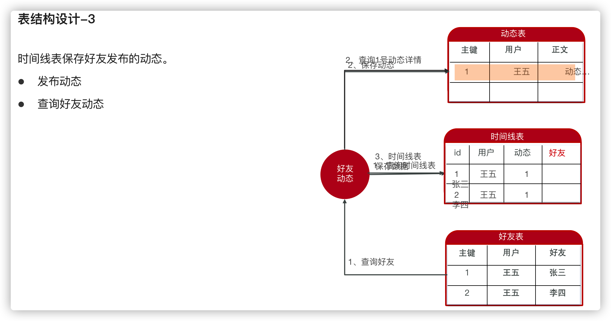

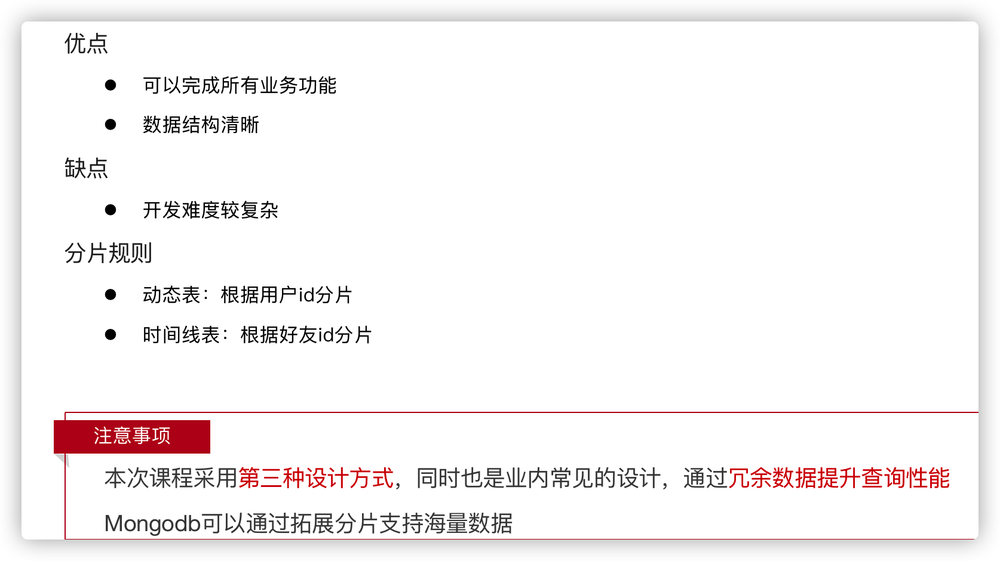

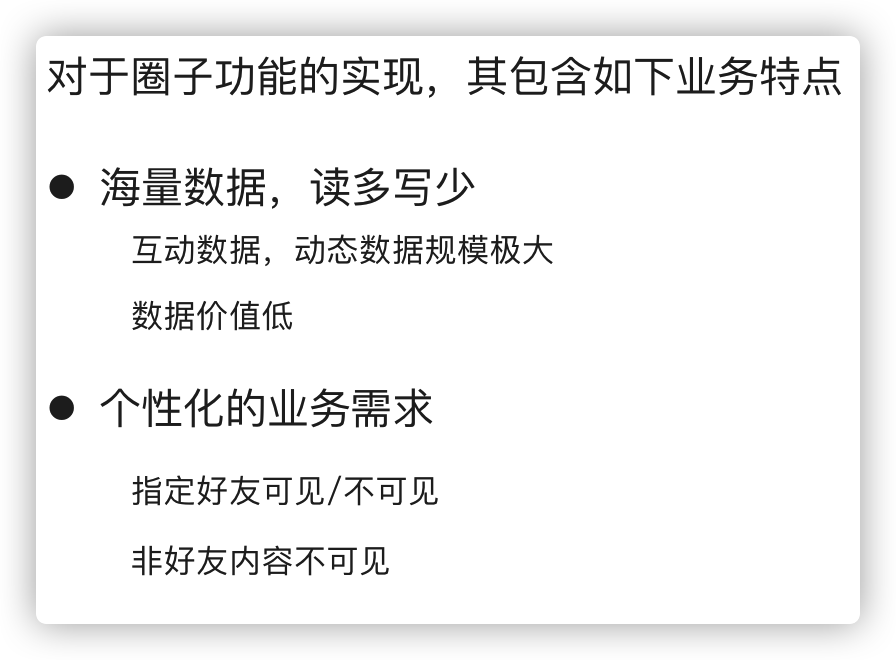

### 1.4、表结构设计

> **发布表：动态总记录表（记录每个人发送的动态详情）**

~~~json
#表名：movement
{
    "_id": ObjectId("5e82dc416401952928c211d8"),
    "pid": NumberLong("10064"),
    "userId": NumberLong("6"),
    "textContent": "最悲伤却又是最痛苦的谎言，就是我还好，没有关系。",
    "medias": [
        "https://tanhua-dev.oss-cn-zhangjiakou.aliyuncs.com/photo/7/1.jpg",
        "https://tanhua-dev.oss-cn-zhangjiakou.aliyuncs.com/photo/7/1564567349498.jpg",
        "https://tanhua-dev.oss-cn-zhangjiakou.aliyuncs.com/photo/7/1564567352977.jpg",
        "https://tanhua-dev.oss-cn-zhangjiakou.aliyuncs.com/photo/7/1564567360406.jpg"
    ],
    "longitude": "121.588627",
    "latitude": "30.935781",
    "state": NumberInt("0"),
    "locationName": "中国上海市奉贤区人民路445弄",
    "created": NumberLong("1585634369493"),
    "_class": "com.tanhua.dubbo.server.pojo.Publish"
}
~~~

> **好友时间线表：记录当前好友发布的动态数据**

~~~json
#表名：movement_timeline
{
    "_id": ObjectId("609cf6538743d448c02c61f0"),
    "movementId": ObjectId("609cf6538743d448c02c61ef"),
    "userId": NumberLong("106"),
    "friendId": NumberLong("1"),
    "created": NumberLong("1620899411043"),
    "_class": "com.tanhua.model.mongo.MovementTimeLine"
}

~~~

> **好友关系表：记录好友的双向关系（双向）**

~~~json
#表名：friend
{
    "_id": ObjectId("6018bc055098b2230031e2da"),
    "created": NumberLong("1612233733056"),
    "userId": NumberLong("1"),
    "friendId": NumberLong("106"),
    "_class": "com.itheima.domain.mongo.Friend"
}
~~~

## 4、圈子实现 

### 3.1、环境搭建

Mongodb中实现字段的自增：两种解决方法（1、使用redis保证自动增长，2、使用mongodb自定义表）

#### 3.1.1、mongo主键自增

> 第一步：创建实体类

```java
package com.tanhua.domain.mongo;

import lombok.AllArgsConstructor;
import lombok.Data;
import lombok.NoArgsConstructor;
import org.bson.types.ObjectId;
import org.springframework.data.annotation.Id;
import org.springframework.data.mongodb.core.mapping.Document;
import org.springframework.data.mongodb.core.mapping.Field;

@Document(collection = "sequence")
@Data
@AllArgsConstructor
@NoArgsConstructor
public class Sequence {

    private ObjectId id;

    private long seqId; //自增序列

    private String collName;  //集合名称
}
```

> 第二步：编写service

```java
package com.tanhua.dubbo.utils;

import com.tanhua.domain.mongo.Sequence;
import org.springframework.beans.factory.annotation.Autowired;
import org.springframework.data.mongodb.core.FindAndModifyOptions;
import org.springframework.data.mongodb.core.MongoTemplate;
import org.springframework.data.mongodb.core.query.Criteria;
import org.springframework.data.mongodb.core.query.Query;
import org.springframework.data.mongodb.core.query.Update;
import org.springframework.stereotype.Component;

@Component
public class IdWorker {

    @Autowired
    private MongoTemplate mongoTemplate;

    public Long getNextId(String collName) {
        Query query = new Query(Criteria.where("collName").is(collName));

        Update update = new Update();
        update.inc("seqId", 1);

        FindAndModifyOptions options = new FindAndModifyOptions();
        options.upsert(true);
        options.returnNew(true);

        Sequence sequence = mongoTemplate.findAndModify(query, update, options, Sequence.class);
        return sequence.getSeqId();
    }
}

```

#### 3.1.2、实体类

写到tanhua-domain工程中：

##### Movement

Movement：发布信息表（总记录表数据）

~~~java
package com.tanhua.domain.mongo;

import lombok.AllArgsConstructor;
import lombok.Data;
import lombok.NoArgsConstructor;
import org.bson.types.ObjectId;
import org.springframework.data.mongodb.core.mapping.Document;

import java.util.List;

//动态详情表
@Data
@NoArgsConstructor
@AllArgsConstructor
@Document(collection = "movement")
public class Movement implements java.io.Serializable {


    private ObjectId id; //主键id
    private Long pid; //Long类型，用于推荐系统的模型(自动增长)
    private Long created; //发布时间
    private Long userId;
    private String textContent; //文字
    private List<String> medias; //媒体数据，图片或小视频 url
    private String longitude; //经度
    private String latitude; //纬度
    private String locationName; //位置名称
    private Integer state = 0;//状态 0：未审（默认），1：通过，2：驳回
}
~~~

##### MovementTimeLine

MovementTimeLine：好友时间线表，用于存储好友发布（或推荐）的数据，每一个用户一张表进行存储

~~~java
package com.tanhua.domain.mongo;

import lombok.AllArgsConstructor;
import lombok.Data;
import lombok.NoArgsConstructor;
import org.bson.types.ObjectId;
import org.springframework.data.mongodb.core.mapping.Document;

/**
 * 好友时间线表，用于存储好友发布的数据
 */
@Data
@NoArgsConstructor
@AllArgsConstructor
@Document(collection = "movement_timeLine")
public class MovementTimeLine implements java.io.Serializable {

    private static final long serialVersionUID = 9096178416317502524L;
    private ObjectId id;
    private ObjectId movementId;//动态id
    private Long userId;   //发布动态用户id
    private Long friendId; // 可见好友id
    private Long created; //发布的时间
}

~~~

##### Friend

Friend  好友关系表

~~~java
package com.tanhua.domain.mongo;

import lombok.AllArgsConstructor;
import lombok.Data;
import lombok.NoArgsConstructor;
import org.bson.types.ObjectId;
import org.springframework.data.mongodb.core.mapping.Document;

/**
 * 好友表:好友关系表
 */
@Data
@NoArgsConstructor
@AllArgsConstructor
@Document(collection = "friend")
public class Friend implements java.io.Serializable{

    private static final long serialVersionUID = 6003135946820874230L;
    private ObjectId id;
    private Long userId; //用户id
    private Long friendId; //好友id
    private Long created; //时间

}

~~~

#### 3.1.3、API接口

```java
package com.tanhua.dubbo.api.mongo;

import com.tanhua.domain.mongo.Publish;
import com.tanhua.domain.vo.PageResult;

public interface MovementApi {

}
```

#### 3.1.4、API实现类

```java
package com.tanhua.dubbo.api.mongo;

import com.tanhua.domain.mongo.*;
import com.tanhua.domain.vo.PageResult;
import com.tanhua.dubbo.utils.IdService;
import org.apache.dubbo.config.annotation.Service;
import org.bson.types.ObjectId;
import org.springframework.beans.factory.annotation.Autowired;
import org.springframework.data.domain.PageRequest;
import org.springframework.data.domain.Pageable;
import org.springframework.data.domain.Sort;
import org.springframework.data.mongodb.core.MongoTemplate;
import org.springframework.data.mongodb.core.query.Criteria;
import org.springframework.data.mongodb.core.query.Query;

import java.util.ArrayList;
import java.util.List;

@Service
public class MovementApiImpl implements PublishApi {

}
```

#### 3.1.5、MovementsController

```java
package com.tanhua.server.controller;

import com.tanhua.domain.mongo.Publish;
import com.tanhua.server.service.MovementsService;
import org.springframework.beans.factory.annotation.Autowired;
import org.springframework.http.ResponseEntity;
import org.springframework.web.bind.annotation.*;
import org.springframework.web.multipart.MultipartFile;

import java.io.IOException;

@RestController
@RequestMapping("/movements")
public class MovementsController {

    @Autowired
    private MovementsService movementsService;

}
```

#### 3.1.6、MovementsService

```java
package com.tanhua.server.service;

import com.tanhua.autoconfig.templates.OssTemplate;
import com.tanhua.domain.db.UserInfo;
import com.tanhua.domain.mongo.Publish;
import com.tanhua.domain.vo.Movements;
import com.tanhua.domain.vo.PageResult;
import com.tanhua.dubbo.api.UserInfoApi;
import com.tanhua.dubbo.api.mongo.PublishApi;
import com.tanhua.server.interceptor.UserHolder;
import io.jsonwebtoken.lang.Collections;
import org.apache.dubbo.config.annotation.Reference;
import org.springframework.beans.BeanUtils;
import org.springframework.beans.factory.annotation.Autowired;
import org.springframework.http.ResponseEntity;
import org.springframework.stereotype.Service;
import org.springframework.util.StringUtils;
import org.springframework.web.multipart.MultipartFile;

import java.io.IOException;
import java.text.SimpleDateFormat;
import java.util.*;

@Service
public class MovementsService {

    @Autowired
    private OssTemplate ossTemplate;

    @DubboReference
    private MovementApi movementApi;

    @DubboReference
    private UserInfoApi userInfoApi;

    @Autowired
    private RedisTemplate<String,String> redisTemplate;
}
```

### 3.2、发布动态

后续的测试：使用106（13800138000）和1号用户（13500000000）

#### 3.2.0、思路步骤

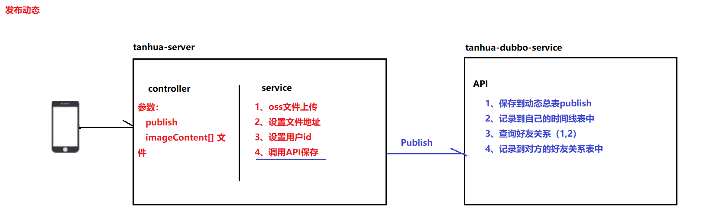

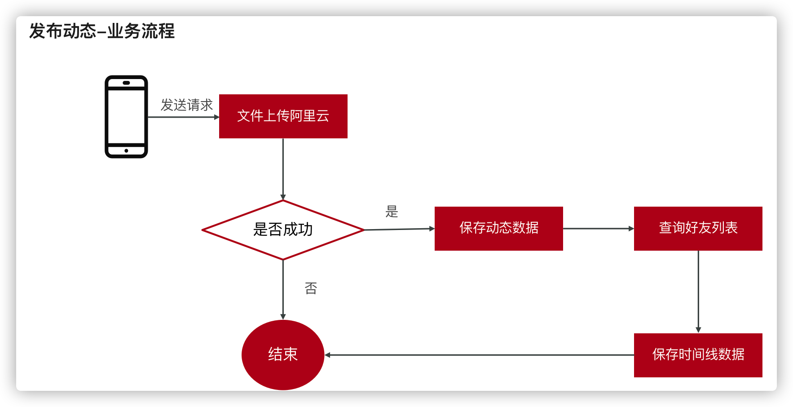

#### 3.2.1、MovementsController

`tanhua-server`工程编写MovementsController，完成发布动态功能

```java
@RestController
@RequestMapping("/movements")
public class MovementController {

    @Autowired
    private MovementService movementService;

    @Autowired
    private CommentsService commentsService;

    /**
     * 发布动态
     */
    @PostMapping
    public ResponseEntity movements(Movement movement,
                                    MultipartFile imageContent[]) throws IOException {
        movementService.publishMovement(movement,imageContent);
        return ResponseEntity.ok(null);
    }
}
```

#### 3.2.2、编写service

`tanhua-server`工程编写MovementsService，完成发布动态功能

```java
/**
 * 发布动态
 */
public void publishMovement(Movement movement, MultipartFile[] imageContent) throws IOException {
    //1、判断发布动态的内容是否存在
    if(StringUtils.isEmpty(movement.getTextContent())) {
        throw  new BusinessException(ErrorResult.contentError());
    }
    //2、获取当前登录的用户id
    Long userId = UserHolder.getUserId();
    //3、将文件内容上传到阿里云OSS，获取请求地址
    List<String> medias = new ArrayList<>();
    for (MultipartFile multipartFile : imageContent) {
        String upload = ossTemplate.upload(multipartFile.getOriginalFilename(), multipartFile.getInputStream());
        medias.add(upload);
    }
    //4、将数据封装到Movement对象
    movement.setUserId(userId);
    movement.setMedias(medias);
    //5、调用API完成发布动态
    movementApi.publish(movement);
}
```

#### 3.2.3、API层

```java
package com.tanhua.dubbo.api;

import com.tanhua.dubbo.utils.IdWorker;
import com.tanhua.dubbo.utils.TimeLineService;
import com.tanhua.model.mongo.Movement;
import com.tanhua.model.vo.PageResult;
import org.apache.dubbo.config.annotation.DubboService;
import org.springframework.beans.factory.annotation.Autowired;
import org.springframework.data.domain.Sort;
import org.springframework.data.mongodb.core.MongoTemplate;
import org.springframework.data.mongodb.core.query.Criteria;
import org.springframework.data.mongodb.core.query.Query;

import java.util.List;

@DubboService
public class MovementApiImpl implements MovementApi{

    @Autowired
    private MongoTemplate mongoTemplate;

    @Autowired
    private IdWorker idWorker;

    @Autowired
    private TimeLineService timeLineService;

    //发布动态
    public void publish(Movement movement) {
        //1、保存动态详情
        try {
            //设置PID
            movement.setPid(idWorker.getNextId("movement"));
            //设置时间
            movement.setCreated(System.currentTimeMillis());
            //movement.setId(ObjectId.get());
            mongoTemplate.save(movement);
//            //2、查询当前用户的好友数据
//            Criteria criteria = Criteria.where("userId").is(movement.getUserId());
//            Query query = Query.query(criteria);
//            List<Friend> friends = mongoTemplate.find(query, Friend.class);
//            Thread.sleep(10000);
//            //3、循环好友数据，构建时间线数据存入数据库
//            for (Friend friend : friends) {
//                MovementTimeLine timeLine = new MovementTimeLine();
//                timeLine.setMovementId(movement.getId());
//                timeLine.setUserId(friend.getUserId());
//                timeLine.setFriendId(friend.getFriendId());
//                timeLine.setCreated(System.currentTimeMillis());
//                mongoTemplate.save(timeLine);
//            }
            timeLineService.saveTimeLine(movement.getUserId(),movement.getId());
        } catch (Exception e) {
            //忽略事务处理
            e.printStackTrace();
        }
    }
}
```

#### 3.2.4、异步处理工具类

大量的时间线数据同步写入的问题如何解决？

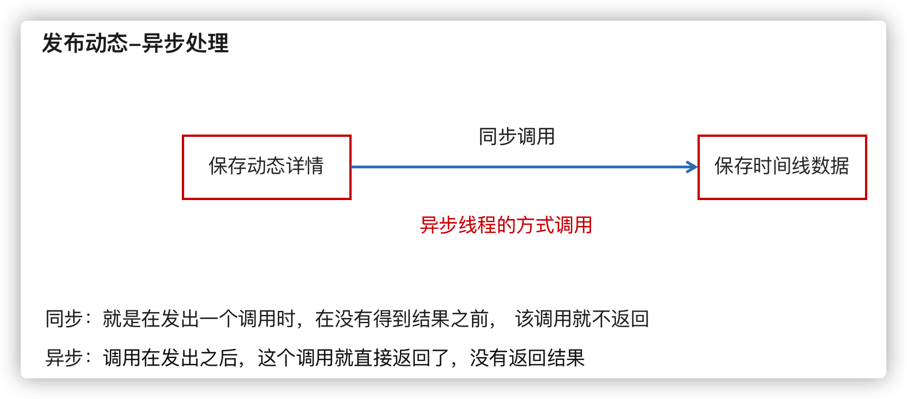

@Async： Spring提供的异步处理注解，被此注解标注的方法会在新的线程中执行，其实就相当于我们自己new Thread。

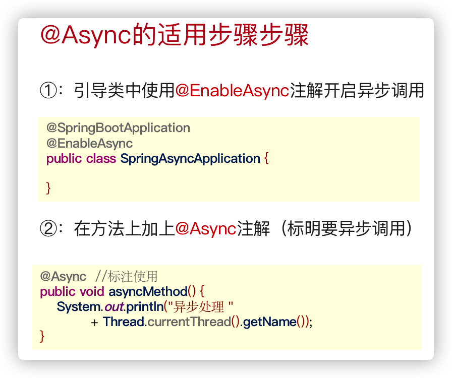

```java
@Component
public class TimeLineService {

    @Autowired
    private MongoTemplate mongoTemplate;

    @Async
    public void saveTimeLine(Long userId, ObjectId movementId) {
        //2、查询当前用户的好友数据
        Criteria criteria = Criteria.where("userId").is(userId);
        Query query = Query.query(criteria);
        List<Friend> friends = mongoTemplate.find(query, Friend.class);
        try {
            Thread.sleep(10000);
        } catch (InterruptedException e) {
            e.printStackTrace();
        }
        //3、循环好友数据，构建时间线数据存入数据库
        for (Friend friend : friends) {
            MovementTimeLine timeLine = new MovementTimeLine();
            timeLine.setMovementId(movementId);
            timeLine.setUserId(friend.getUserId());
            timeLine.setFriendId(friend.getFriendId());
            timeLine.setCreated(System.currentTimeMillis());
            mongoTemplate.save(timeLine);
        }
    }
}
```

#### 3.2.5、整合测试

```java
@RunWith(SpringRunner.class)
@SpringBootTest(classes = AppServerApplication.class)
public class MovementApiTest {

    @DubboReference
    private MovementApi movementApi;

    @Test
    public void testPublish() {
        Movement movement = new Movement();
        movement.setUserId(106l);
        movement.setTextContent("你的酒窝没有酒，我却醉的像条狗");
        List<String> list = new ArrayList<>();
        list.add("https://tanhua-dev.oss-cn-zhangjiakou.aliyuncs.com/images/tanhua/avatar_1.png");
        list.add("https://tanhua-dev.oss-cn-zhangjiakou.aliyuncs.com/images/tanhua/avatar_2.png");
        movement.setMedias(list);
        movement.setLatitude("40.066355");
        movement.setLongitude("116.350426");
        movement.setLocationName("中国北京市昌平区建材城西路16号");
        movementApi.publish(movement);
    }
}
```


### 3.3、查询个人动态

查询好友动态其实就是查询自己的时间线表，好友在发动态时已经将动态信息写入到了自己的时间线表中。

#### 3.3.0、思路分析

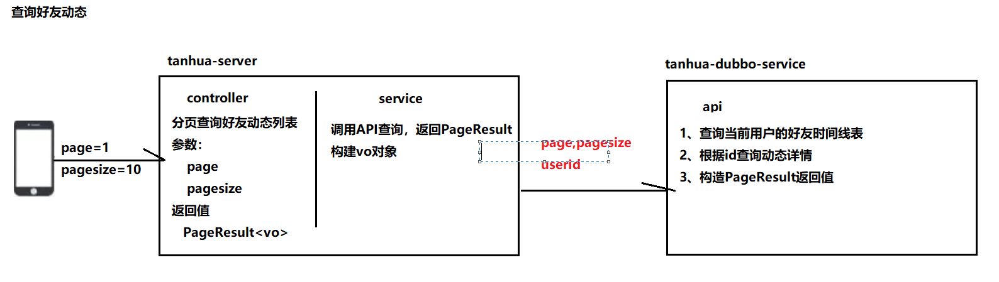

#### 3.3.1、vo对象

~~~java
package com.tanhua.model.vo;

import com.tanhua.model.domain.UserInfo;
import com.tanhua.model.mongo.Movement;
import lombok.AllArgsConstructor;
import lombok.Data;
import lombok.NoArgsConstructor;
import org.springframework.beans.BeanUtils;
import org.springframework.util.StringUtils;

import java.io.Serializable;
import java.text.SimpleDateFormat;
import java.util.Date;

@Data
@NoArgsConstructor
@AllArgsConstructor
public class MovementsVo  implements Serializable {

    private String id; //动态id

    private Long userId; //用户id
    private String avatar; //头像
    private String nickname; //昵称
    private String gender; //性别 man woman
    private Integer age; //年龄
    private String[] tags; //标签


    private String textContent; //文字动态
    private String[] imageContent; //图片动态
    private String distance; //距离
    private String createDate; //发布时间 如: 10分钟前
    private Integer likeCount; //点赞数
    private Integer commentCount; //评论数
    private Integer loveCount; //喜欢数


    private Integer hasLiked; //是否点赞（1是，0否）
    private Integer hasLoved; //是否喜欢（1是，0否）


    public static MovementsVo init(UserInfo userInfo, Movement item) {
        MovementsVo vo = new MovementsVo();
        //设置动态数据
        BeanUtils.copyProperties(item, vo);
        vo.setId(item.getId().toHexString());
        //设置用户数据
        BeanUtils.copyProperties(userInfo, vo);
        if(!StringUtils.isEmpty(userInfo.getTags())) {
            vo.setTags(userInfo.getTags().split(","));
        }
        //图片列表
        vo.setImageContent(item.getMedias().toArray(new String[]{}));
        //距离
        vo.setDistance("500米");
        Date date = new Date(item.getCreated());
        vo.setCreateDate(new SimpleDateFormat("yyyy-MM-dd hh:mm:ss").format(date));
        //设置是否点赞(后续处理)
        vo.setHasLoved(0);
        vo.setHasLiked(0);
        return vo;
    }
}
~~~

#### 3.3.2、controller

修改`MovementsController`完成查询好友动态功能

```java
/**
 * 查询我的动态
 */
@GetMapping("/all")
public ResponseEntity findByUserId(Long userId,
                                   @RequestParam(defaultValue = "1") Integer page,
                                   @RequestParam(defaultValue = "10") Integer pagesize) {
    PageResult pr = movementService.findByUserId(userId,page,pagesize);
    return ResponseEntity.ok(pr);
}
```

#### 3.3.3、service

修改`MovementsService`完成查询好友动态功能

```java
//查询个人动态
public PageResult findByUserId(Long userId, Integer page, Integer pagesize) {
    //1、根据用户id，调用API查询个人动态内容（PageResult  -- Movement）
    PageResult pr = movementApi.findByUserId(userId,page,pagesize);
    //2、获取PageResult中的item列表对象
    List<Movement> items = (List<Movement>) pr.getItems();
    //3、非空判断
    if(items == null) {
        return pr;
    }
    //4、循环数据列表
    UserInfo userInfo = userInfoApi.findById(userId);
    List<MovementsVo> vos = new ArrayList<>();
    for (Movement item : items) {
        //5、一个Movement构建一个Vo对象
        MovementsVo vo = MovementsVo.init(userInfo, item);
        vos.add(vo);
    }
    //6、构建返回值
    pr.setItems(vos);
    return pr;
}
```

#### 3.3.4、API层

修改`PublishApi`和`PublishApiImpl`完成查询好友动态功能

```java
@Override
public PageResult findByUserId(Long userId, Integer page, Integer pagesize) {
    Criteria criteria = Criteria.where("userId").is(userId);
    Query query = Query.query(criteria).skip((page -1 ) * pagesize).limit(pagesize)
            .with(Sort.by(Sort.Order.desc("created")));
    List<Movement> movements = mongoTemplate.find(query, Movement.class);
    return new PageResult(page,pagesize,0l,movements);
}
```

#### 3.3.5、测试

 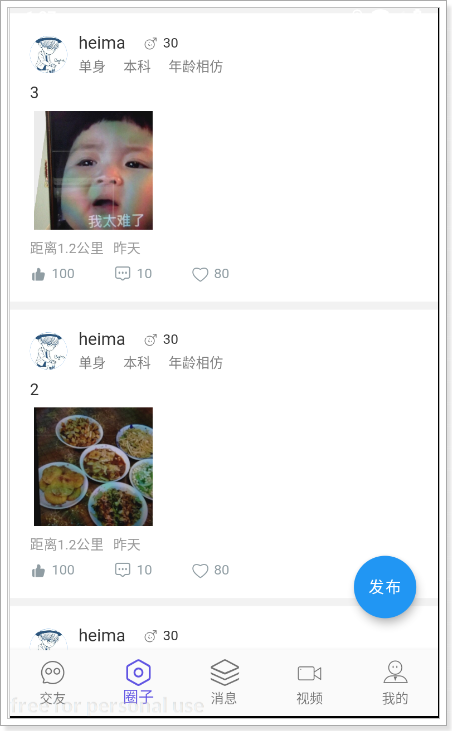

