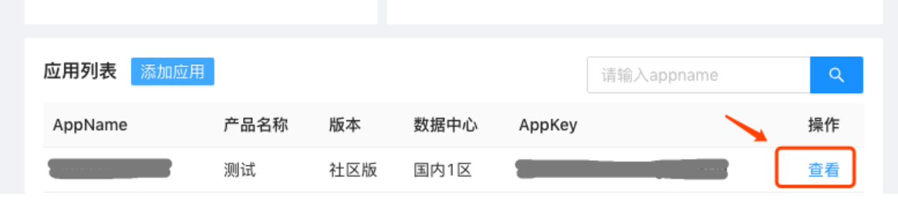

### 安装

如果你的项目使用Maven构建并且spring boot是2.4.3以上版本，可以在pom.xml中添加下面代码：

```xml
<dependency>
    <groupId>com.easemob.im</groupId>
    <artifactId>im-sdk-core</artifactId>
    <version>0.2.5</version>
</dependency>
```

如果你使用的spring-boot是2.4.3以下版本的，还需要在pom.xml中添加:

```xml
<dependencyManagement>
    <dependencies>
        <dependency>
            <groupId>io.netty</groupId>
            <artifactId>netty-bom</artifactId>
            <version>4.1.59.Final</version>
            <type>pom</type>
            <scope>import</scope>
        </dependency>
        <dependency>
            <groupId>io.projectreactor</groupId>
            <artifactId>reactor-bom</artifactId>
            <version>2020.0.4</version>
            <type>pom</type>
            <scope>import</scope>
        </dependency>
    </dependencies>
</dependencyManagement>
```

### 准备

在使用Server SDK之前，需要准备环信appkey、Client ID、ClientSecre。

如果你有环信管理后台账号并创建过应用，请先登录环信管理后台，点击[ 这里](https://console.easemob.com/user/login)，然后到“应用列表” → 点击“查看”即可获取到appkey、Client ID、ClientSecret。



### 使用

[EMService](https://easemob.github.io/easemob-im-server-sdk/com/easemob/im/server/EMService.html)是所有API的入口，可以这样初始化：

```java
EMProperties properties = EMProperties.builder()
        .setAppkey(cliProperties.getAppkey())
        .setClientId(cliProperties.getClientId())
        .setClientSecret(cliProperties.getClientSecret())
        .build();

EMService service = new EMService(properties);
```

根据业务资源，API分为：

- [Attachment](https://easemob.github.io/easemob-im-server-sdk/com/easemob/im/server/api/attachment/AttachmentApi.html) 用于上传下载附件
- [Block](https://easemob.github.io/easemob-im-server-sdk/com/easemob/im/server/api/block/BlockApi.html) 用于限制访问
- [Contact](https://easemob.github.io/easemob-im-server-sdk/com/easemob/im/server/api/contact/ContactApi.html) 用于管理联系人
- [Group](https://easemob.github.io/easemob-im-server-sdk/com/easemob/im/server/api/group/GroupApi.html) 用于管理群组
- [Message](https://easemob.github.io/easemob-im-server-sdk/com/easemob/im/server/api/message/MessageApi.html) 用于发送消息
- [User](https://easemob.github.io/easemob-im-server-sdk/com/easemob/im/server/api/user/UserApi.html) 用于管理用户
- [Room](https://easemob.github.io/easemob-im-server-sdk/com/easemob/im/server/api/room/RoomApi.html) 用于管理聊天室


