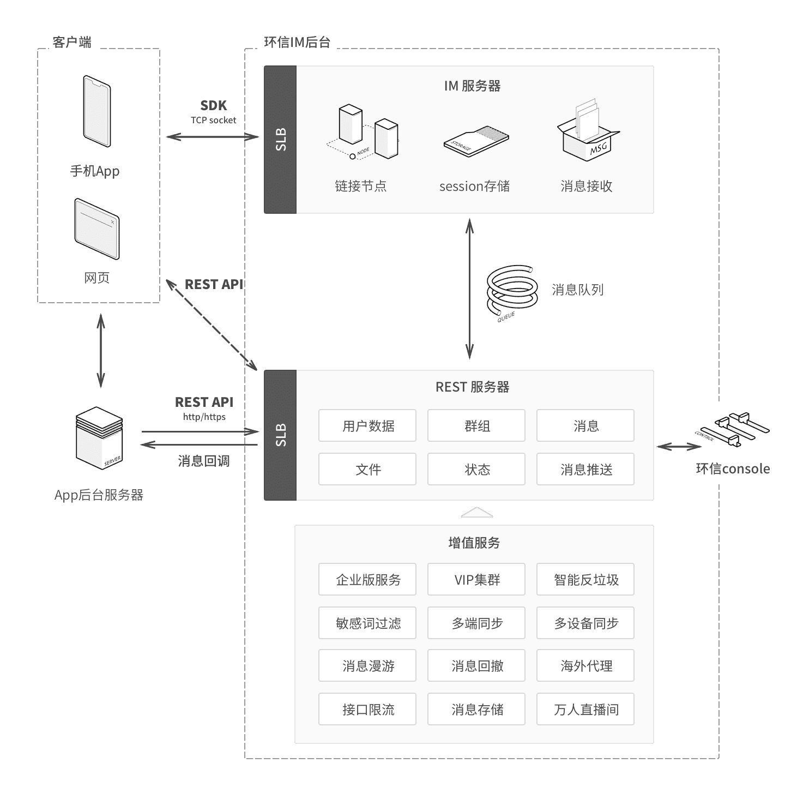
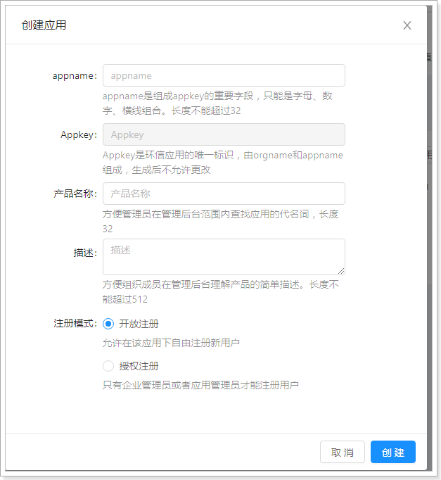
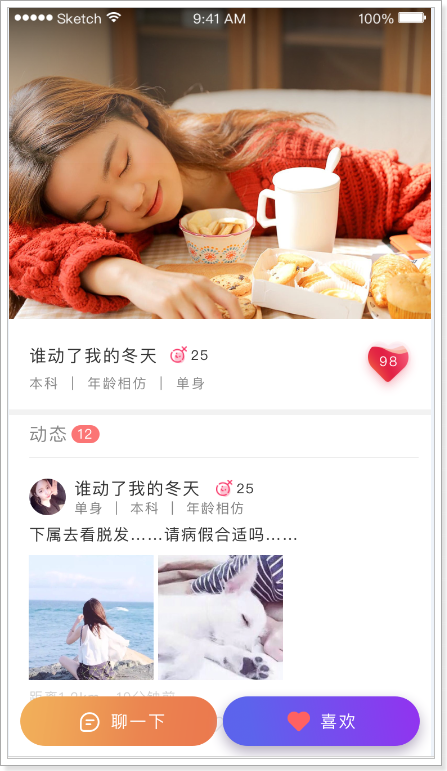

## 1、即时通信

### 1.1、什么是即时通信？

 

### 1.2、功能说明

在探花交友项目中也提供了类似微信的聊天功能，用户可以和好友或陌生人聊天。

如果是陌生人，通过《聊一下》功能进行打招呼，如果对方同意后，就成为了好友，可以进行聊天了。

陌生人之间如果相互喜欢，那么就会成为好友，也就可以聊天了。

在消息界面中也可以查看：点赞、评论、喜欢、公告等消息信息。

 

 

 

### 1.3、技术方案

对于高并发的即时通讯实现，还是很有挑战的，所需要考虑的点非常多，除了要实现功能，还要考虑并发、流量、负载、服务器、容灾等等。虽然有难度也并不是高不可攀。

对于现实即时通讯往往有两种方案：

- 方案一：
  - 自主实现，从设计到架构，再到实现。
  - 技术方面可以采用：Netty + WebSocket + RocketMQ + MongoDB + Redis + ZooKeeper + MySQL
  
  > redis集群 缓存
  >
  > mongo集群存储聊天记录
  >
  > mysql集群存储用户基础数据
  >
  > 分布式文件系统 存储文件资源 
  >
  > 即时通讯：不用http，用netty，高性能，非阻塞的nio服务器
  
  - 
  
- 方案二：
  - 对接第三方服务完成。
  - 这种方式简单，只需要按照第三方的api进行对接就可以了。
  - 如：环信、网易、容联云通讯等。

如何选择呢？

如果是中大型企业做项目可以选择自主研发，如果是中小型企业研发中小型的项目，选择第二种方案即可。方案一需要有大量的人力、物力的支持，开发周期长，成本高，但可控性强。方案二，成本低，开发周期短，能够快速的集成起来进行功能的开发，只是在可控性方面来说就差了一些。

探花交友项目选择方案二进行实现。

## 2、环信

官网：https://www.easemob.com/  稳定健壮，消息必达，亿级并发的即时通讯云


### 2.1、开发简介

平台架构：

 

集成：

环信和用户体系的集成主要发生在2个地方，服务器端集成和客户端集成。

 

探花集成：

- 探花前端使用AndroidSDK进行集成
  - 文档：http://docs-im.easemob.com/im/android/sdk/import
- 后端集成用户体系
  - 文档：http://docs-im.easemob.com/im/server/ready/user

### 2.2、环信Console

需要使用环信平台，那么必须要进行注册，登录之后即可创建应用。环信100以内的用户免费使用，100以上就要注册企业版了。

企业版价格：

 

创建应用：

 

创建完成：


### 2.3、接口说明

#### 2.3.1、Appkey 数据结构

当您申请了 AppKey 后，会得到一个 **xxxx#xxxx** 格式的字符串，字符串只能由小写字母数字组成，AppKey是环信应用的唯一标识。前半部分 **org_name** 是在多租户体系下的唯一租户标识，后半部分 **app_name** 是租户下的app唯一标识（在环信后台创建一个app时填写的应用 id 即是 app_name ）。下述的 REST API 中，**/{org_name}/{app_name}**的请求，均是针对一个唯一的appkey进行的。目前环信注册的appkey暂不能由用户自己完成删除操作，如果对 APP 删除需要联系环信操作完成。

| Appkey             | xxxx     | 分隔符 | xxxx     |
| :----------------- | :------- | :----- | :------- |
| 环信应用的唯一标识 | org_name | #      | app_name |

#### 2.3.2、环信 ID 数据结构

环信作为一个聊天通道，只需要提供环信 ID （也就是 IM 用户名）和密码就够了。

| 名称     | 字段名   | 数据类型 | 描述                           |
| :------- | :------- | :------- | :----------------------------- |
| 环信 ID  | username | String   | 在 AppKey 的范围内唯一用户名。 |
| 用户密码 | password | String   | 用户登录环信使用的密码。       |

#### 2.3.4、获取管理员权限

环信提供的 REST API 需要权限才能访问，权限通过发送 HTTP 请求时携带 token 来体现，下面描述获取 token 的方式。说明：API 描述的时候使用到的 {APP 的 client_id} 之类的这种参数需要替换成具体的值。

**重要提醒：**获取 token 时服务器会返回 token 有效期，具体值参考接口返回的 expires_in 字段值。由于网络延迟等原因，系统不保证 token 在此值表示的有效期内绝对有效，如果发现 token 使用异常请重新获取新的 token，比如“http response code”返回 401。另外，请不要频繁向服务器发送获取 token 的请求，同一账号发送此请求超过一定频率会被服务器封号，切记，切记！！

client_id 和 client_secret 可以在环信管理后台的 [APP 详情页面](http://www.google.com/)看到。

> **HTTP Request**

|  | /**{org_name}/{app_name}/token** |
| :---------------------- | :------------------------------- |
|                         |                                  |

> **Request Headers**

| 参数         | 说明             |
| :----------- | :--------------- |
| Content-Type | application/json |

> **Request Body**

| 参数          | 说明                                                         |
| :------------ | :----------------------------------------------------------- |
| grant_type    | client_credentials                                           |
| client_id     | App的client_id，可在[app详情页找到](https://console.easemob.com/app-detail/detail) |
| client_secret | App的client_secret，可在[app详情页找到](https://console.easemob.com/app-detail/detail) |

> **Response Body**

| 参数         | 说明                                                 |
| :----------- | :--------------------------------------------------- |
| access_token | 有效的token字符串                                    |
| expires_in   | token 有效时间，以秒为单位，在有效期内不需要重复获取 |
| application  | 当前 App 的 UUID 值                                  |

 

## 3、抽取环信组件

抽取环信组件到`tanhua-autoconfig`工程中

### 3.1、编写HuanXinTemplate

```java
@Slf4j
public class HuanXinTemplate {

    private EMService service;

    public HuanXinTemplate(HuanXinProperties properties) {
        EMProperties emProperties = EMProperties.builder()
                .setAppkey(properties.getAppkey())
                .setClientId(properties.getClientId())
                .setClientSecret(properties.getClientSecret())
                .build();
        service = new EMService(emProperties);
    }

    //创建环信用户
    public Boolean createUser(String username,String password) {
        try {
            //创建环信用户
            service.user().create(username.toLowerCase(), password)
                    .block();
            return true;
        }catch (Exception e) {
            e.printStackTrace();
            log.error("创建环信用户失败~");
        }
        return false;
    }

    //添加联系人
    public Boolean addContact(String username1,String username2) {
        try {
            //创建环信用户
            service.contact().add(username1,username2)
                    .block();
            return true;
        }catch (Exception e) {
            log.error("添加联系人失败~");
        }
        return false;
    }

    //删除联系人
    public Boolean deleteContact(String username1,String username2) {
        try {
            //创建环信用户
            service.contact().remove(username1,username2)
                    .block();
            return true;
        }catch (Exception e) {
            log.error("删除联系人失败~");
        }
        return false;
    }

    //发送消息
    public Boolean sendMsg(String username,String content) {
        try {
            //接收人用户列表
            Set<String> set = CollUtil.newHashSet(username);
            //文本消息
            EMTextMessage message = new EMTextMessage().text(content);
            //发送消息  from：admin是管理员发送
            service.message().send("admin","users",
                    set,message,null).block();
            return true;
        }catch (Exception e) {
            log.error("删除联系人失败~");
        }
        return false;
    }
}
```

### 3.2、编写Properties对象

```java
@Configuration
@ConfigurationProperties(prefix = "tanhua.huanxin")
@Data
public class HuanXinProperties {

    private String appkey;
    private String clientId;
    private String clientSecret;
    
}
```

### 3.3、配置

`tanhua-app-server`工程的`application.yml`文件加入配置如下

```yml
tanhua:
  huanxin:
    appkey: 1110201018107234#tanhua
    clientId: YXA6nxJJ_pdEQ_eYUlqcRicS4w
    clientSecret: YXA6GMUxVEZhAvxlMn4OvHSXbWuEUTE
```

### 3.4、测试

```java
@RunWith(SpringRunner.class)
@SpringBootTest
public class HuanXinTest {

    @Autowired
    private HuanXinTemplate template;

    @Test
    public void testRegister() {
        template.createUser("user01","123456");
    }
}
```

## 4、用户体系集成

将用户体系集成的逻辑写入到`tanhua-server`系统中。

* 探花用户注册时需要将用户信息注册到环信系统中
  * 对于老数据：编写单元测试方法批量的注册到环信
  * **对于新用户：改造代码（用户注册的时候，自动注册到环信）**
* APP从服务端获取当前用户的环信用户密码，自动登入环信系统
  * 编写一个接口，获取当前用户在环信的用户名密码
* APP自动获取环信服务器发送的信息数据

### 4.1、注册环信用户

在用户登录逻辑中，当第一次注册时，将用户信息注册到环信

```java
/**
 * 验证登录
 * @param phone
 * @param code
 */
public Map loginVerification(String phone, String code) {
    //1、从redis中获取下发的验证码
    String redisCode = redisTemplate.opsForValue().get("CHECK_CODE_" + phone);
    //2、对验证码进行校验（验证码是否存在，是否和输入的验证码一致）
    if(StringUtils.isEmpty(redisCode) || !redisCode.equals(code)) {
        //验证码无效
        throw new BusinessException(ErrorResult.loginError());
    }
    //3、删除redis中的验证码
    redisTemplate.delete("CHECK_CODE_" + phone);
    //4、通过手机号码查询用户
    User user = userApi.findByMobile(phone);
    boolean isNew = false;
    //5、如果用户不存在，创建用户保存到数据库中
    if(user == null) {
        user = new User();
        user.setMobile(phone);
        user.setPassword(DigestUtils.md5Hex("123456"));
        Long userId = userApi.save(user);
        user.setId(userId);
        isNew = true;

        //注册环信用户
        String hxUser = "hx"+user.getId();
        Boolean create = huanXinTemplate.createUser(hxUser, Constants.INIT_PASSWORD);
        if(create) {
            user.setHxUser(hxUser);
            user.setHxPassword(Constants.INIT_PASSWORD);
            userApi.update(user);
        }
    }
    //6、通过JWT生成token(存入id和手机号码)
    Map tokenMap = new HashMap();
    tokenMap.put("id",user.getId());
    tokenMap.put("mobile",phone);
    String token = JwtUtils.getToken(tokenMap);
    //7、构造返回值
    Map retMap = new HashMap();
    retMap.put("token",token);
    retMap.put("isNew",isNew);

    return retMap;
}
```

### 4.2、查询环信用户信息

在app中，用户登录后需要根据用户名密码登录环信，由于用户名密码保存在后台，所以需要提供接口进行返回。

#### 4.2.1 API接口

api地址：http://192.168.136.160:3000/project/19/interface/api/85


#### 4.2.2 vo对象

```java

import lombok.AllArgsConstructor;
import lombok.Data;
import lombok.NoArgsConstructor;

@Data
@NoArgsConstructor
@AllArgsConstructor
public class HuanXinUserVo {
    private String username;
    private String password;
}
```

#### 4.2.3 代码实现

编写HuanXinController实现：


### 4.3、环信用户ID查询用户信息

在好友聊天时，完全基于环信服务器实现。为了更好的页面效果，需要展示出用户的基本信息，这是需要通过环信用户id查询用户。

#### MessagesController

```java
@RestController
@RequestMapping("/messages")
public class MessagesController {

    @Autowired
    private MessagesService messagesService;

    @GetMapping("/userinfo")
    public ResponseEntity userinfo(String huanxinId) {
       UserInfoVo vo = messagesService.findUserInfoByHuanxin(huanxinId);
        return ResponseEntity.ok(vo);
    }
}
```

#### MessagesService

```java
@Service
public class MessagesService {

    @DubboReference
    private UserApi userApi;

    @DubboReference
    private UserInfoApi userInfoApi;

    @DubboReference
    private FriendApi friendApi;

    @Autowired
    private HuanXinTemplate huanXinTemplate;

    /**
     * 根据环信id查询用户详情
     */
    public UserInfoVo findUserInfoByHuanxin(String huanxinId) {
        //1、根据环信id查询用户
        User user = userApi.findByHuanxin(huanxinId);
        //2、根据用户id查询用户详情
        UserInfo userInfo = userInfoApi.findById(user.getId());
        UserInfoVo vo = new UserInfoVo();
        BeanUtils.copyProperties(userInfo,vo); //copy同名同类型的属性
        if(userInfo.getAge() != null) {
            vo.setAge(userInfo.getAge().toString());
        }
        return vo;
    }
}
```

### 4.4、发送消息给客户端

目前已经完成了用户体系的对接，下面我们进行测试发送消息，场景是这样的：


 

点击“聊一下”，就会给对方发送一条陌生人信息，这个消息由系统发送完成。

我们暂时通过环信的控制台进行发送： 

消息内容：

~~~shell
{"userId":106,"huanXinId":"hx106","nickname":"黑马小妹","strangerQuestion":"你喜欢去看蔚蓝的大海还是去爬巍峨的高山？","reply":"我喜欢秋天的落叶，夏天的泉水，冬天的雪地，只要有你一切皆可~"}
~~~

 

 

 

可以看到已经接收到了消息。

### 4.5、数据处理

针对新注册用户已经可以同步到环信服务器，而老数据需要程序员手动处理。

注意：使用测试账号最多支持100个用户

```java
    @Test
    public void register() {
        for (int i = 1; i < 106; i++) {
            User user = userApi.findById(Long.valueOf(i));
            if(user != null) {
                Boolean create = template.createUser("hx" + user.getId(), Constants.INIT_PASSWORD);
                if (create){
                    user.setHxUser("hx" + user.getId());
                    user.setHxPassword(Constants.INIT_PASSWORD);
                    userApi.update(user);
                }
            }
        }
    }
```

## 5、联系人管理

涵盖了系统业务：

* 查看感兴趣的用户，点击“聊一下”，查看陌生人问题
* 回答陌生人问题，会给感兴趣的用户发送一条消息（发送的添加好友的请求）
  * 对方获取一条消息（服务端发送）
* 对方查看消息：如果两个投缘（点击聊一下，双方加为好友）
  * 将好友关系记录到探花的MongoDB数据库中
  * 将好友关系记录到环信
* 成为好友后，可以查看好友列表
* 对目标好友发送消息（和服务端无关）

### 5.1、查看用户详情

在首页可以查看感兴趣人的详细资料。点击“聊一下”，可以查看对方的问题

#### 5.1.1、mock接口

地址：http://192.168.136.160:3000/project/19/interface/api/103


#### 5.1.2、TanhuaController

```java
/**
 * 查看佳人详情
 */
@GetMapping("/{id}/personalInfo")
public ResponseEntity personalInfo(@PathVariable("id") Long userId) {
    TodayBest best = tanhuaService.personalInfo(userId);
    return ResponseEntity.ok(best);
}
```

#### 5.1.3、TanhuaService

```java
//查看佳人详情
public TodayBest personalInfo(Long userId) {
    //1、根据用户id查询，用户详情
    UserInfo userInfo = userInfoApi.findById(userId);
    //2、根据操作人id和查看的用户id，查询两者的推荐数据
    RecommendUser user = recommendUserApi.queryByUserId(userId,UserHolder.getUserId());
    //3、构造返回值
    return TodayBest.init(userInfo,user);
}
```

#### 5.1.4、API接口和实现类

`RecommendUserApi`和`RecommendUserApiImpl`编写查询用户缘分值方法

```java
@Override
public RecommendUser queryByUserId(Long userId, Long toUserId) {
    Criteria criteria = Criteria.where("toUserId").is(toUserId).and("userId").is(userId);
    Query query = Query.query(criteria);
    RecommendUser user = mongoTemplate.findOne(query, RecommendUser.class);
    if(user == null) {
        user = new RecommendUser();
        user.setUserId(userId);
        user.setToUserId(toUserId);
        //构建缘分值
        user.setScore(95d);
    }
    return user;
}
```

### 5.2、查看陌生人好友问题

点击“聊一下”，可以查看对方的问题

#### 5.2.1、mock接口

地址：http://192.168.136.160:3000/project/19/interface/api/124


#### 5.2.2、TanhuaController

```java
/**
 * 查看陌生人问题
 */
@GetMapping("/strangerQuestions")
public ResponseEntity strangerQuestions(Long userId) {
    String questions = tanhuaService.strangerQuestions(userId);
    return ResponseEntity.ok(questions);
}
```

#### 5.2.3、TanhuaService

```java
//查看陌生人问题
public String strangerQuestions(Long userId) {
    Question question = questionApi.findByUserId(userId);
    return question == null ? "你喜欢java编程吗？" : question.getTxt();
}
```

### 5.3、回复陌生人消息

需求：

* 通过服务器端，给目标用户发送一条陌生人消息

#### 5.3.1、mock接口

地址：http://192.168.136.160:3000/project/19/interface/api/106


#### 5.3.2、TanhuaController

```java
/**
 * 回复陌生人问题
 */
@PostMapping("/strangerQuestions")
public ResponseEntity replyQuestions(@RequestBody Map map) {
    //前端传递的userId:是Integer类型的
    String obj = map.get("userId").toString();
    Long userId = Long.valueOf(obj);
    String reply = map.get("reply").toString();
    tanhuaService.replyQuestions(userId,reply);
    return ResponseEntity.ok(null);
}
```

#### 5.3.3、TanhuaService

创建`TanhuaService`并编写方法，完成回复陌生人消息功能

```json
{"userId":106,"huanXinId":"hx106","nickname":"黑马小妹","strangerQuestion":"你喜欢去看蔚蓝的大海还是去爬巍峨的高山？","reply":"我喜欢秋天的落叶，夏天的泉水，冬天的雪地，只要有你一切皆可~"}
```

```java
//回复陌生人问题
public void replyQuestions(Long userId, String reply) {
    //1、构造消息数据
    Long currentUserId = UserHolder.getUserId();
    UserInfo userInfo = userInfoApi.findById(currentUserId);
    Map map = new HashMap();
    map.put("userId",currentUserId);
    map.put("huanXinId", Constants.HX_USER_PREFIX+currentUserId);
    map.put("nickname",userInfo.getNickname());
    map.put("strangerQuestion",strangerQuestions(userId));
    map.put("reply",reply);
    String message = JSON.toJSONString(map);
    //2、调用template对象，发送消息
    Boolean aBoolean = template.sendMsg(Constants.HX_USER_PREFIX + userId, message);//1、接受方的环信id，2、消息
    if(!aBoolean) {
        throw  new BusinessException(ErrorResult.error());
    }
}
```

### 5.4、添加联系人

用户获取陌生人消息后，点击“聊一下”，就会成为联系人（好友）。

实现：

- 将好友写入到MongoDB中
- 将好友关系注册到环信

#### 5.4.1、mock接口

地址： http://192.168.136.160:3000/project/19/interface/api/205

 

#### 5.4.2、定义MessagesController

```java
/**
 * 添加好友
 */
@PostMapping("/contacts")
public ResponseEntity contacts(@RequestBody Map map) {
    Long friendId = Long.valueOf(map.get("userId").toString());
    messagesService.contacts(friendId);
    return ResponseEntity.ok(null);
}
```

#### 5.4.3、编写Service方法

`MessageService`补充添加联系人方法

```java
//添加好友关系
public void contacts(Long friendId) {
    //1、将好友关系注册到环信
    Boolean aBoolean = huanXinTemplate.addContact(Constants.HX_USER_PREFIX + UserHolder.getUserId(),
            Constants.HX_USER_PREFIX + friendId);
    if(!aBoolean) {
        throw new BusinessException(ErrorResult.error());
    }
    //2、如果注册成功，记录好友关系到mongodb
    friendApi.save(UserHolder.getUserId(),friendId);
}
```

#### 5.4.4、dubbo服务

创建`FriendApi`和`FriendApiImpl`并编写添加好友的方法

**`FriendApiImpl`实现类**

```java
@Override
public void save(Long userId, Long friendId) {
    //1、保存自己的好友数据
    Query query1 = Query.query(Criteria.where("userId").is(userId).and("frinedId").is(friendId));
    //1.1 判断好友关系是否存在
    if(!mongoTemplate.exists(query1, Friend.class)) {
        //1.2 如果不存在，保存
        Friend friend1 = new Friend();
        friend1.setUserId(userId);
        friend1.setFriendId(friendId);
        friend1.setCreated(System.currentTimeMillis());
        mongoTemplate.save(friend1);
    }
    //2、保存好友的数据
    Query query2 = Query.query(Criteria.where("userId").is(friendId).and("frinedId").is(userId));
    //2.1 判断好友关系是否存在
    if(!mongoTemplate.exists(query2, Friend.class)) {
        //2.2 如果不存在，保存
        Friend friend1 = new Friend();
        friend1.setUserId(friendId);
        friend1.setFriendId(userId);
        friend1.setCreated(System.currentTimeMillis());
        mongoTemplate.save(friend1);
    }
}
```

#### 5.4.5、测试

 

 

可以看到好友已经添加成功。

### 5.5、联系人列表

联系人列表：分页查询好友列表数据 （tanhua-users：好友关系表）

#### 5.5.1、mock接口

地址：http://192.168.136.160:3000/project/19/interface/api/202

 

响应数据结构：

 

#### 5.5.2、定义ContactVo

~~~java
package com.tanhua.domain.vo;

import lombok.AllArgsConstructor;
import lombok.Data;
import lombok.NoArgsConstructor;

import java.io.Serializable;

@Data
@NoArgsConstructor
@AllArgsConstructor
public class ContactVo implements Serializable {

    private Long id;
    private String userId;
    private String avatar;
    private String nickname;
    private String gender;
    private Integer age;
    private String city;

    public static ContactVo init(UserInfo userInfo) {
        ContactVo vo = new ContactVo();
        if(userInfo != null) {
        	BeanUtils.copyProperties(userInfo,vo);
        	vo.setUserId("hx"+userInfo.getId().toString());
        }
        return vo;
    }
}

~~~

#### 5.5.3、编写MessagesController

在`MessagesController`中添加查询联系人列表方法

```java
/**
 * 分页查询联系人列表
 */
@GetMapping("/contacts")
public ResponseEntity contacts(@RequestParam(defaultValue = "1") Integer page,
                               @RequestParam(defaultValue = "10") Integer pagesize,
                               String keyword) {
    PageResult pr = messagesService.findFriends(page,pagesize,keyword);
    return ResponseEntity.ok(pr);
}
```

#### 5.5.4、编写Service

在`MessageService`中添加查询联系人方法

```java
//分页查询联系人列表
public PageResult findFriends(Integer page, Integer pagesize, String keyword) {
    //1、调用API查询当前用户的好友数据 -- List<Friend>
    List<Friend> list = friendApi.findByUserId(UserHolder.getUserId(),page,pagesize);
    if(CollUtil.isEmpty(list)) {
        return new PageResult();
    }
    //2、提取数据列表中的好友id
    List<Long> userIds = CollUtil.getFieldValues(list, "friendId", Long.class);
    //3、调用UserInfoAPI查询好友的用户详情
    UserInfo info = new UserInfo();
    info.setNickname(keyword);
    Map<Long, UserInfo> map = userInfoApi.findByIds(userIds, info);
    //4、构造VO对象
    List<ContactVo> vos = new ArrayList<>();
    for (Friend friend : list) {
        UserInfo userInfo = map.get(friend.getFriendId());
        if(userInfo != null) {
            ContactVo vo = ContactVo.init(userInfo);
            vos.add(vo);
        }
    }
    return new PageResult(page,pagesize,0l,vos);
}
```

#### 5.5.5、dubbo服务

在`FriendApi`和`FriendApiImpl`中添加分页查询方法

```java
@Override
public List<Friend> findByUserId(Long userId, Integer page, Integer pagesize) {
    Criteria criteria = Criteria.where("userId").is(userId);
    Query query = Query.query(criteria).skip((page - 1) * pagesize).limit(pagesize)
            .with(Sort.by(Sort.Order.desc("created")));
    return mongoTemplate.find(query,Friend.class);
}
```

