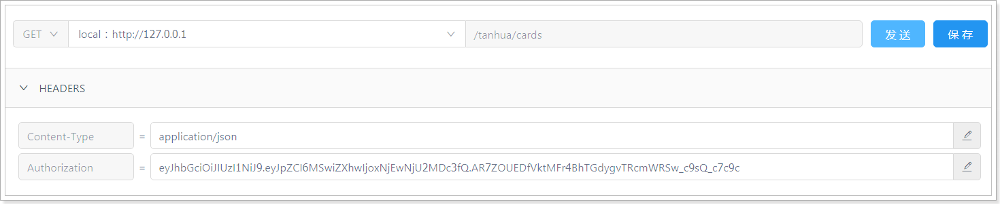
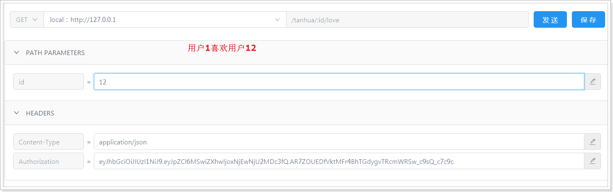

## 课程说明

- 实现探花功能
- MongoDB geo
- 搜附近
  - 上报地理位置
  - 搜附近

## 1、探花

探花功能是将推荐的好友随机的通过卡片的形式展现出来，用户可以选择左滑、右滑操作，左滑：“不喜欢”，右滑：“喜欢”。

喜欢：如果双方喜欢，那么就会成为好友。

 

如果已经喜欢或不喜欢的用户在列表中不再显示。

### 1.1、查询推荐列表dubbo服务

#### 1.1.1、实体对象

```java
package com.tanhua.dubbo.server.pojo;

import lombok.AllArgsConstructor;
import lombok.Data;
import lombok.NoArgsConstructor;
import org.bson.types.ObjectId;
import org.springframework.data.mongodb.core.index.Indexed;
import org.springframework.data.mongodb.core.mapping.Document;

@Data
@NoArgsConstructor
@AllArgsConstructor
@Document(collection = "user_like")
public class UserLike implements java.io.Serializable {

    private static final long serialVersionUID = 6739966698394686523L;

    private ObjectId id;
    @Indexed
    private Long userId; //用户id，自己
    @Indexed
    private Long likeUserId; //喜欢的用户id，对方
    private Boolean isLike; // 是否喜欢
    private Long created; //创建时间
    private Long updated; // 更新时间

}
```


#### 1.1.2、定义接口

**RecommendUserApi**

```java

    /**
     * 查询探花列表，查询时需要排除喜欢和不喜欢的用户
     */
    List<RecommendUser> queryCardsList(Long userId, int count);
```

#### 1.1.3、编写实现

**RecommendUserApiImpl**

```java

   /**
     * 查询探花列表，查询时需要排除喜欢和不喜欢的用户
     * 1、排除喜欢，不喜欢的用户
     * 2、随机展示
     * 3、指定数量
     */
    public List<RecommendUser> queryCardsList(Long userId, int counts) {
        //1、查询喜欢不喜欢的用户ID
        List<UserLike> likeList = mongoTemplate.find(Query.query(Criteria.where("userId").is(userId)), UserLike.class);
        List<Long> likeUserIdS = CollUtil.getFieldValues(likeList, "likeUserId", Long.class);
        //2、构造查询推荐用户的条件
        Criteria criteria = Criteria.where("toUserId").is(userId).and("userId").nin(likeUserIdS);
        //3、使用统计函数，随机获取推荐的用户列表
        TypedAggregation<RecommendUser> newAggregation = TypedAggregation.newAggregation(RecommendUser.class,
                Aggregation.match(criteria),//指定查询条件
                Aggregation.sample(counts)
        );
        AggregationResults<RecommendUser> results = mongoTemplate.aggregate(newAggregation, RecommendUser.class);
        //4、构造返回
        return results.getMappedResults();
    }
```

#### 1.1.4、单元测试

```java
//com.tanhua.dubbo.server.api.TestRecommendUserApi

@Test
public void testQueryCardList(){
    this.recommendUserApi.queryCardsList(106l, 10)
            .forEach(recommendUser -> System.out.println(recommendUser));
}
```

### 1.2、查询推荐列表APP接口实现

接口文档：https://mock-java.itheima.net/project/35/interface/api/593

#### 1.2.1、TanHuaController

~~~java
	/**
     * 探花-推荐用户列表
     */
    @GetMapping("/cards")
    public ResponseEntity queryCardsList() {
        List<TodayBest> list = this.tanhuaService.queryCardsList();
        return ResponseEntity.ok(list);
    }
~~~

#### 1.2.2、TanHuaService

~~~properties
#默认推荐列表
tanhua:
  default:
    recommend:
      users: 2,3,8,10,18,20,24,29,27,32,36,37,56,64,75,88
~~~

```java
    @Value("${tanhua.default.recommend.users}")
    private String recommendUser;

	    //探花-推荐用户列表
    public List<TodayBest> queryCardsList() {
        //1、调用推荐API查询数据列表（排除喜欢/不喜欢的用户，数量限制）
        List<RecommendUser> users = recommendUserApi.queryCardsList(UserHolder.getUserId(),10);
        //2、判断数据是否存在，如果不存在，构造默认数据 1,2,3
        if(CollUtil.isEmpty(users)) {
            users = new ArrayList<>();
            String[] userIdS = recommendUser.split(",");
            for (String userId : userIdS) {
                RecommendUser recommendUser = new RecommendUser();
                recommendUser.setUserId(Convert.toLong(userId));
                recommendUser.setToUserId(UserHolder.getUserId());
                recommendUser.setScore(RandomUtil.randomDouble(60, 90));
                users.add(recommendUser);
            }
        }
        //3、构造VO
        List<Long> ids = CollUtil.getFieldValues(users, "userId", Long.class);
        Map<Long, UserInfo> infoMap = userInfoApi.findByIds(ids, null);

        List<TodayBest> vos = new ArrayList<>();
        for (RecommendUser user : users) {
            UserInfo userInfo = infoMap.get(user.getUserId());
            if(userInfo != null) {
                TodayBest vo = TodayBest.init(userInfo, user);
                vos.add(vo);
            }
        }
        return vos;
    }
```

#### 1.2.3、测试




效果：

 

### 1.3、喜欢的dubbo服务

用户的喜欢与不喜欢列表需要保存在redis中，为了防止redis中的数据丢失，同时需要将数据保存到mongodb进行持久化保存。

#### 1.3.1、定义接口

```java
package com.tanhua.dubbo.api;

public interface UserLikeApi {

    //保存或者更新
    Boolean saveOrUpdate(Long userId, Long likeUserId, boolean isLike);
}

```

#### 1.3.2、编写实现

```java
@DubboService
public class UserLikeApiImpl implements UserLikeApi{

    @Autowired
    private MongoTemplate mongoTemplate;

    @Override
    public Boolean saveOrUpdate(Long userId, Long likeUserId, boolean isLike) {
        try {
            //1、查询数据
            Query query = Query.query(Criteria.where("userId").is(userId).and("likeUserId").is(likeUserId));
            UserLike userLike = mongoTemplate.findOne(query, UserLike.class);
            //2、如果不存在，保存
            if(userLike == null) {
                userLike = new UserLike();
                userLike.setUserId(userId);
                userLike.setLikeUserId(likeUserId);
                userLike.setCreated(System.currentTimeMillis());
                userLike.setUpdated(System.currentTimeMillis());
                userLike.setIsLike(isLike);
                mongoTemplate.save(userLike);
            }else {
                //3、更新
                Update update = Update.update("isLike", isLike)
                        .set("updated",System.currentTimeMillis());
                mongoTemplate.updateFirst(query,update,UserLike.class);
            }
            return true;
        } catch (Exception e) {
            e.printStackTrace();
            return false;
        }
    }
}
```

### 1.4、左滑右滑

左滑：“不喜欢”，右滑：“喜欢”，如果双方喜欢，那么就会成为好友。

#### 1.4.1、TanHuaController

```java
/**
 * 喜欢
 */
@GetMapping("{id}/love")
public ResponseEntity<Void> likeUser(@PathVariable("id") Long likeUserId) {
        this.tanhuaService.likeUser(likeUserId);
        return ResponseEntity.ok(null);
}

/**
 * 不喜欢
 */
@GetMapping("{id}/unlove")
public ResponseEntity<Void> notLikeUser(@PathVariable("id") Long likeUserId) {
        this.tanhuaService.notLikeUser(likeUserId);
        return ResponseEntity.ok(null);
}
```

#### 1.4.2、TanHuaService

```java
    @Autowired
    private MessagesService messagesService;

    //探花喜欢 106 -  2
    public void likeUser(Long likeUserId) {
        //1、调用API，保存喜欢数据(保存到MongoDB中)
        Boolean save = userLikeApi.saveOrUpdate(UserHolder.getUserId(),likeUserId,true);
        if(!save) {
            //失败
            throw new BusinessException(ErrorResult.error());
        }
        //2、操作redis，写入喜欢的数据，删除不喜欢的数据 (喜欢的集合，不喜欢的集合)
        redisTemplate.opsForSet().remove(Constants.USER_NOT_LIKE_KEY+UserHolder.getUserId(),likeUserId.toString());
        redisTemplate.opsForSet().add(Constants.USER_LIKE_KEY+UserHolder.getUserId(),likeUserId.toString());
        //3、判断是否双向喜欢
        if(isLike(likeUserId,UserHolder.getUserId())) {
            //4、添加好友
            messagesService.contacts(likeUserId);
        }
    }

    public Boolean isLike(Long userId,Long likeUserId) {
        String key = Constants.USER_LIKE_KEY+userId;
        return redisTemplate.opsForSet().isMember(key,likeUserId.toString());
    }

    //不喜欢
    public void notLikeUser(Long likeUserId) {
        //1、调用API，保存喜欢数据(保存到MongoDB中)
        Boolean save = userLikeApi.saveOrUpdate(UserHolder.getUserId(),likeUserId,false);
        if(!save) {
            //失败
            throw new BusinessException(ErrorResult.error());
        }
        //2、操作redis，写入喜欢的数据，删除不喜欢的数据 (喜欢的集合，不喜欢的集合)
        redisTemplate.opsForSet().add(Constants.USER_NOT_LIKE_KEY+UserHolder.getUserId(),likeUserId.toString());
        redisTemplate.opsForSet().remove(Constants.USER_LIKE_KEY+UserHolder.getUserId(),likeUserId.toString());
        //3、判断是否双向喜欢，删除好友(各位自行实现)
    }
```

#### 1.4.3、测试




user_like表，可以看到已经相互喜欢了：

 

tanhua_users表，可以看到相互是好友了：

 

环信平台：

 


## 2、MongoDB地理位置检索

MongoDB 支持对地理空间数据的查询操作。

### 2.1、地理位置索引

地理位置查询，必须创建索引才可以能查询，目前有两种索引。

##### 2d :

使用2d index 能够将数据作为二维平面上的点存储起来,在MongoDB 2.4以前使用2。

##### 2dsphere:

`2dsphere`索引支持查询在一个类地球的球面上进行几何计算，以GeoJSON对象或者普通坐标对的方式存储数据。

**GeoJsonPoint对象不支持序列化**，所以不用传来传去的，最后直接将一个个参数现场构造直接存在数据库里

MongoDB内部支持多种GeoJson对象类型：

#### Point 

最基础的坐标点，指定纬度和经度坐标，首先列出**经度**，然后列出 **纬度**：

- 有效的经度值介于`-180`和之间`180`，两者都包括在内。
- 有效的纬度值介于`-90`和之间`90`，两者都包括在内。

```json
{ type: "Point", coordinates: [ 40, 5 ] }
```

#### LineString

```json
{ type: "LineString", coordinates: [ [ 40, 5 ], [ 41, 6 ] ] }
```

#### Polygon

```json
{
  type: "Polygon",
  coordinates: [ [ [ 0 , 0 ] , [ 3 , 6 ] , [ 6 , 1 ] , [ 0 , 0  ] ] ]
}
```

### 2.2、案例

查询附近并按照距离返回

#### 查询附近

查询当前坐标附近的目标

```java
@Test
public void testNear() {
    //构造坐标点
    GeoJsonPoint point = new GeoJsonPoint(116.404, 39.915);
    //构造半径
    Distance distanceObj = new Distance(1, Metrics.KILOMETERS);
    //画了一个圆圈
    Circle circle = new Circle(point, distanceObj);
    //构造query对象
    Query query = Query.query(Criteria.where("location").withinSphere(circle));
    //省略其他内容
    List<Places> list = mongoTemplate.find(query, Places.class);
    list.forEach(System.out::println);
}

```

#### 查询并获取距离

我们假设需要以当前坐标为原点，查询附近指定范围内的餐厅，并直接显示距离

```java
//查询附近且获取间距
@Test
public void testNear1() {
    //1、构造中心点(圆点)
    GeoJsonPoint point = new GeoJsonPoint(116.404, 39.915);
    //2、构建NearQuery对象
    NearQuery query = NearQuery.near(point, Metrics.KILOMETERS).maxDistance(1, Metrics.KILOMETERS);
    //3、调用mongoTemplate的geoNear方法查询
    GeoResults<Places> results = mongoTemplate.geoNear(query, Places.class);
    //4、解析GeoResult对象，获取距离和数据
    for (GeoResult<Places> result : results) {
        Places places = result.getContent();
        double value = result.getDistance().getValue();
        System.out.println(places+"---距离："+value + "km");
    }
}
```

## 3、上报地理位置

当客户端检测用户的地理位置，当变化大于500米时或每隔5分钟，向服务端上报地理位置。

用户的地理位置存储到MongoDB中，如下：

 

### 3.1、dubbo服务

#### 3.1.1、定义pojo

在my-tanhua-dubbo-interface中创建：

~~~java
@Data
@NoArgsConstructor
@AllArgsConstructor
@Document(collection = "user_location")
@CompoundIndex(name = "location_index", def = "{'location': '2dsphere'}")
public class UserLocation implements java.io.Serializable{

    private static final long serialVersionUID = 4508868382007529970L;

    @Id
    private ObjectId id;
    @Indexed
    private Long userId; //用户id
    private GeoJsonPoint location; //x:经度 y:纬度
    private String address; //位置描述
    private Long created; //创建时间
    private Long updated; //更新时间
    private Long lastUpdated; //上次更新时间
}

~~~

#### 3.1.2、定义dubbo接口

在my-tanhua-dubbo-interface工程中。

~~~java
package com.tanhua.dubbo.server.api;

public interface UserLocationApi {

    //更新地理位置
    Boolean updateLocation(Long userId, Double longitude, Double latitude, String address);
}

~~~

#### 3.1.3、编写实现

~~~java
@DubboService
public class UserLocationApiImpl implements UserLocationApi{

    @Autowired
    private MongoTemplate mongoTemplate;

    //更新地理位置
    public Boolean updateLocation(Long userId, Double longitude, Double latitude, String address) {
        try {
            //1、根据用户id查询位置信息
            Query query = Query.query(Criteria.where("userId").is(userId));
            UserLocation location = mongoTemplate.findOne(query, UserLocation.class);
            if(location == null) {
                //2、如果不存在用户位置信息，保存
                location = new UserLocation();
                location.setUserId(userId);
                location.setAddress(address);
                location.setCreated(System.currentTimeMillis());
                location.setUpdated(System.currentTimeMillis());
                location.setLastUpdated(System.currentTimeMillis());
                location.setLocation(new GeoJsonPoint(longitude,latitude));
                mongoTemplate.save(location);
            }else {
                //3、如果存在，更新
                Update update = Update.update("location", new GeoJsonPoint(longitude, latitude))
                        .set("updated", System.currentTimeMillis())
                        .set("lastUpdated", location.getUpdated());
                mongoTemplate.updateFirst(query,update,UserLocation.class);
            }
            return true;
        } catch (Exception e) {
            e.printStackTrace();
            return false;
        }
    }
}
~~~

#### 3.1.4、单元测试

地理位置坐标拾取：http://api.map.baidu.com/lbsapi/getpoint/index.html

```java
@RunWith(SpringRunner.class)
@SpringBootTest(classes = AppServerApplication.class)
public class TestUserLocationApi {

    @DubboReference
    private UserLocationApi userLocationApi;

    @Test
    public void testUpdateUserLocation() {
        this.userLocationApi.updateLocation(1L, 116.353885,40.065911, "育新地铁站");
        this.userLocationApi.updateLocation(2L, 116.352115,40.067441, "北京石油管理干部学院");
        this.userLocationApi.updateLocation(3L, 116.336438,40.072505, "回龙观医院");
        this.userLocationApi.updateLocation(4L, 116.396797,40.025231, "奥林匹克森林公园");
        this.userLocationApi.updateLocation(5L, 116.323849,40.053723, "小米科技园");
        this.userLocationApi.updateLocation(6L, 116.403963,39.915119, "天安门");
        this.userLocationApi.updateLocation(7L, 116.328103,39.900835, "北京西站");
        this.userLocationApi.updateLocation(8L, 116.609564,40.083812, "北京首都国际机场");
        this.userLocationApi.updateLocation(9L, 116.459958,39.937193, "德云社(三里屯店)");
        this.userLocationApi.updateLocation(10L, 116.333374,40.009645, "清华大学");
        this.userLocationApi.updateLocation(41L, 116.316833,39.998877, "北京大学");
        this.userLocationApi.updateLocation(42L, 117.180115,39.116464, "天津大学(卫津路校区)");
    }
}
```

### 3.2、APP接口

接口文档：https://mock-java.itheima.net/project/35/interface/api/557

#### 3.2.1、BaiduController

~~~java
@RestController
@RequestMapping("/baidu")
public class BaiduController {

    @Autowired
    private BaiduService baiduService;

    /**
     * 更新位置
     */
    @PostMapping("/location")
    public ResponseEntity updateLocation(@RequestBody Map param) {
        Double longitude = Double.valueOf(param.get("longitude").toString());
        Double latitude = Double.valueOf(param.get("latitude").toString());
        String address = param.get("addrStr").toString();
        this.baiduService.updateLocation(longitude, latitude,address);
        return ResponseEntity.ok(null);
    }
}

~~~

#### 3.2.2、BaiduService

```java
@Service
public class BaiduService {

    @DubboReference
    private UserLocationApi userLocationApi;

    //更新地理位置
    public void updateLocation(Double longitude, Double latitude, String address) {
        Boolean flag = userLocationApi.updateLocation(UserHolder.getUserId(),longitude,latitude,address);
        if(!flag) {
            throw  new BusinessException(ErrorResult.error());
        }
    }
}

```

### 3.3、测试


## 4、搜附近

在首页中点击“搜附近”可以搜索附近的好友，效果如下：

  

实现思路：根据当前用户的位置，查询附近范围内的用户。范围是可以设置的。

### 4.1、dubbo服务

#### 4.1.1、定义接口方法

**UserLocationApi**

~~~java

    /**
     * 根据位置搜索附近人的所有ID
     */
    List<Long> queryNearUser(Long userId, Double metre);
~~~

#### 4.1.2、编写实现

**UserLocationApiImpl**

~~~java
    @Override
    public List<Long> queryNearUser(Long userId, Double metre) {
        //1、根据用户id，查询用户的位置信息
        Query query = Query.query(Criteria.where("userId").is(userId));
        UserLocation location = mongoTemplate.findOne(query, UserLocation.class);
        if(location == null) {
            return null;
        }
        //2、已当前用户位置绘制原点
        GeoJsonPoint point = location.getLocation();
        //3、绘制半径
        Distance distance = new Distance(metre / 1000, Metrics.KILOMETERS);
        //4、绘制圆形
        Circle circle = new Circle(point, distance);
        //5、查询
        Query locationQuery = Query.query(Criteria.where("location").withinSphere(circle));
        List<UserLocation> list = mongoTemplate.find(locationQuery, UserLocation.class);
        return CollUtil.getFieldValues(list,"userId",Long.class);
    }
~~~

### 4.2、APP接口服务

#### 4.2.1、NearUserVo

~~~java
//附近的人vo对象
@Data
@NoArgsConstructor
@AllArgsConstructor
public class NearUserVo {

    private Long userId;
    private String avatar;
    private String nickname;

    public static NearUserVo init(UserInfo userInfo) {
        NearUserVo vo = new NearUserVo();
        vo.setUserId(userInfo.getId());
        vo.setAvatar(userInfo.getAvatar());
        vo.setNickname(userInfo.getNickname());
        return vo;
    }
}
~~~

#### 4.2.2、TanHuaController

~~~java
    /**
     * 搜附近
     */
    @GetMapping("/search")
    public ResponseEntity<List<NearUserVo>> queryNearUser(String gender,
                                                          @RequestParam(defaultValue = "2000") String distance) {
        List<NearUserVo> list = this.tanhuaService.queryNearUser(gender, distance);
        return ResponseEntity.ok(list);
    }
~~~

#### 4.2.3、TanHuaService

```java
    //搜附近
    public List<NearUserVo> queryNearUser(String gender, String distance) {
        //1、调用API查询附近的用户（返回的是附近的人的所有用户id，包含当前用户的id）
        List<Long> userIds = userLocationApi.queryNearUser(UserHolder.getUserId(),Double.valueOf(distance));
        //2、判断集合是否为空
        if(CollUtil.isEmpty(userIds)) {
            return new ArrayList<>();
        }
        //3、调用UserInfoApi根据用户id查询用户详情
        UserInfo userInfo = new UserInfo();
        userInfo.setGender(gender);
        Map<Long, UserInfo> map = userInfoApi.findByIds(userIds, userInfo);
        //4、构造返回值。
        List<NearUserVo> vos = new ArrayList<>();
        for (Long userId : userIds) {
            //排除当前用户
            if(userId == UserHolder.getUserId()) {
                continue;
            }
            UserInfo info = map.get(userId);
            if(info != null) {
                NearUserVo vo = NearUserVo.init(info);
                vos.add(vo);
            }
        }
        return vos;
    }
```

#### 4.2.4、测试

 

