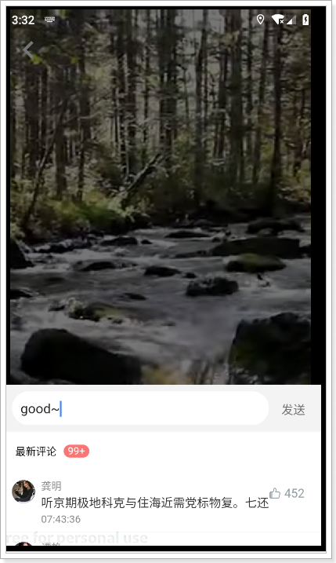
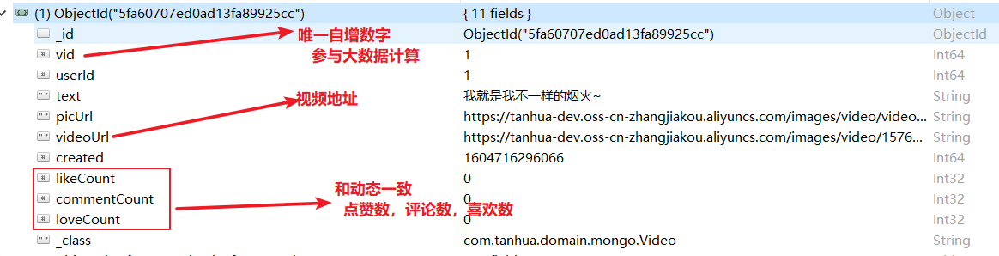

```markdown
1. 我的动态（查询思路）
2. 圈子的互动（点赞，喜欢，评论）
	a. 数据表：quanzi_comment(commentType记录操作类型)
	b. 点赞，喜欢，评论（保存记录）
	c. 取消点赞，取消喜欢（删除记录）
	d. 为了保证效率（结合redis缓存，互动数量记录到动态表）
```

## 课程说明

- 小视频功能说明
- FastDFS环境搭建
- 小视频的功能实现


## 1、我的访客

查询别人来访了我的主页的信息，其他用户在浏览我的主页时，需要记录访客数据。访客在一天内每个用户只记录一次。

查询数据时，如果用户查询过列表，就需要记录这次查询数据的时间，下次查询时查询大于等于该时间的数据。

如果，用户没有记录查询时间，就查询最近的5个来访用户。

### 1.1、dubbo服务

#### 1.1.1、实体对象

~~~java
@Data
@NoArgsConstructor
@AllArgsConstructor
@Document(collection = "visitors")
public class Visitors implements java.io.Serializable{

    private static final long serialVersionUID = 2811682148052386573L;

    private ObjectId id;
    private Long userId; //我的id
    private Long visitorUserId; //来访用户id
    private String from; //来源，如首页、圈子等
    private Long date; //来访时间
    private String visitDate;//来访日期
    private Double score; //得分

}
~~~

#### 1.1.2、定义接口

~~~java
package com.tanhua.dubbo.server.api;

import com.tanhua.dubbo.server.pojo.Visitors;

import java.util.List;

public interface VisitorsApi {

    /**
     * 保存访客数据
     *
     * @param userId 我的id
     * @param visitorUserId 访客id
     * @param from 来源
     * @return
     */
    String save(Long userId, Long visitorUserId, String from);

    /**
     * 查询我的访客数据，存在2种情况：
     * 1. 我没有看过我的访客数据，返回前5个访客信息
     * 2. 之前看过我的访客，从上一次查看的时间点往后查询5个访客数据
     */
    List<Visitors> queryMyVisitor(Long userId);

}

~~~

#### 1.1.3、编写实现

~~~java
package com.tanhua.dubbo.server.api;

import cn.hutool.core.convert.Convert;
import cn.hutool.core.date.DateUtil;
import cn.hutool.core.util.ObjectUtil;
import com.alibaba.dubbo.config.annotation.Service;
import com.tanhua.dubbo.server.pojo.RecommendUser;
import com.tanhua.dubbo.server.pojo.Visitors;
import org.bson.types.ObjectId;
import org.springframework.beans.factory.annotation.Autowired;
import org.springframework.data.domain.PageRequest;
import org.springframework.data.domain.Sort;
import org.springframework.data.mongodb.core.MongoTemplate;
import org.springframework.data.mongodb.core.query.Criteria;
import org.springframework.data.mongodb.core.query.Query;
import org.springframework.data.redis.core.RedisTemplate;

import java.util.List;

@Service(version = "1.0.0")
public class VisitorsApiImpl implements VisitorsApi {

    @Autowired
    private MongoTemplate mongoTemplate;

    private static final String VISITOR_REDIS_KEY = "VISITOR_USER";

    @Autowired
    private RedisTemplate<String, String> redisTemplate;

    @Override
    public String saveVisitor(Long userId, Long visitorUserId, String from) {
        //校验
        if (!ObjectUtil.isAllNotEmpty(userId, visitorUserId, from)) {
            return null;
        }

        //查询访客用户在今天是否已经记录过，如果已经记录过，不再记录
        String today = DateUtil.today();
        Long minDate = DateUtil.parseDateTime(today + " 00:00:00").getTime();
        Long maxDate = DateUtil.parseDateTime(today + " 23:59:59").getTime();

        Query query = Query.query(Criteria.where("userId").is(userId)
                .and("visitorUserId").is(visitorUserId)
                .andOperator(Criteria.where("date").gte(minDate),
                        Criteria.where("date").lte(maxDate)
                )
        );
        long count = this.mongoTemplate.count(query, Visitors.class);
        if (count > 0) {
            //今天已经记录过的
            return null;
        }

        Visitors visitors = new Visitors();
        visitors.setFrom(from);
        visitors.setVisitorUserId(visitorUserId);
        visitors.setUserId(userId);
        visitors.setDate(System.currentTimeMillis());
        visitors.setId(ObjectId.get());

        //存储数据
        this.mongoTemplate.save(visitors);

        return visitors.getId().toHexString();
    }


    @Override
    public List<Visitors> queryMyVisitor(Long userId) {
        // 查询前5个访客数据，按照访问时间倒序排序
        // 如果用户已经查询过列表，记录查询时间，后续查询需要按照这个时间往后查询
        // 上一次查询列表的时间
        Long date = Convert.toLong(this.redisTemplate.opsForHash().get(VISITOR_REDIS_KEY, String.valueOf(userId)));

        PageRequest pageRequest = PageRequest.of(0, 5, Sort.by(Sort.Order.desc("date")));
        Query query = Query.query(Criteria.where("userId").is(userId))
                .with(pageRequest);
        if (ObjectUtil.isNotEmpty(date)) {
            query.addCriteria(Criteria.where("date").gte(date));
        }

        List<Visitors> visitorsList = this.mongoTemplate.find(query, Visitors.class);
        //查询每个来访用户的得分
        for (Visitors visitors : visitorsList) {

            Query queryScore = Query.query(Criteria.where("toUserId")
                    .is(userId).and("userId").is(visitors.getVisitorUserId())
            );
            RecommendUser recommendUser = this.mongoTemplate.findOne(queryScore, RecommendUser.class);
            if(ObjectUtil.isNotEmpty(recommendUser)){
                visitors.setScore(recommendUser.getScore());
            }else {
                //默认得分
                visitors.setScore(90d);
            }
        }

        return visitorsList;
    }
}

~~~

### 1.2、记录访客数据

~~~java
//com.tanhua.server.service.TanHuaService

    public TodayBest queryUserInfo(Long userId) {

        UserInfo userInfo = this.userInfoService.queryUserInfoByUserId(userId);
        if(ObjectUtil.isEmpty(userInfo)){
            return null;
        }

        TodayBest todayBest = new TodayBest();
        todayBest.setId(userId);
        todayBest.setAge(userInfo.getAge());
        todayBest.setGender(userInfo.getSex().name().toLowerCase());
        todayBest.setNickname(userInfo.getNickName());
        todayBest.setTags(Convert.toStrArray(StrUtil.split(userInfo.getTags(),',')));
        todayBest.setAvatar(userInfo.getLogo());

        //缘分值
        User user = UserThreadLocal.get();
        todayBest.setFateValue(this.recommendUserService.queryScore(userId, user.getId()).longValue());

        //记录来访用户
        this.visitorsApi.saveVisitor(userId, user.getId(), "个人主页");

        return todayBest;
    }
~~~

### 1.3、首页谁看过我

#### 1.3.1、VO对象

```java

@Data
@NoArgsConstructor
@AllArgsConstructor
public class VisitorsVo {

    private Long id; //用户id
    private String avatar;
    private String nickname;
    private String gender; //性别 man woman
    private Integer age;
    private String[] tags;
    private Long fateValue; //缘分值

    /**
     * 在vo对象中，补充一个工具方法，封装转化过程
     */
    public static VisitorsVo init(UserInfo userInfo, Visitors visitors) {
        VisitorsVo vo = new VisitorsVo();
        BeanUtils.copyProperties(userInfo,vo);
        if(userInfo.getTags() != null) {
            vo.setTags(userInfo.getTags().split(","));
        }
        vo.setFateValue(visitors.getScore().longValue());
        return vo;
    }
}
```

#### 1.3.2、MovementController

~~~java
    /**
     * 谁看过我
     */
    @GetMapping("visitors")
    public ResponseEntity queryVisitorsList(){
        List<VisitorsVo> list = movementService.queryVisitorsList();
        return ResponseEntity.ok(list);
    }
~~~

#### 1.3.3、MovementService

```java


    public List<VisitorsVo> queryVisitorsList() {
        User user = UserThreadLocal.get();
        List<Visitors> visitorsList = this.visitorsApi.queryMyVisitor(user.getId());

        if (CollUtil.isEmpty(visitorsList)) {
            return Collections.emptyList();
        }

        List<Object> userIds = CollUtil.getFieldValues(visitorsList, "visitorUserId");
        List<UserInfo> userInfoList = this.userinfoService.queryByUserIdList(userIds);

        List<VisitorsVo> visitorsVoList = new ArrayList<>();

        for (Visitors visitor : visitorsList) {
            for (UserInfo userInfo : userInfoList) {
                if (ObjectUtil.equals(visitor.getVisitorUserId(), userInfo.getUserId())) {
                    VisitorsVo visitorsVo = BeanUtil.toBeanIgnoreError(userInfo, VisitorsVo.class);
                    visitorsVo.setGender(userInfo.getSex().name().toLowerCase());
                    visitorsVo.setFateValue(visitor.getScore().intValue());
                    visitorsVoList.add(visitorsVo);
                    break;
                }
            }
        }

        return visitorsVoList;
    }
```


## 2、小视频功能说明

小视频功能类似于抖音、快手小视频的应用，用户可以上传小视频进行分享，也可以浏览查看别人分享的视频，并且可以对视频评论和点赞操作。

1、视频发布（视频：容量大，视频存储到什么位置？）

2、查询视频列表（问题：数据库表）

3、关注视频作者

4、视频播放（客户端获取视频的URL地址，自动的播放）

效果：

 

查看详情：

 

评论：

 

点赞：

 

## 3、FastDFS

视频存储

* 阿里云OSS（视频简单，贵！！！）
* 自建存储系统

对于小视频的功能的开发，核心点就是：存储 + 推荐 + 加载速度 。

- 对于存储而言，小视频的存储量以及容量都是非常巨大的
  - 所以我们选择自己搭建分布式存储系统 FastDFS进行存储
- 对于推荐算法，我们将采用多种权重的计算方式进行计算
- 对于加载速度，除了提升服务器带宽外可以通过CDN的方式进行加速，当然了这需要额外购买CDN服务

### 2.1、FastDFS是什么？

FastDFS是分布式文件系统。使用 FastDFS很容易搭建一套高性能的文件服务器集群提供文件上传、下载等服务。

### 2.2、工作原理

FastDFS 架构包括 Tracker server 和 Storage server。客户端请求 Tracker server 进行文件上传、下载，通过 Tracker server 调度最终由 Storage server 完成文件上传和下载。

Tracker server 作用是负载均衡和调度，通过 Tracker server 在文件上传时可以根据一些策略找到 Storage server 提供文件上传服务。可以将 tracker 称为追踪服务器或调度服务器。

Storage server 作用是文件存储，客户端上传的文件最终存储在 Storage 服务器上，Storage server 没有实现自己的文件系统而是利用操作系统的文件系统来管理文件。可以将storage称为存储服务器。

 

每个 tracker 节点地位平等。收集 Storage 集群的状态。

Storage 分为多个组，每个组之间保存的文件是不同的。每个组内部可以有多个成员，组成员内部保存的内容是一样的，组成员的地位是一致的，没有主从的概念。

文件存储到Storage server服务器上。为了方便http访问调用，每个Storage server还要绑定一个nginx

#### 2.1.3、文件的上传

 

客户端上传文件后存储服务器将文件 ID 返回给客户端，此文件 ID 用于以后访问该文件的索引信息。文件索引信息包括：组名，虚拟磁盘路径，数据两级目录，文件名。

#### 2.1.4、文件的下载

 

客户端下载请求到Tracker服务，Tracker返回给客户端storage的信息，客户端根据这些信息进行请求storage获取到文件。

文件下载使用频率并不高，由于客户端记录的访问地址，直接拼接地址访问即可

通过java向Storage Server下载文件主要用Ngix，直接获取ip和端口，访问Storage Server，让Ngix转发，就不用拿到file_id再查询Storage Serve

### 2.3、FastDFS环境搭建

​	企业中搭建FastDFS是一个比较繁琐和复杂的过程（多个服务器之间的配合和配置等，专业的人员搭建），但是在学习阶段。由于所有的组件全部配置到linux虚拟机，已docker运行。所以linux的内存有要求（运行的过程中，可能会出现fastdfs的容器，启动之后自动关闭，表示虚拟机内存不足，适当的扩大内存），学习环境中使用一台调度服务器，一台存储服务器

#### 2.3.1、搭建服务

我们使用docker进行搭建。目前所有的组件全部以docker的形式配置

~~~shell
#进入目录
cd /root/docker-file/fastdfs/
#启动
docker-compose up -d
#查看容器
docker ps -a
~~~


FastDFS**调度服务器**地址：192.168.136.160:22122
FastDFS**存储服务器**地址：http://192.168.136.160:8888/

#### 2.3.2、java client

* 导入依赖（已经存在，被注释）
* 在application.yml中配置Fastdfs
* 注入FastFileStorageClient对象，完成文件上传

导入依赖：

找到`tanhua-server`的pom文件，打开fastdfs的依赖如下

~~~xml
<dependency>
    <groupId>com.github.tobato</groupId>
    <artifactId>fastdfs-client</artifactId>
    <version>1.26.7</version>
    <exclusions>
        <exclusion>
            <groupId>ch.qos.logback</groupId>
            <artifactId>logback-classic</artifactId>
        </exclusion>
    </exclusions>
</dependency>
~~~

##### application.yml

~~~properties
# ===================================================================
# 分布式文件系统FDFS配置
# ===================================================================
fdfs:
  so-timeout: 1500
  connect-timeout: 600
  #缩略图生成参数
  thumb-image:
    width: 150
    height: 150
  #TrackerList参数,支持多个
  tracker-list: 192.168.136.160:22122
  web-server-url: http://192.168.136.160:8888/
~~~

##### 测试


~~~java
package com.tanhua.server.test;

import com.github.tobato.fastdfs.domain.conn.FdfsWebServer;
import com.github.tobato.fastdfs.domain.fdfs.StorePath;
import com.github.tobato.fastdfs.service.FastFileStorageClient;
import com.tanhua.server.TanhuaServerApplication;
import org.junit.Test;
import org.junit.runner.RunWith;
import org.springframework.beans.factory.annotation.Autowired;
import org.springframework.boot.test.context.SpringBootTest;
import org.springframework.test.context.junit4.SpringRunner;

import java.io.File;
import java.io.FileInputStream;
import java.io.FileNotFoundException;

@RunWith(SpringRunner.class)
@SpringBootTest(classes = TanhuaServerApplication.class)
public class TestFastDFS {

    //测试将文件上传到FastDFS文件系统中

    //从调度服务器获取，一个目标存储服务器，上传
    @Autowired
    private FastFileStorageClient client;

    @Autowired
    private FdfsWebServer webServer;// 获取存储服务器的请求URL

    @Test
    public void testFileUpdate() throws FileNotFoundException {
 		//1、指定文件
        File file = new File("D:\\1.jpg");
		//2、文件上传
        StorePath path = client.uploadFile(new FileInputStream(file),
                file.length(), "jpg", null);
		//3、拼接访问路径
        String url = webServer.getWebServerUrl() + path.getFullPath();
    }
}

~~~

存储服务器：

* 在线的存储服务器：阿里云OSS
* 自己搭建分布式的存储服务器：fastdfs

## 4、发布小视频

### 4.0、分析过程

#### 表结构

```json

{
    "_id" : ObjectId("5fa60707ed0ad13fa89925cc"),
    "vid" : NumberLong(1),
    "userId" : NumberLong(1),
    "text" : "我就是我不一样的烟火~",
    "picUrl" : "https://tanhua-dev.oss-cn-zhangjiakou.aliyuncs.com/images/video/video_1.png",
    "videoUrl" : "https://tanhua-dev.oss-cn-zhangjiakou.aliyuncs.com/images/video/1576134125940400.mp4",
    "created" : NumberLong(1604716296066),
    "likeCount" : 0,
    "commentCount" : 0,
    "loveCount" : 0,
    "_class" : "com.tanhua.domain.mongo.Video"
}
```



#### 操作步骤


### 4.1、搭建环境

#### 4.1.1 实体类

**tanhua-domain**中配置实体类Video

~~~java
package com.tanhua.domain.mongo;

import lombok.AllArgsConstructor;
import lombok.Data;
import lombok.NoArgsConstructor;
import org.bson.types.ObjectId;
import org.springframework.data.mongodb.core.mapping.Document;

@Data
@NoArgsConstructor
@AllArgsConstructor
@Document(collection = "video")
public class Video implements java.io.Serializable {

    private static final long serialVersionUID = -3136732836884933873L;

    private ObjectId id; //主键id
    private Long vid; //自动增长
    private Long created; //创建时间


    private Long userId;
    private String text; //文字
    private String picUrl; //视频封面文件，URL
    private String videoUrl; //视频文件，URL


    private Integer likeCount=0; //点赞数
    private Integer commentCount=0; //评论数
    private Integer loveCount=0; //喜欢数
}

~~~

#### 4.1.2 API接口与实现

##### 定义接口

**tanhua-dubbo-interface**工程定义API接口VideoApi

~~~java
package com.tanhua.dubbo.api.mongo;

import com.tanhua.domain.mongo.FollowUser;
import com.tanhua.domain.mongo.Video;
import com.tanhua.domain.vo.PageResult;

public interface VideoApi {

}

~~~

##### 接口实现类

**tanhua-dubbo-service**工程定义API接口实现类VideoApiImpl

~~~java
package com.tanhua.dubbo.api.mongo;

import com.tanhua.domain.mongo.FollowUser;
import com.tanhua.domain.mongo.Video;
import com.tanhua.domain.vo.PageResult;
import com.tanhua.dubbo.utils.IdService;
import org.apache.dubbo.config.annotation.Service;
import org.bson.types.ObjectId;
import org.checkerframework.checker.units.qual.C;
import org.springframework.beans.factory.annotation.Autowired;
import org.springframework.data.domain.Sort;
import org.springframework.data.mongodb.core.MongoTemplate;
import org.springframework.data.mongodb.core.query.Criteria;
import org.springframework.data.mongodb.core.query.Query;

import java.util.List;

@Service
public class VideoApiImpl implements VideoApi {
    
}
~~~

#### 4.1.3、controller控制器

**tanhua-server**定义`SmallVideoController`

```java
package com.tanhua.server.controller;

import com.tanhua.server.service.VideoService;
import org.springframework.beans.factory.annotation.Autowired;
import org.springframework.http.ResponseEntity;
import org.springframework.web.bind.annotation.*;
import org.springframework.web.multipart.MultipartFile;

import java.io.IOException;

@RestController
@RequestMapping("/smallVideos")
public class SmallVideoController {

    @Autowired
    private SmallVideosService videosService;
    
}
```

#### 4.1.4、service业务层

**tanhua-server**定义`SmallVideosService`

```java
package com.tanhua.server.service;

import com.github.tobato.fastdfs.domain.conn.FdfsWebServer;
import com.github.tobato.fastdfs.domain.fdfs.StorePath;
import com.github.tobato.fastdfs.service.FastFileStorageClient;
import com.tanhua.autoconfig.templates.OssTemplate;
import com.tanhua.domain.db.UserInfo;
import com.tanhua.domain.mongo.FollowUser;
import com.tanhua.domain.mongo.Video;
import com.tanhua.domain.vo.PageResult;
import com.tanhua.domain.vo.VideoVo;
import com.tanhua.dubbo.api.UserInfoApi;
import com.tanhua.dubbo.api.mongo.VideoApi;
import com.tanhua.server.interceptor.UserHolder;
import org.apache.dubbo.config.annotation.Reference;
import org.springframework.beans.BeanUtils;
import org.springframework.beans.factory.annotation.Autowired;
import org.springframework.data.redis.core.RedisTemplate;
import org.springframework.http.ResponseEntity;
import org.springframework.stereotype.Service;
import org.springframework.web.multipart.MultipartFile;

import java.io.IOException;
import java.util.ArrayList;
import java.util.List;

@Service
public class SmallVideosService {

    @Autowired
    private OssTemplate ossTemplate;

    @Autowired
    private FastFileStorageClient client;

    @Autowired
    private FdfsWebServer webServer;

    @Reference
    private VideoApi videoApi;

    @Reference
    private UserInfoApi userInfoApi;

    @Autowired
    private RedisTemplate<String,String> redisTemplate;
}
```

### 4.2、发布视频

#### 4.2.1、接口文档

http://192.168.136.160:3000/project/19/interface/api/214


#### 4.2.2、SmallVideosController

```java
@RestController
@RequestMapping("/smallVideos")
public class SmallVideosController {

    @Autowired
    private SmallVideosService videosService;

    /**
     * 发布视频
     *  接口路径：POST
     *  请求参数：
     *      videoThumbnail：封面图
     *      videoFile：视频文件
     */
    @PostMapping
    public ResponseEntity saveVideos(MultipartFile videoThumbnail,MultipartFile videoFile) throws IOException {
        videosService.saveVideos(videoThumbnail,videoFile);
        return ResponseEntity.ok(null);
    }
}
```


#### 4.2.3、SmallVideosService

```java
@Service
public class SmallVideosService {

    @Reference
    private VideoApi videoApi;

    @Reference
    private UserInfoApi userInfoApi;

    @Autowired
    private OssTemplate ossTemplate;

    @Autowired
    private FastFileStorageClient storageClient;

    @Autowired
    private FdfsWebServer webServer;

    @Autowired
    private RedisTemplate<String,String> redisTemplate;

    /**
     * 发布视频
     */
    //@CacheEvict(value = "videoList",allEntries = true)
    public ResponseEntity saveVideos(MultipartFile videoThumbnail, MultipartFile videoFile) throws IOException {
        //1、封面图上传到阿里云OSS，获取地址
        String picUrl = ossTemplate.upload(videoThumbnail.getOriginalFilename(), videoThumbnail.getInputStream());
        //2、视频上传到fdfs上，获取请求地址
        //获取文件的后缀名
        String filename = videoFile.getOriginalFilename();  //ssss.avi
        String sufix = filename.substring(filename.lastIndexOf(".")+1);
        StorePath storePath = storageClient.uploadFile(videoFile.getInputStream(),
                                    videoFile.getSize(), sufix, null);//文件输入流，文件长度，文件后缀，元数据
        String videoUrl = webServer.getWebServerUrl() + storePath.getFullPath();
        //3、创建Video对象，并设置属性
        Video video = new Video();
        video.setUserId(UserHolder.getUserId());
        video.setPicUrl(picUrl);
        video.setVideoUrl(videoUrl);
        video.setText("我就是我，不一样的烟火");
        //4、调用API完成保存
        videoApi.save(video);
        //5、构造返回值
        return ResponseEntity.ok(null);
    }
}
```


#### 4.2.4、API接口

**VideoApi**与**VideoApiImpl**中编写保存video的方法

```java
//视频服务实现类
@Service
public class VideoApiImpl implements VideoApi {

    @Autowired
    private MongoTemplate mongoTemplate;

    @Autowired
    private IdService idService;

    //保存
    public void save(Video video) {
        video.setId(ObjectId.get());
        video.setCreated(System.currentTimeMillis());
        video.setVid(idService.getNextId("video"));
        mongoTemplate.save(video);
    }
}
```


#### 4.2.5、测试问题

对于SpringBoot工程进行文件上传，默认支持最大的文件是1M。为了解决这个问题，需要在application.yml中配置文件限制

如果上传视频，会导致异常，是因为请求太大的缘故：


#### 4.2.6、配置文件解析

在**tanhua-server**工程的application.yml中添加解析器，配置请求文件和请求体

~~~properties
Spring:
  servlet:
    multipart:
      max-file-size: 30MB
      max-request-size: 30MB
~~~

## 5、小视频列表

### 5.0、分析

数据库表：video

* 创建VO对象

* 创建controller对象，并配置分页查询接口方法
* 创建service对象，其中调用API，构造vo对象返回值
  * 调用API：PageResult<Video>
  * 将Video转化成VO对象
* 在API服务层，创建方法，分页查询小视频列表，返回`PageResult<Video>`

### 5.1、Controller

```java
    /**
     * 视频列表
     */
    @GetMapping
    public ResponseEntity queryVideoList(@RequestParam(defaultValue = "1")  Integer page,
                                         @RequestParam(defaultValue = "10") Integer pagesize) {
        PageResult result = videosService.queryVideoList(page, pagesize);
        return ResponseEntity.ok(result);
    }
```


### 5.2、Service

```java
    public PageResult queryVideoList(Integer page, Integer pagesize) {
        //1、调用API查询分页数据 PageResult<Video>
        PageResult result = videoApi.findAll(page,pagesize);
        //2、获取分页对象中list集合  List<Video>
        List<Video> items = (List<Video>)result.getItems();
        //3、一个Video转化成一个VideoVo对象
        List<VideoVo> list = new ArrayList<>();
        for (Video item : items) {
            UserInfo info = userInfoApi.findById(item.getUserId());
            VideoVo vo = VideoVo.init(info, item);
            //加入了作者关注功能，从redis判断是否存在关注的key，如果存在设置hasFocus=1
            if(redisTemplate.hasKey("followUser_"+UserHolder.getUserId()+"_"+item.getUserId())) {
                vo.setHasFocus(1);
            }
            list.add(vo);
        }
        //4、替换PageResult中的list列表
        result.setItems(list);
        //5、构造返回值
       return result;
    }
```


### 5.3、API接口和实现

**VideoApi**与**VideoApiImpl**中编写分页查询方法

```java
    //分页查询视频列表
    public PageResult findAll(Integer page, Integer pagesize) {
        //1、查询总数
        long count = mongoTemplate.count(new Query(), Video.class);
        //2、分页查询数据列表
        Query query = new Query().limit(pagesize).skip((page-1) * pagesize)
                        .with(Sort.by(Sort.Order.desc("created")));
        List<Video> list = mongoTemplate.find(query, Video.class);
        //3、构建返回
        return new PageResult(page,pagesize,(int) count,list);
    }
```


### 5.4、定义Vo对象

**tanhua-domain**定义返回VO对象**VideoVo**

~~~java
package com.tanhua.domain.vo;

import com.tanhua.domain.db.UserInfo;
import com.tanhua.domain.mongo.Video;
import lombok.AllArgsConstructor;
import lombok.Data;
import lombok.NoArgsConstructor;
import org.springframework.beans.BeanUtils;

import java.io.Serializable;

@Data
@NoArgsConstructor
@AllArgsConstructor
public class VideoVo implements Serializable {


    private Long userId;
    private String avatar; //头像
    private String nickname; //昵称

    private String id;
    private String cover; //封面
    private String videoUrl; //视频URL
    private String signature; //发布视频时，传入的文字内容


    private Integer likeCount; //点赞数量
    private Integer hasLiked; //是否已赞（1是，0否）
    private Integer hasFocus; //是否关注 （1是，0否）
    private Integer commentCount; //评论数量

    public static VideoVo init(UserInfo userInfo, Video item) {
        VideoVo vo = new VideoVo();
        //copy用户属性
        BeanUtils.copyProperties(userInfo,vo);  //source,target
        //copy视频属性
        BeanUtils.copyProperties(item,vo);
        vo.setCover(item.getPicUrl());
        vo.setId(item.getId().toHexString());
        vo.setSignature(item.getText());
        vo.setHasFocus(0);
        vo.setHasLiked(0);
        return vo;
    }
}

~~~

### 5.5、测试

#### 测试问题

在运行测试时，及其容易出现空指针等异常。


#### 解决方法

之所以出现这类问题“”或者空指针异常，是由于MongoDB中非关系数据库，不能自动约束检测表关系。我们检查Video数据库表得知。其中有几条数据的发布人是虚拟构造，在用户表中并不存在


解决思路很简单，删除错误数据即可

## 6、关注用户

关注用户是关注小视频发布的作者，这样我们后面计算推荐时，关注的用户将权重更重一些。

关注用户

* controller：接受参数
* service：调用API，操作redis
* api接口（VideoAPI）：关注的保存和删除
* 修改之前的查询service，从redis获取数据（如果存在返回1:，不存在返回0）

### 6.1、实体类对象

```java
package com.tanhua.domain.mongo;

import lombok.AllArgsConstructor;
import lombok.Data;
import lombok.NoArgsConstructor;
import org.bson.types.ObjectId;
import org.springframework.data.mongodb.core.mapping.Document;

//用户关注表（关注小视频的发布作者）
@Data
@NoArgsConstructor
@AllArgsConstructor
@Document(collection = "focus_user")
public class FocusUser implements java.io.Serializable{

    private static final long serialVersionUID = 3148619072405056052L;

    private ObjectId id; //主键id
    private Long userId; //用户id    106
    private Long followUserId; //关注的用户id   1
    private Long created; //关注时间
}
```

### 6.2、Controller

```java
/**
 * 关注视频作者
 */
@PostMapping("/{id}/userFocus")
public ResponseEntity userFocus(@PathVariable("id") Long followUserId) {
    videosService.userFocus(followUserId);
	return ResponseEntity.ok(null);
}

/**
 * 取消关注视频作者
 */
@PostMapping("/{id}/userUnFocus")
public ResponseEntity userUnFocus(@PathVariable("id") Long followUserId) {
    videosService.userUnFocus(followUserId);
	return ResponseEntity.ok(null);    
}
```
### 6.3、Service

```java
    //关注视频作者
    public void userFocus(Long followUserId) {
        //1、创建FollowUser对象，并设置属性
        FollowUser followUser = new FollowUser();
        followUser.setUserId(UserHolder.getUserId());
        followUser.setFollowUserId(followUserId);
        //2、调用API保存
        videoApi.saveFollowUser(followUser);
        //3、将关注记录存入redis中
        String key = Constants.FOCUS_USER_KEY + UserHolder.getUserId();
        String hashKey = String.valueOf(followUserId);
        redisTemplate.opsForHash().put(key,hashKey,"1");
    }

    //取消关注视频作者
    public void userUnFocus(Long followUserId) {
        //1、调用API删除关注数据
        videoApi.deleteFollowUser(UserHolder.getUserId(),followUserId);
        //2、删除redis中关注记录
        String key = Constants.FOCUS_USER_KEY + UserHolder.getUserId();
        String hashKey = String.valueOf(followUserId);
        redisTemplate.opsForHash().delete(key,hashKey);
    }
```


### 6.4、API和实现类

**VideoApi**与**VideoApiImpl**中编写关注方法


**解决重复关注的问题：**

在保存关注数据时，可以根据userId和followUserId查询数据库，如果存在则不再保存数据

### 6.5、修改查询视频列表

查询视频列表是，从redis中获取关注数据


## 7、通用缓存SpringCache

实现缓存逻辑有2种方式：

1. 每个接口单独控制缓存逻辑
2. 统一控制缓存逻辑

Spring从3.1开始定义了org.springframework.cache.Cache和org.springframework.cache.CacheManager接口来统一不同的缓存技术；并支持使用JCache（JSR-107）注解简化我们开发；

- Cache接口为缓存的组件规范定义，包含缓存的各种操作集合；

- Cache接口下Spring提供了各种xxxCache的实现；如RedisCache，EhCacheCache ,ConcurrentMapCache等；

- 每次调用需要缓存功能的方法时，Spring会检查检查指定参数的指定的目标方法是否已经被调用过；如果有就直接从缓存中获取方法调用后的结果，如果没有就调用方法并缓存结果后返回给用户。下次调用直接从缓存中获取。

- 使用Spring缓存抽象时我们需要关注以下两点；

  1、确定方法需要被缓存以及他们的缓存策略

  2、从缓存中读取之前缓存存储的数据

内部使用AOP的形式，对redis操作进行简化

### 7.1、重要概念

| 名称        | 解释                                                 |
| :---------- | :--------------------------------------------------- |
| @Cacheable  | 主要针对方法配置，能够根据方法的请求参数对其进行缓存 |
| @CacheEvict | 清空缓存                                             |

### 7.2、入门案例

#### 7.2.1 导入依赖

导入SpringDataRedis的依赖，并在application.yml中配置 （略）

#### 7.2.2 开启缓存支持

然后在启动类注解@EnableCaching开启缓存

```java
@SpringBootApplication
@EnableCaching  //开启缓存
public class DemoApplication{
 
    public static void main(String[] args) {
        SpringApplication.run(DemoApplication.class, args);
    }
}
```

#### 7.2.3 编写UserInfoService

```java
package com.tanhua.server.test;

import com.tanhua.domain.db.UserInfo;
import org.springframework.cache.annotation.CacheEvict;
import org.springframework.cache.annotation.Cacheable;
import org.springframework.stereotype.Service;

@Service
public class UserInfoService {

    //根据id查询
    public UserInfo queryById(Long userId) {
        //从数据库查询
        UserInfo user = new UserInfo();
        user.setId(userId);
        user.setNickname("ceshi");
        return user;
    }

    //根据id修改
    public void update(Long userId) {
        UserInfo user = new UserInfo();
        user.setId(userId);
        user.setNickname("itcast");
    }
}
```

#### 7.2.3 缓存@Cacheable

`@Cacheable`注解会先查询是否已经有缓存，有会使用缓存，没有则会执行方法并缓存。

```java
@Cacheable(value = "user",key = "#userId")
public UserInfo queryById(Long userId) {
    //从数据库查询
    UserInfo user = new UserInfo();
    user.setId(userId);
    user.setNickname("ceshi");
    return user;
}
```

此处的`value`是必需的，它指定了你的缓存存放在哪块命名空间。

此处的`key`是使用的spEL表达式，参考上章。这里有一个小坑，如果你把`methodName`换成`method`运行会报错，观察它们的返回类型，原因在于`methodName`是`String`而`methoh`是`Method`。

此处的`User`实体类一定要实现序列化`public class User implements Serializable`，否则会报`java.io.NotSerializableException`异常。

到这里，你已经可以运行程序检验缓存功能是否实现。

#### 7.2.4 清除@CacheEvict

`@CachEvict` 的作用 主要针对方法配置，能够根据一定的条件对缓存进行清空 。

```JAVA
//根据id修改
@CacheEvict(value = "user",key = "#userId")
public void update(Long userId) {
    //修改用户
    UserInfo user = new UserInfo();
    user.setId(userId);
    user.setNickname("itcast");
}
```

### 7.3、视频列表缓存处理

修改VideoService，分页列表存入缓存，发布视频删除缓存

由于使用Reids缓存处理数据时，不能缓存ResponseEntity对象，所以需要修改方法返回值为PageResult

```java
@Cacheable(value="videoList",key="#page + '_' +  #pagesize")
public PageResult queryVideoList(Integer page, Integer pagesize) {
    //1、调用API查询 ： PageReulst<Video>
    PageResult result = videoApi.findAll(page,pagesize);
    //2、获取分页中的list集合  List<Video>
    List<Video> items = (List<Video>)result.getItems();
    //3、循环视频列表，一个Video构造一个Vo
    List<VideoVo> list = new ArrayList<>();
    for (Video item : items) {
        UserInfo userInfo = userInfoApi.findById(item.getUserId());
        VideoVo vo = VideoVo.init(userInfo, item);
        //从redis中获取，当前用户是否已经关注了视频发布作者
        String key = "followUser_"+UserHolder.getUserId()+"_"+item.getUserId();
        if (redisTemplate.hasKey(key)) {
            vo.setHasFocus(1);
        }
        list.add(vo);
    }
    //4、替换result中的item数据
    result.setItems(list);
    //5、构造返回值
    result;
}
```

### 7.4、发布视频清空缓存

```java

//发布视频
@CacheEvict(value="videoList",allEntries = true)
public ResponseEntity saveVideo(MultipartFile videoThumbnail, MultipartFile videoFile) throws IOException {
    //1、图片上传到阿里云oss，获取请求地址
    String picUrl = ossTemplate.upload(videoThumbnail.getOriginalFilename(), videoThumbnail.getInputStream());
    //2、视频上传到fdfs上，获取请求地址
    String filename = videoFile.getOriginalFilename(); //xxxx.avi
    //获取文件后缀
    String sufix = filename.substring(filename.lastIndexOf(".")+1);

    StorePath storePath = client.uploadFile(videoFile.getInputStream(),
                                            videoFile.getSize(), sufix, null); //文件输入流，文件长度（大小），文件的后缀名，元数据（null）
    String videoUrl = webServer.getWebServerUrl() + storePath.getFullPath();
    //3、构建Video对象，并设置属性
    Video video = new Video();
    video.setPicUrl(picUrl);
    video.setVideoUrl(videoUrl);
    video.setText("传智播客是一个负责任的教育机构~"); //客户端未传递，手动模拟
    video.setUserId(UserHolder.getUserId());
    //4、调用api保存
    videoApi.save(video);
    //5、构建返回值
    return ResponseEntity.ok(null);
}
```
