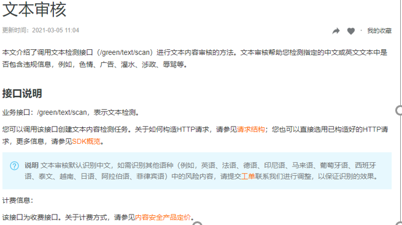
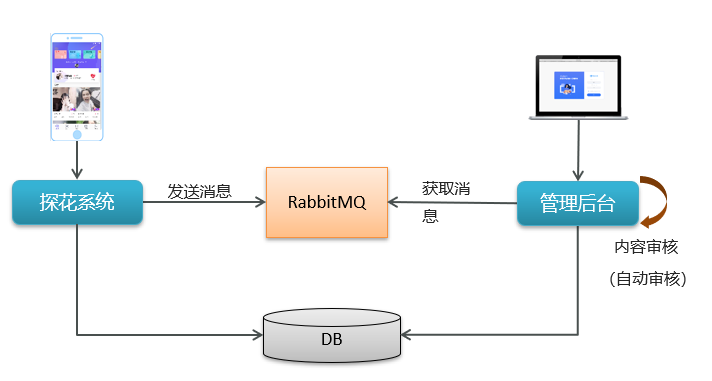

## 1、用户冻结解冻

用户冻结/解冻使用管理员在后台系统对用户的惩罚措施。对于发布不当言论或者违法违规内容的用户，可以暂时、永久禁止其登录，评论，发布动态、

后台中解冻/冻结，就是将用户状态写入数据库中

APP端用户在进行登录，评论，发布动态时检测Redis中冻结状态


### 1.1 用户冻结

#### ManageController

```java
//用户冻结
@PostMapping("/users/freeze")
public ResponseEntity freeze(@RequestBody Map params) {
    Map map =  managerService.userFreeze(params);
    return ResponseEntity.ok(map);
}
```

#### ManageService

```java
//用户冻结
public Map userFreeze(Map params) {
    Integer freezingTime = (Integer) params.get("freezingTime");
    Long userId = (Long) params.get("userId");
    int days = 0;
    if (freezingTime == 1) {
        days = 3;
    }
    if (freezingTime == 2) {
        days = 7;
    }
    if (freezingTime == 3) {
        days = -1;
    }
    String value = JSON.toJSONString(params);
    redisTemplate.opsForValue().set(Constants.FREEZE_USER+userId,value,days, TimeUnit.MINUTES);
    Map map = new HashMap();
    map.put("message","冻结成功");
    return map;
}
```

### 1.2 用户解冻

#### ManageController

```java
//用户解冻
@PostMapping("/users/unfreeze")
public ResponseEntity unfreeze(@RequestBody  Map params) {
    Map map =  managerService.userUnfreeze(params);
    return ResponseEntity.ok(map);
}
```

#### ManageService

```java
//用户解冻
public Map userUnfreeze(Map params) {
    Long userId = (Long) params.get("userId");
    String reasonsForThawing = (String) params.get("reasonsForThawing");
    redisTemplate.delete(Constants.FREEZE_USER+userId);
    Map map = new HashMap();
    map.put("message","解冻成功");
    return map;
}
```

### 1.3 查询数据列表

#### UserInfo

添加字段

```java
//用户状态,1为正常，2为冻结
@TableField(exist = false)
private String userStatus = "1";
```

#### ManageService

```java
public ResponseEntity findById(Long userId) {
    UserInfo info = userInfoApi.findById(userId);
    if(redisTemplate.hasKey(Constants.FREEZE_USER+info.getId())) {
        info.setUserStatus("2");
    }
    return ResponseEntity.ok(info);
}
```

#### 1.4 探花系统修改

#### UserFreezeService

```java
@Service
public class UserFreezeService {

    @Autowired
    private RedisTemplate<String,String> redisTemplate;

    public void checkUserStatus(Integer state,Long userId) {
        String value = redisTemplate.opsForValue().get(Constants.FREEZE_USER + userId);
        if(!StringUtils.isEmpty(value)) {
            Map map = JSON.parseObject(value, Map.class);
            Integer freezingRange = (Integer) map.get("freezingRange");
            if(freezingRange == state) {
                throw new BusinessException(ErrorResult.builder().errMessage("您的账号被冻结！").build());
            }
        }
    }
}
```

## 2、数据统计

后台系统首页中，显示各种统计数据，比如：累计用户数、新增用户数、登录次数等内容。

1、探花系统将用户操作日志写入RabbitMQ（如果把用户操作日志在探花系统写在数据库，写日志的时候抛出异常会影响其他业务）

2、管理后台获取最新消息，构造日志数据存入数据库

3、加入统计表，定时统计


### 2.1 数据采集

1、探花系统将用户操作日志写入RabbitMQ

2、管理后台获取最新消息，构造日志数据存入数据库

#### 2.1.1 部署RabbitMQ

探花交友所需的第三方服务组件，已经以Docker-Compose准备好了。仅仅需要进入相关目录，以命令形式启动运行即可

```shell
#进入目录
cd /root/docker-file/rmq/
#创建容器并启动
docker-compose up –d
#查看容器
docker ps -a
```

服务地址：192.168.136.160:5672

管理后台：http://192.168.136.160:15672/

#### 2.1.2 消息类型说明

探花项目间使用RabbitMQ收发消息，这里采用topic类型消息

日志消息key规则：log.xxx


#### 2.1.3 实体类对象

##### Log

```java
package com.tanhua.model.domain;

import lombok.AllArgsConstructor;
import lombok.Builder;
import lombok.Data;
import lombok.NoArgsConstructor;

@Data
@Builder
@NoArgsConstructor
@AllArgsConstructor
public class Log {
    /**
     * id
     */
    private Long id;
    /**
     * 用户id
     */
    private Long userId;
    /**
     * 操作时间
     */
    private String logTime;

    /**
     * 操作类型,
     * 0101为登录，0102为注册，
     * 0201为发动态，0202为浏览动态，0203为动态点赞，0204为动态喜欢，0205为评论，0206为动态取消点赞，0207为动态取消喜欢，
     * 0301为发小视频，0302为小视频点赞，0303为小视频取消点赞，0304为小视频评论
     */
    private String type;

    /**
     * 登陆地点
     */
    private String place;
    /**
     * 登陆设备
     */
    private String equipment;

    public Log(Long userId, String logTime, String type) {
        this.userId = userId;
        this.logTime = logTime;
        this.type = type;
    }
}
```

##### Analysis

```java
package com.tanhua.model.domain;

import lombok.AllArgsConstructor;
import lombok.Builder;
import lombok.Data;
import lombok.NoArgsConstructor;

import java.util.Date;

@Data
@NoArgsConstructor
@AllArgsConstructor
@Builder
public class Analysis{

    private Long id;
    /**
     * 日期
     */
    private Date recordDate;
    /**
     * 新注册用户数
     */
    private Integer numRegistered = 0;
    /**
     * 活跃用户数
     */
    private Integer numActive = 0;
    /**
     * 登陆次数
     */
    private Integer numLogin = 0;
    /**
     * 次日留存用户数
     */
    private Integer numRetention1d = 0;

    private Date created;
}
```

#### 2.1.4 发送日志消息

```java
@Autowired
private AmqpTemplate amqpTemplate;
public void login() {
    ………    
    //构造Map集合   
    Map<String, Object> msg = new HashMap<>();   
    msg.put(“userId”, UserHolder.getUserId().toString());  
    msg.put(“date", System.currentTimeMillis());    
	msg.put("type", "0101",);   
    String message = JSON.toJSONString(msg);    
    //发送消息
 	try {      
		amqpTemplate.convertSendAndReceive("tanhua.log.exchange",
                                             "log.user",message);    
	}catch (Exception e) {
		e.printStackTrace();
	}  
	………
}
```

#### 2.1.5 监听器处理消息

```java
@Component
public class LogListener {

    @Autowired
    private LogMapper logMapper;

    @RabbitListener(bindings = @QueueBinding(
            value = @Queue(
                    value = "tanhua.log.queue",
                    durable = "true"
            ),
            exchange = @Exchange(
                    value = "tanhua.log.exchange",
                    type = ExchangeTypes.TOPIC),
            key = {"log.*"})
    )
    public void listenCreate(String message) throws Exception {
        try {
            Map<String, Object> map = JSON.parseObject(message);
            //1、获取数据
            Long userId = (Long) map.get("userId");
            String date = (String) map.get("date");
            String objId = (String) map.get("objId");
            String type = (String) map.get("type");
            //2、保存到数据库
            Log log = new Log(userId,date,type);
            logMapper.insert(log);
        } catch (Exception e) {
            e.printStackTrace();
        }
    }
}
```

#### 2.1.6 消息发送工具类

```java
package com.tanhua.server.service;

import com.alibaba.fastjson.JSON;
import org.springframework.amqp.AmqpException;
import org.springframework.amqp.core.AmqpTemplate;
import org.springframework.beans.factory.annotation.Autowired;
import org.springframework.stereotype.Service;

import java.text.SimpleDateFormat;
import java.util.Date;
import java.util.HashMap;
import java.util.Map;

@Service
public class MqMessageService {

    @Autowired
    private AmqpTemplate amqpTemplate;

    //发送日志消息
    public void sendLogService(Long userId,String type,String key,String busId) {
        try {
            Map map = new HashMap();
            map.put("userId",userId.toString());
            map.put("type",type);
            map.put("logTime",new SimpleDateFormat("yyyy-MM-dd").format(new Date()));
            map.put("busId",busId);
            String message = JSON.toJSONString(map);
            amqpTemplate.convertAndSend("tanhua.log.exchange",
                    "log."+key,message);
        } catch (AmqpException e) {
            e.printStackTrace();
        }
    }

    //发送动态审核消息
    public void sendAudiService(String movementId) {
        try {
            amqpTemplate.convertAndSend("tanhua.audit.exchange",
                    "audit.movement",movementId);
        } catch (AmqpException e) {
            e.printStackTrace();
        }
    }
}
```

### 2.2 AOP处理日志

项目中大量方法需要改造，加入消息处理。

不易维护且存在耦合

解决方法：使用AOP + 自定义注解

#### 2.2.1 自定义注解

```java
@Target({ElementType.METHOD})
@Retention(RetentionPolicy.RUNTIME)
@Documented
public @interface LogConfig {

    //动态获取方法参数，支持SpringEL
    String objId() default "";

    //路由的key
    String key();

    //日志类型
    String type();
}
```

#### 2.2.2 切面

```java
@Component
@Aspect
public class LogAspect {

    @Autowired
    private AmqpTemplate amqpTemplate;

    @Before(value="execution(* com.tanhua.server.service.*.*(..)) && @annotation(config)")
    public void checkUserState(JoinPoint pjp , LogConfig config) throws Throwable {
        //解析SpringEL获取动态参数
        MethodSignature signature = (MethodSignature) pjp.getSignature();
        String objId = parse(config.objId(), signature.getParameterNames(), pjp.getArgs());
        //构造Map集合
        Map<String, Object> msg = new HashMap<>();
        msg.put("userId", UserHolder.getUserId());
        msg.put("date", new SimpleDateFormat("yyyy-MM-dd").format(new Date()));
        msg.put("objId", objId);
        msg.put("type", config.type());
        String message = JSON.toJSONString(msg);
        //发送消息
        try {
            amqpTemplate.convertSendAndReceive("tanhua.log.exchange",
                    "log."+config.key(),message);
        }catch (Exception e) {
            e.printStackTrace();
        }
    }


    public String parse(String expression, String[] paraNames,Object [] paras) {
        if(StringUtils.isEmpty(expression)) return "";
        StandardEvaluationContext context = new StandardEvaluationContext();
        for(int i=0;i<paraNames.length;i++) {
            context.setVariable(paraNames[i], paras[i]);
        }
        Expression exp = new SpelExpressionParser().parseExpression(expression);
        Object value = exp.getValue(context);
        return value == null ? "" : value.toString();
    }
}
```

#### 2.2.3 配置

```java
//根据id查询
@LogConfig(type = "0202",key = "movement",objId = "#movementId")
public MovementsVo findById(String movementId) {
    //1、调用api根据id查询动态详情
    Movement movement = movementApi.findById(movementId);
    //2、转化vo对象
    if(movement != null) {
        UserInfo userInfo = userInfoApi.findById(movement.getUserId());
        return MovementsVo.init(userInfo,movement);
    }else {
        return null;
    }
}
```

### 2.3 定时任务

在实际项目开发中，除了Web应用、SOA服务（面向服务的架构）外，还有一类不可缺少的，那就是定时任务调度。定时任务的场景可以说非常广泛：

* 某些网站会定时发送优惠邮件；

* 银行系统还款日信用卡催收款；

* 某些应用的生日祝福短信等。

那究竟何为定时任务调度，一句话概括就是：基于给定的时间点、给定的时间间隔、自动执行的任务

Spring 3.0以后自带了task 调度工具

#### 2.3.1 入门案例

##### 开启定时任务

```java
@SpringBootApplication(exclude = {MongoAutoConfiguration.class, MongoDataAutoConfiguration.class})
@MapperScan("com.tanhua.admin.mapper")
@EnableScheduling //开启定时任务支持
public class AdminServerApplication {

    public static void main(String[] args) {
        SpringApplication.run(AdminServerApplication.class,args);
    }
}
```

##### 定时任务类

```java
@Component
public class AnalysisTask {
    /**
     * 配置时间规则
     */
    @Scheduled( cron = "0/20 * * * * ? ")
    public void analysis() throws ParseException {
        //业务逻辑
        String time = new SimpleDateFormat("yyyy-MM-dd HH:mm:ss").format(new Date());
        System.out.println("当前时间："+time);
    }
}
```

#### 2.3.2 CRON表达式

对于定时任务，我们使用的时候主要是注重两个方面，一个是定时任务的业务，另一个就是Cron表达式。

**Cron  表达式支持到六个域 **

| **名称** | **是否必须** | **允许值**      | **特殊字符**    |
| -------- | ------------ | --------------- | --------------- |
| 秒       | 是           | 0-59            | , - * /         |
| 分       | 是           | 0-59            | , - * /         |
| 时       | 是           | 0-23            | , - * /         |
| 日       | 是           | 1-31            | , - * ? / L W C |
| 月       | 是           | 1-12 或 JAN-DEC | , - * /         |
| 周       | 是           | 1-7 或 SUN-SAT  | , - * ? / L C # |

月份和星期的名称是不区分大小写的。FRI 和 fri 是一样的。 域之间有空格分隔

#### 2.3.3 定时统计

##### AnalysisTask

```java
@Component
public class AnalysisTask {

    @Autowired
    private AnalysisService analysisService;

    /**
     * 配置时间规则
     */
    @Scheduled( cron = "0/20 * * * * ? ")
    public void analysis() throws ParseException {
        //业务逻辑
        String time = new SimpleDateFormat("yyyy-MM-dd HH:mm:ss").format(new Date());
        System.out.println("开始统计："+time);
        //调logService完成日志统计
        analysisService.analysis();
        System.out.println("结束统计");
    }
}
```

##### AnalysisService

```java
/**
 * 定时统计日志数据到统计表中
 *    1、查询tb_log表中的数 （每日注册用户数，每日登陆用户，活跃的用户数据，次日留存的用户）
 *    2、构造AnalysisByDay对象
 *    3、完成统计数据的更新或者保存
 */
public void analysis() throws ParseException {

    String todayStr = new SimpleDateFormat("yyyy-MM-dd").format(new Date());
    String yestodayStr =  DateUtil.yesterday().toString("yyyy-MM-dd"); //工具类
    //1、统计每日注册用户数
    Integer numRegistered = logMapper.queryByTypeAndLogTime("0102",todayStr);
    //2、统计每日登陆用户
    Integer numLogin = logMapper.queryByTypeAndLogTime("0101",todayStr);
    //3、统计活跃的用户数
    Integer numActive = logMapper.queryByLogTime(todayStr);
    //4、统计次日留存的用户数
    Integer numRetention1d = logMapper.queryNumRetention1d(todayStr, yestodayStr);
    //5、根据当前时间查询AnalysisByDay数据
    QueryWrapper<Analysis> qw = new QueryWrapper<>();
    Date todatDate = new SimpleDateFormat("yyyy-MM-dd").parse(todayStr);
    qw.eq("record_date", todatDate);

    Analysis analysis = analysisMapper.selectOne(qw);
    if(analysis == null) {
        //7、如果不存在，保存
        analysis = new Analysis();
        analysis.setRecordDate(todatDate);
        analysis.setNumRegistered(numRegistered);
        analysis.setNumLogin(numLogin);
        analysis.setNumActive(numActive);
        analysis.setNumRetention1d(numRetention1d);
        analysis.setCreated(new Date());
        analysisMapper.insert(analysis);
    }else{
        //8、如果存在，更新
        analysis.setNumRegistered(numRegistered);
        analysis.setNumLogin(numLogin);
        analysis.setNumActive(numActive);
        analysis.setNumRetention1d(numRetention1d);
        analysisMapper.updateById(analysis);
    }

}
```

##### AnalysisMapper

```java
public interface LogMapper extends BaseMapper<Log> {
    @Select("SELECT COUNT(DISTINCT user_id) FROM tb_log WHERE TYPE=#{type} AND log_time=#{logTime}")
    Integer queryByTypeAndLogTime(@Param("type") String type, @Param("logTime") String logTime); //根据操作时间和类型


    @Select("SELECT COUNT(DISTINCT user_id) FROM tb_log WHERE log_time=#{logTime}")
    Integer queryByLogTime(String logTime); //展示记录时间查询


    @Select("SELECT COUNT(DISTINCT user_id)  FROM tb_log WHERE log_time=#{today} AND user_id IN (\n " +
        " SELECT user_id FROM tb_log WHERE TYPE=\"0102\" AND log_time=#{yestoday} \n " +
        ")")
    Integer queryNumRetention1d(@Param("today")  String today,@Param("yestoday") String yestoday); //查询次日留存
}
```

##### 测试数据

为了方便操作，可以通过以下单元测试方法。保存若干操作数据

```java
package com.tanhua.manager.test;

import com.tanhua.manager.domain.Log;
import com.tanhua.manager.mapper.LogMapper;
import org.junit.Test;
import org.junit.runner.RunWith;
import org.springframework.beans.factory.annotation.Autowired;
import org.springframework.boot.test.context.SpringBootTest;
import org.springframework.test.context.junit4.SpringRunner;

import java.util.Random;

@RunWith(SpringRunner.class)
@SpringBootTest
public class LogTest {

    @Autowired
    private LogMapper logMapper;
    
    private String logTime = "";

    //模拟登录数据
    public void testInsertLoginLog() {
        for (int i = 0; i < 5; i++) {
            Log log = new Log();
            log.setUserId((long)(i+1));
            log.setLogTime(logTime);
            log.setType("0101");
            logMapper.insert(log);
        }
    }

    //模拟注册数据
    public void testInsertRegistLog() {
        for (int i = 0; i < 10; i++) {
            Log log = new Log();
            log.setUserId((long)(i+1));
            log.setLogTime(logTime);
            log.setType("0102");
            logMapper.insert(log);
        }
    }
    //模拟其他操作
    public void testInsertOtherLog() {
        String[] types = new String[]{"0201","0202","0203","0204","0205","0206","0207","0301","0302","0303","0304"};
        for (int i = 0; i < 10; i++) {
            Log log = new Log();
            log.setUserId((long)(i+1));
            log.setLogTime(logTime);
            int index = new Random().nextInt(10);
            log.setType(types[index]);
            logMapper.insert(log);
        }
    }

	@Test
    public void generData() {
        testInsertLoginLog();
        testInsertRegistLog();
        testInsertOtherLog();
    }
}
```


### 2.4 首页统计


#### 2.4.1 vo对象

```java
@Data
@AllArgsConstructor
@NoArgsConstructor
public class AnalysisSummaryVo {
    /**
     * 累计用户数
     */
    private Long cumulativeUsers;
    /**
     * 过去30天活跃用户数
     */
    private Long activePassMonth;
    /**
     * 过去7天活跃用户
     */
    private Long activePassWeek;
    /**
     * 今日新增用户数量
     */
    private Long newUsersToday;
    /**
     * 今日新增用户涨跌率，单位百分数，正数为涨，负数为跌
     */
    private BigDecimal newUsersTodayRate;
    /**
     * 今日登录次数
     */
    private Long loginTimesToday;
    /**
     * 今日登录次数涨跌率，单位百分数，正数为涨，负数为跌
     */
    private BigDecimal loginTimesTodayRate;
    /**
     * 今日活跃用户数量
     */
    private Long activeUsersToday;
    /**
     * 今日活跃用户涨跌率，单位百分数，正数为涨，负数为跌
     */
    private BigDecimal activeUsersTodayRate;
}
```

#### 2.4.2 DashboardController

```java
@RestController
@RequestMapping("/dashboard")
public class DashboardController {

    @Autowired
    private AnalysisService analysisService;

    /**
     * 概要统计信息
     */
    @GetMapping("/dashboard/summary")
    public AnalysisSummaryVo getSummary() {

        AnalysisSummaryVo analysisSummaryVo = new AnalysisSummaryVo();

        DateTime dateTime = DateUtil.parseDate("2020-09-08");

        //累计用户数
        analysisSummaryVo.setCumulativeUsers(Long.valueOf(1000));

        //过去30天活跃用户
        analysisSummaryVo.setActivePassMonth(this.analysisService.queryActiveUserCount(dateTime, -30));

        //过去7天活跃用户
        analysisSummaryVo.setActivePassWeek(this.analysisService.queryActiveUserCount(dateTime, -7));

        //今日活跃用户
        analysisSummaryVo.setActiveUsersToday(this.analysisService.queryActiveUserCount(dateTime, 0));


        //今日新增用户
        analysisSummaryVo.setNewUsersToday(this.analysisService.queryRegisterUserCount(dateTime, 0));

        //今日新增用户涨跌率，单位百分数，正数为涨，负数为跌
        analysisSummaryVo.setNewUsersTodayRate(computeRate(
                analysisSummaryVo.getNewUsersToday(),
                this.analysisService.queryRegisterUserCount(dateTime, -1)
        ));

        //今日登录次数
        analysisSummaryVo.setLoginTimesToday(this.analysisService.queryLoginUserCount(dateTime, 0));

        //今日登录次数涨跌率，单位百分数，正数为涨，负数为跌
        analysisSummaryVo.setLoginTimesTodayRate(computeRate(
                analysisSummaryVo.getLoginTimesToday(),
                this.analysisService.queryLoginUserCount(dateTime, -1)
        ));


        return analysisSummaryVo;

    }

    private static BigDecimal computeRate(Long current, Long last) {
        BigDecimal result;
        if (last == 0) {
            // 当上一期计数为零时，此时环比增长为倍数增长
            result = new BigDecimal((current - last) * 100);
        } else {
            result = BigDecimal.valueOf((current - last) * 100).divide(BigDecimal.valueOf(last), 2, BigDecimal.ROUND_HALF_DOWN);
        }
        return result;
    }
    
    private static String offsetDay(Date date,int offSet) {
        return DateUtil.offsetDay(date,offSet).toDateStr();
    }
}
```

#### 2.4.3 AnalysisService

```java
/**
 * 查询活跃用户的数量
 */
public Long queryActiveUserCount(DateTime today, int offset) {
    return this.queryUserCount(today, offset, "num_active");
}

/**
 * 查询注册用户的数量
 */
public Long queryRegisterUserCount(DateTime today, int offset) {
    return this.queryUserCount(today, offset, "num_registered");
}

/**
 * 查询登录用户的数量
 */
public Long queryLoginUserCount(DateTime today, int offset) {
    return this.queryUserCount(today, offset, "num_login");
}

private Long queryAnalysisCount(String column,String today,String offset){
    return analysisMapper.sumAnalysisData(column,leDate,dtDate);
}
```

#### 2.4.4 AnalysisMapper

```java
public interface AnalysisMapper extends BaseMapper<Analysis> {

    @Select("select sum(${column}) from tb_analysis where record_date > #{leDate} and record_date < #{gtDate}")
    Long sumAnalysisData(@Param("column") String column, @Param("leDate") String leDate, @Param("gtDate") String gtDate);
}
```

## 3、内容审核

内容安全是识别服务，支持对图片、视频、文本、语音等对象进行多样化场景检测，有效降低内容违规风险。

目前很多平台都支持内容检测，如阿里云、腾讯云、百度AI、网易云等国内大型互联网公司都对外提供了API。

按照性能和收费来看，探花交友项目使用的就是阿里云的内容安全接口，使用到了图片和文本的审核。

### 3.1 阿里云内容审核

#### 3.1.1 准备工作

1，前往[阿里云官网](https://www.aliyun.com/)注册账号

2，打开[云盾内容安全产品试用页面](https://promotion.aliyun.com/ntms/act/lvwangdemo.html)，单击立即开通，正式开通服务


3，在[AccessKey管理页面](https://ak-console.aliyun.com/#/accesskey)管理您的AccessKeyID和AccessKeySecret


#### 3.1.2 文本内容垃圾检测

文本垃圾内容检测：[点击访问](https://help.aliyun.com/document_detail/70439.html?spm=a2c4g.11186623.6.659.35ac3db3l0wV5k)

文本垃圾内容Java SDK: [点击访问]( https://help.aliyun.com/document_detail/53427.html?spm=a2c4g.11186623.6.717.466d7544QbU8Lr )



#### 3.1.3 图片审核


图片垃圾内容Java SDK: https://help.aliyun.com/document_detail/53424.html?spm=a2c4g.11186623.6.715.c8f69b12ey35j4 

#### 3.1.4 抽取工具

##### GreenProperties

```java
@Data
@ConfigurationProperties("tanhua.green")
public class GreenProperties {
    /**
     * 账号
     */
    String accessKeyID;
    /**
     * 密钥
     */
    String accessKeySecret;

    /**
     * 场景
     */
    String scenes;
}
```

##### AliyunGreenTemplate

```java
package com.tanhua.autoconfig.template;

import com.alibaba.fastjson.JSON;
import com.alibaba.fastjson.JSONArray;
import com.alibaba.fastjson.JSONObject;
import com.aliyuncs.DefaultAcsClient;
import com.aliyuncs.IAcsClient;
import com.aliyuncs.green.model.v20180509.ImageSyncScanRequest;
import com.aliyuncs.green.model.v20180509.TextScanRequest;
import com.aliyuncs.http.FormatType;
import com.aliyuncs.http.HttpResponse;
import com.aliyuncs.http.MethodType;
import com.aliyuncs.http.ProtocolType;
import com.aliyuncs.profile.DefaultProfile;
import com.aliyuncs.profile.IClientProfile;
import com.tanhua.autoconfig.properties.GreenProperties;
import lombok.extern.slf4j.Slf4j;

import java.util.*;

/**
 * @author: itheima
 * @create: 2021-05-31 00:46
 */
@Slf4j
public class AliyunGreenTemplate {

    private IAcsClient client;

    private GreenProperties greenProperties;

    public AliyunGreenTemplate(GreenProperties greenProperties) {
        this.greenProperties = greenProperties;
        try {
            IClientProfile profile = DefaultProfile
                    .getProfile("cn-shanghai", greenProperties.getAccessKeyID(), greenProperties.getAccessKeySecret());
            DefaultProfile
                    .addEndpoint("cn-shanghai", "cn-shanghai", "Green", "green.cn-shanghai.aliyuncs.com");
            client = new DefaultAcsClient(profile);
        } catch (Exception e) {
            e.printStackTrace();
            log.error("Green配置缺失，请补充!");
        }
    }


    /**
     * 阿里云文本内容检查
     *
     * @param content
     * @return map  key - suggestion内容
     * pass：文本正常，可以直接放行，
     * review：文本需要进一步人工审核，
     * block：文本违规，可以直接删除或者限制公开
     * value -   通过，或 出错原因
     * @throws Exception
     */
    public Map<String, String> greenTextScan(String content) throws Exception {
        TextScanRequest textScanRequest = new TextScanRequest();
        textScanRequest.setAcceptFormat(FormatType.JSON); // 指定api返回格式
        textScanRequest.setHttpContentType(FormatType.JSON);
        textScanRequest.setMethod(MethodType.POST); // 指定请求方法
        textScanRequest.setEncoding("UTF-8");
        textScanRequest.setRegionId("cn-shanghai");
        List<Map<String, Object>> tasks = new ArrayList<>();
        Map<String, Object> task1 = new LinkedHashMap<>();
        task1.put("dataId", UUID.randomUUID().toString());
        /**
         * 待检测的文本，长度不超过10000个字符
         */
        task1.put("content", content);
        tasks.add(task1);
        JSONObject data = new JSONObject();

        /**
         * 检测场景，文本垃圾检测传递：antispam
         **/
        data.put("scenes", Arrays.asList("antispam"));
        data.put("tasks", tasks);
        log.info("检测任务内容：{}", JSON.toJSONString(data, true));
        textScanRequest.setHttpContent(data.toJSONString().getBytes("UTF-8"), "UTF-8", FormatType.JSON);
        // 请务必设置超时时间
        textScanRequest.setConnectTimeout(3000);
        textScanRequest.setReadTimeout(6000);

//        返回结果内容
        Map<String, String> resultMap = new HashMap<>();
        try {
            HttpResponse httpResponse = client.doAction(textScanRequest);
            if (!httpResponse.isSuccess()) {
                new RuntimeException("阿里云文本内容检查出现异常！");
            }
            JSONObject scrResponse = JSON.parseObject(new String(httpResponse.getHttpContent(), "UTF-8"));
            log.info("检测结果内容：{}", JSON.toJSONString(scrResponse, true));
            if (200 != scrResponse.getInteger("code")) {
                new RuntimeException("阿里云文本内容检查出现异常！");
            }
            JSONArray taskResults = scrResponse.getJSONArray("data");
            for (Object taskResult : taskResults) {
                if (200 != ((JSONObject) taskResult).getInteger("code")) {
                    new RuntimeException("阿里云文本内容检查出现异常！");
                }
                JSONArray sceneResults = ((JSONObject) taskResult).getJSONArray("results");
                for (Object sceneResult : sceneResults) {
                    String scene = ((JSONObject) sceneResult).getString("scene");
                    String label = ((JSONObject) sceneResult).getString("label");
                    String suggestion = ((JSONObject) sceneResult).getString("suggestion");
                    log.info("最终内容检测结果，suggestion = {}，label={}", suggestion, label);
//                    设置默认错误返回内容
                    resultMap.put("suggestion", suggestion);
                    if (suggestion.equals("review")) {
                        resultMap.put("reson", "文章内容中有不确定词汇");
                        log.info("返回结果，resultMap={}", resultMap);
                        return resultMap;
                    } else if (suggestion.equals("block")) {
                        String reson = "文章内容中有敏感词汇";
                        if (label.equals("spam")) {
                            reson = "文章内容中含垃圾信息";
                        } else if (label.equals("ad")) {
                            reson = "文章内容中含有广告";
                        } else if (label.equals("politics")) {
                            reson = "文章内容中含有涉政";
                        } else if (label.equals("terrorism")) {
                            reson = "文章内容中含有暴恐";
                        } else if (label.equals("abuse")) {
                            reson = "文章内容中含有辱骂";
                        } else if (label.equals("porn")) {
                            reson = "文章内容中含有色情";
                        } else if (label.equals("flood")) {
                            reson = "文章内容灌水";
                        } else if (label.equals("contraband")) {
                            reson = "文章内容违禁";
                        } else if (label.equals("meaningless")) {
                            reson = "文章内容无意义";
                        }
                        resultMap.put("reson", reson);
                        log.info("返回结果，resultMap={}", resultMap);
                        return resultMap;
                    }

                }
            }
            resultMap.put("suggestion", "pass");
            resultMap.put("reson", "检测通过");

        } catch (Exception e) {
            log.error("阿里云文本内容检查出错！");
            e.printStackTrace();
            new RuntimeException("阿里云文本内容检查出错！");
        }
        log.info("返回结果，resultMap={}", resultMap);
        return resultMap;
    }

    /**
     * 阿里云图片内容安全
     */
    public Map imageScan(List<String> imageList) throws Exception {
        IClientProfile profile = DefaultProfile
                .getProfile("cn-shanghai", greenProperties.getAccessKeyID(), greenProperties.getAccessKeySecret());
        ImageSyncScanRequest imageSyncScanRequest = new ImageSyncScanRequest();
        // 指定api返回格式
        imageSyncScanRequest.setAcceptFormat(FormatType.JSON);
        // 指定请求方法
        imageSyncScanRequest.setMethod(MethodType.POST);
        imageSyncScanRequest.setEncoding("utf-8");
        //支持http和https
        imageSyncScanRequest.setProtocol(ProtocolType.HTTP);
        JSONObject httpBody = new JSONObject();
        /**
         * 设置要检测的场景, 计费是按照该处传递的场景进行
         * 一次请求中可以同时检测多张图片，每张图片可以同时检测多个风险场景，计费按照场景计算
         * 例如：检测2张图片，场景传递porn、terrorism，计费会按照2张图片鉴黄，2张图片暴恐检测计算
         * porn: porn表示色情场景检测
         */

        httpBody.put("scenes", Arrays.asList(greenProperties.getScenes().split(",")));

        /**
         * 如果您要检测的文件存于本地服务器上，可以通过下述代码片生成url
         * 再将返回的url作为图片地址传递到服务端进行检测
         */
        /**
         * 设置待检测图片， 一张图片一个task
         * 多张图片同时检测时，处理的时间由最后一个处理完的图片决定
         * 通常情况下批量检测的平均rt比单张检测的要长, 一次批量提交的图片数越多，rt被拉长的概率越高
         * 这里以单张图片检测作为示例, 如果是批量图片检测，请自行构建多个task
         */
        List list = new ArrayList();
        for (String imageUrl : imageList) {
            JSONObject task = new JSONObject();
            task.put("dataId", UUID.randomUUID().toString());
            // 设置图片链接。
            task.put("url", imageUrl);
            task.put("time", new Date());
            list.add(task);
        }

        httpBody.put("tasks",list);

        imageSyncScanRequest.setHttpContent(org.apache.commons.codec.binary.StringUtils.getBytesUtf8(httpBody.toJSONString()),
                "UTF-8", FormatType.JSON);
        /**
         * 请设置超时时间, 服务端全链路处理超时时间为10秒，请做相应设置
         * 如果您设置的ReadTimeout小于服务端处理的时间，程序中会获得一个read timeout异常
         */
        imageSyncScanRequest.setConnectTimeout(3000);
        imageSyncScanRequest.setReadTimeout(10000);
        HttpResponse httpResponse = null;
        try {
            httpResponse = client.doAction(imageSyncScanRequest);
        } catch (Exception e) {
            e.printStackTrace();
        }

        Map<String, String> resultMap = new HashMap<>();

        //服务端接收到请求，并完成处理返回的结果
        if (httpResponse != null && httpResponse.isSuccess()) {
            JSONObject scrResponse = JSON.parseObject(org.apache.commons.codec.binary.StringUtils.newStringUtf8(httpResponse.getHttpContent()));
            System.out.println(JSON.toJSONString(scrResponse, true));
            int requestCode = scrResponse.getIntValue("code");
            //每一张图片的检测结果
            JSONArray taskResults = scrResponse.getJSONArray("data");
            if (200 == requestCode) {
                for (Object taskResult : taskResults) {
                    //单张图片的处理结果
                    int taskCode = ((JSONObject) taskResult).getIntValue("code");
                    //图片要检测的场景的处理结果, 如果是多个场景，则会有每个场景的结果
                    JSONArray sceneResults = ((JSONObject) taskResult).getJSONArray("results");
                    if (200 == taskCode) {
                        for (Object sceneResult : sceneResults) {
                            String scene = ((JSONObject) sceneResult).getString("scene");
                            String label = ((JSONObject) sceneResult).getString("label");
                            String suggestion = ((JSONObject) sceneResult).getString("suggestion");
                            //根据scene和suggetion做相关处理
                            //do something
                            System.out.println("scene = [" + scene + "]");
                            System.out.println("suggestion = [" + suggestion + "]");
                            System.out.println("suggestion = [" + label + "]");
                            if (!suggestion.equals("pass")) {
                                resultMap.put("suggestion", suggestion);
                                resultMap.put("label", label);
                                return resultMap;
                            }
                        }

                    } else {
                        //单张图片处理失败, 原因视具体的情况详细分析
                        log.error("task process fail. task response:" + JSON.toJSONString(taskResult));
                        return null;
                    }
                }
                resultMap.put("suggestion", "pass");
                return resultMap;
            } else {
                /**
                 * 表明请求整体处理失败，原因视具体的情况详细分析
                 */
                log.error("the whole image scan request failed. response:" + JSON.toJSONString(scrResponse));
                return null;
            }
        }
        return null;
    }
}
```

##### TanhuaAutoConfiguration

```java
@Bean
@ConditionalOnProperty(prefix = "tanhua.green",value = "enable", havingValue = "true")
public AliyunGreenTemplate aliyunGreenTemplate(GreenProperties properties) {
    return new AliyunGreenTemplate(properties);
}
```

##### 配置文件

```yml
tanhua:
  green:
    enable: true
    accessKeyID: LTAI4GKgob9vZ53k2SZdyAC7
    accessKeySecret: LHLBvXmILRoyw0niRSBuXBZewQ30la
    scenes: porn,terrorism #色情，暴力
```

##### 单元测试

```java
    @Autowired
    private AliyunGreenTemplate template;

    @Test
    public void test() throws Exception {
//        Long data = analysisMapper.sumAnalysisData("num_registered", "2020-09-14", "2020-09-18");
//        System.out.println(data);
//        Map<String, String> map = template.greenTextScan("本校小额贷款，安全、快捷、方便、无抵押，随机随贷，当天放款，上门服务");
//        map.forEach((k,v)-> System.out.println(k +"--" + v));
        List<String> list = new ArrayList<>();
        list.add("http://images.china.cn/site1000/2018-03/17/dfd4002e-f965-4e7c-9e04-6b72c601d952.jpg");
        Map<String, String> map = template.imageScan(list);
        System.out.println("------------");
        map.forEach((k,v)-> System.out.println(k +"--" + v));
    }
```

### 3.2 动态审核

#### 3.2.1 执行流程

为了解决程序间耦合关系，这里采用RabbitMQ + 阿里云完成内容审核

* 用户发布动态，保存到数据库

* 发送RabbitMQ消息

* 管理后台监听消息，对内容（文本、图片审核）

* 更新动态的状态



#### 3.2.2 发布消息

```java
    public void publishMovement(Movement movement, MultipartFile[] imageContent) throws IOException {
        //1、判断发布动态的内容是否存在
        if(StringUtils.isEmpty(movement.getTextContent())) {
            throw  new BusinessException(ErrorResult.contentError());
        }
        //2、获取当前登录的用户id
        Long userId = UserHolder.getUserId();
        //3、将文件内容上传到阿里云OSS，获取请求地址
        List<String> medias = new ArrayList<>();
        for (MultipartFile multipartFile : imageContent) {
            String upload = ossTemplate.upload(multipartFile.getOriginalFilename(), multipartFile.getInputStream());
            medias.add(upload);
        }
        //4、将数据封装到Movement对象
        movement.setUserId(userId);
        movement.setMedias(medias);
        //5、调用API完成发布动态
        String movementId = movementApi.publish(movement);
        try {
            amqpTemplate.convertSendAndReceive("tanhua.audit.exchange","audit.movement",movementId);
        }catch (Exception e) {
            e.printStackTrace();
        }
    }
```

#### 3.2.3 监听器

```java
@Component
public class MovementListener {

    @DubboReference
    private MovementApi movementApi;

    @Autowired
    private AliyunGreenTemplate aliyunGreenTemplate;

    @RabbitListener(bindings = @QueueBinding(
            value = @Queue(
                    value = "tanhua.audit.queue",
                    durable = "true"
            ),
            exchange = @Exchange(
                    value = "tanhua.audit.exchange",
                    type = ExchangeTypes.TOPIC),
            key = {"audit.movement"})
    )
    public void listenCreate(String movementId) throws Exception {
        try {
            //1、根据动态id查询动态
            Movement movement = movementApi.findById(movementId);
            //对于RocketMQ消息有可能出现重复，解决方法判断 (幂等性)
            Integer state = 0;
            if(movement != null && movement.getState() == 0) {
                Map<String, String> textScan = aliyunGreenTemplate.greenTextScan(movement.getTextContent());
                Map<String, String> imageScan = aliyunGreenTemplate.imageScan(movement.getMedias());
                if(textScan != null && imageScan != null) {
                    String textSuggestion = textScan.get("suggestion");
                    String imageSuggestion = imageScan.get("suggestion");
                    if ("block".equals(textSuggestion) || "block".equals(textSuggestion)){
                        state = 2;
                    }else if("pass".equals(textSuggestion) || "pass".equals(textSuggestion)) {
                        state = 1;
                    }
                }
            }
            movementApi.update(movementId,state);
        } catch (Exception e) {
            e.printStackTrace();
        }
    }
}
```

#### 3.2.4 movementApi

```java
@Override
public void update(String movementId, Integer state) {
    Query query = Query.query(Criteria.where("id").in(new ObjectId(movementId)));
    Update update = Update.update("state", state);
    mongoTemplate.updateFirst(query,update,Movement.class);
}
```

