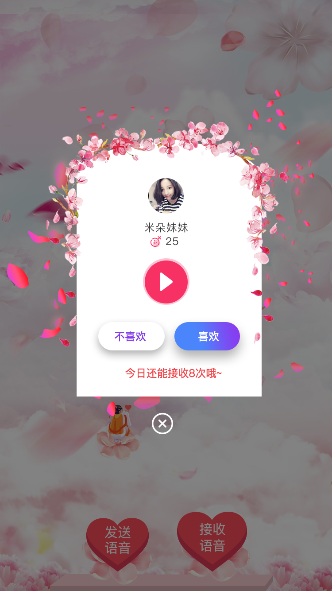
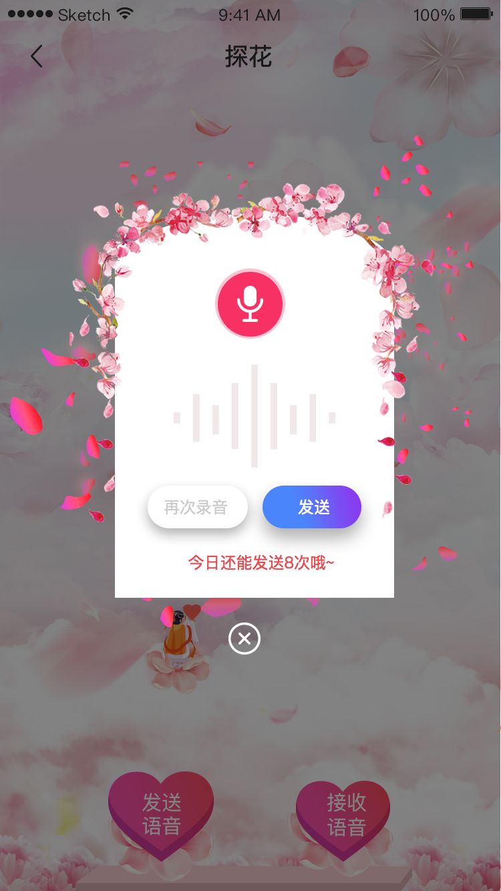
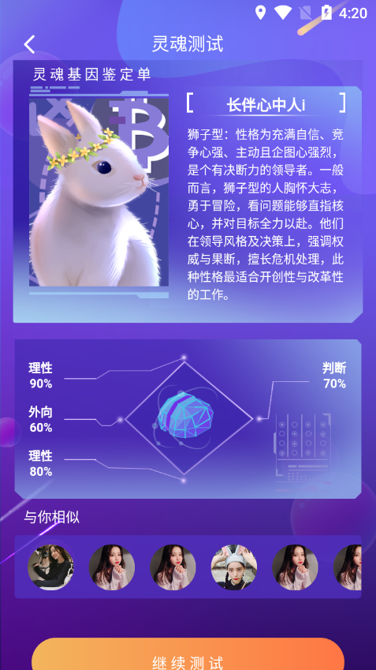
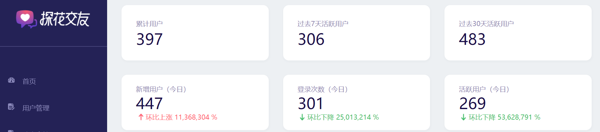
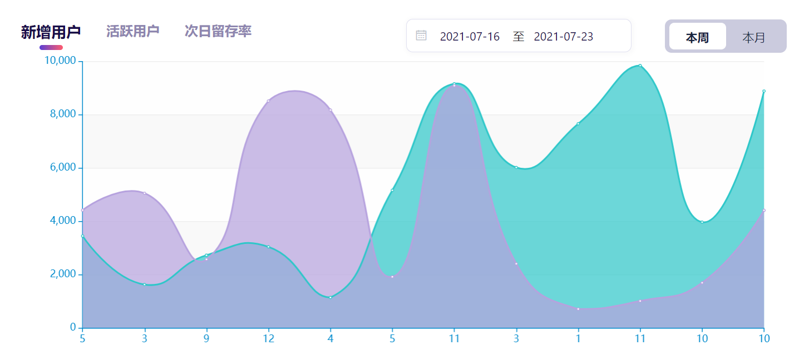
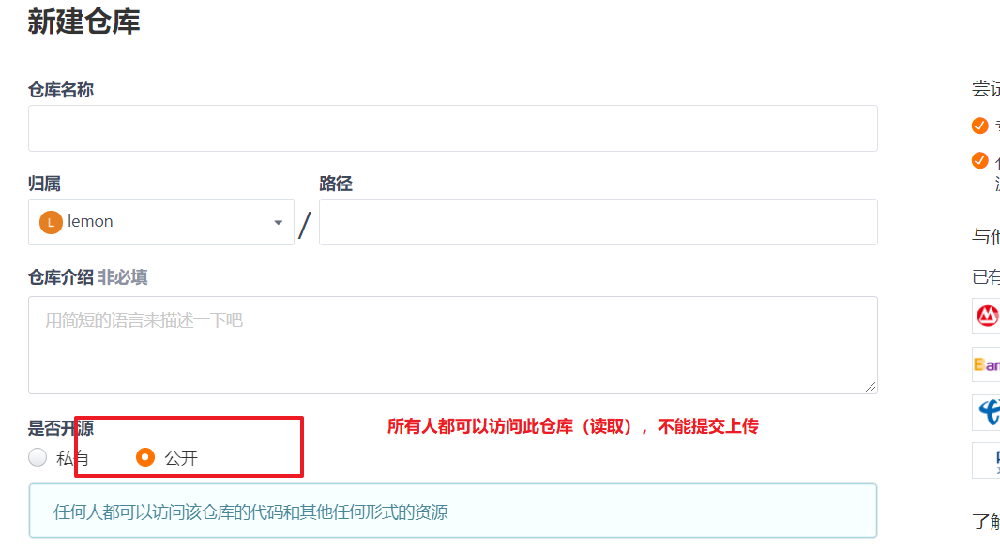
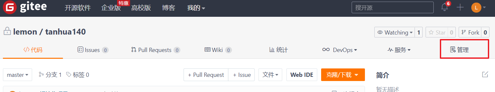
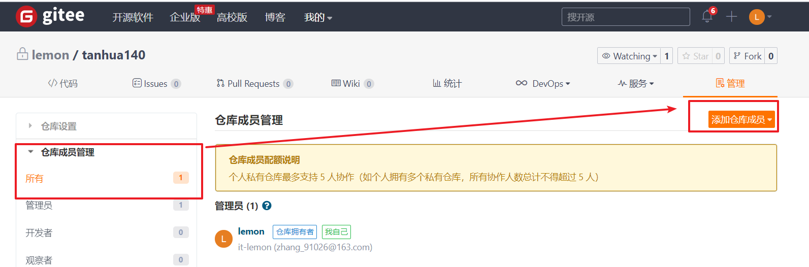

## 1、个人练习

个人练习部分内容，是每个人都需要独立实现的功能点。具体为每日课程的拓展作业，包含：

客户端更新用户头像

更新客户端手机号码

动态评论点赞

客户端喜欢数据统计

小视频点赞，评论，关注视频作者

## 2、小组实战

在项目实战中，需要基于提供的代码基础之上进行新功能的开发，此次项目实战需要完成的新功能有桃花传音和测灵魂，后台数据统计，审核动态等，功能的选择根据分组情况进行，功能的实现需要从需求分析开始到表结构的设计，再到实现，包含了整个开发环节。

### 桃花传音

主要功能点：

- 语音匹配类似漂流瓶类似，可以发送匿名语音，
- 可以收听匿名语音，收听完匿名语音可以选择喜欢或不喜欢。
- 如果双方互相喜欢那么可以配对成功互相关注

#### 接收语音

点击接收语音按钮，随机查询一个语音消息返回，在听完语音后，可以选择喜欢或者不喜欢，如果双方互相喜欢那么可以配对成功互相关注。

* 每日的接受数量限制（10条）
* 对于语音，只能被一个人获取
* API文档：http://192.168.136.160:3000/project/19/interface/api/130

 

#### 发送语音

用户可以选择发送语音，录制一段语音后发出。

API文档：http://192.168.136.160:3000/project/19/interface/api/127

 

### 测试灵魂

基本需求：

* 客户端展示问卷的题目，用户进行答题

- 测试题用于对用户进行分类，每次提交答案后更新用户属性
- 测试题为顺序回答，回答完初级题解锁下一级问题
- 答题完成，可以展示测试结果

**功能介绍：**

* 问卷列表：展示所有的问卷（低级，中级，高级）：http://192.168.136.160:3000/project/19/interface/api/139
* 提交问卷答案：
  * 数据内容：题目id和题目选项  
  * 根据提交的答案，和问题的预设评分，统计总分
  * 根据总分，计算出人格类型（更新用户属性） 50  --- 获取人格类型（狐狸）
  * 记录评分报告（低级问答，总分，用户的人格类型。。。。）
* 查看问卷的报告

**提示**

* 设计数据库表
* 对每个题目的选择预设评分（1：A2分，B3分，C4分，D5分）
* 用户提交答卷的时候，根据预设评分计算总分：50分
* 根据分数和人格类型的关系获取人格类型  ：  10-20：狐狸型，21-40分：狮子型，41-60：白兔型

#### 试卷列表

测试灵魂主页展示题目列表

API接口地址：http://192.168.136.160:3000/project/19/interface/api/139

#### 提交问卷

答题结束，自动提交问卷

API接口地址：http://192.168.136.160:3000/project/19/interface/api/133

#### 查看结果

答题结束后，可以查看测试报告展示数据

API接口地址：http://192.168.136.160:3000/project/19/interface/api/136

### 我的喜欢列表

基本需求：查询相互喜欢，喜欢和粉丝数据列表。

喜欢：只用户单向喜欢其他用户

粉丝：其他用户喜欢我的用户

双向喜欢：如果两者互相喜欢可以加为好友。

API接口地址：http://192.168.136.160:3000/project/19/interface/api/241

#### 粉丝喜欢

在列表页面查看喜欢我的用户（粉丝），可以对粉丝进行喜欢

API地址：http://192.168.136.160:3000/project/19/interface/api/271

#### 喜欢取消

对于已喜欢的用户，可以进行取消喜欢

API地址：http://192.168.136.160:3000/project/19/interface/api/256

### 后台-摘要统计

后台系统中，可以展示累计用户，新增用户等数据。

API地址：http://192.168.136.160:3000/project/25/interface/api/349

### 后台-次日留存统计

后台系统，展示次日流程，活跃，新增用户数据统计

API地址：http://192.168.136.160:3000/project/25/interface/api/340

## 3、GIT说明

实战中采用gitee完成代码管理

### 组长职责

1. 创建一个gitee的远程仓库（仓库必须是新仓库）

组长创建仓库的时候，要创建成公开的！！！！

2. 将代码第一次push到远程仓库上
3. 邀请组员加入仓库（邀请组员之后，组员才能和你一起操作此仓库中的代码）

> 在当前仓库中，点击管理

> 点击成员管理，添加新的成员
>
> 

> 复制邀请链接给组员，组员接受即可

### 组员

1. 注册gitee账号（git课程已经注册）
2. 接受组长的邀请，加入到组长的仓库中
3. 克隆代码后，一定要配置maven，配置jdk

